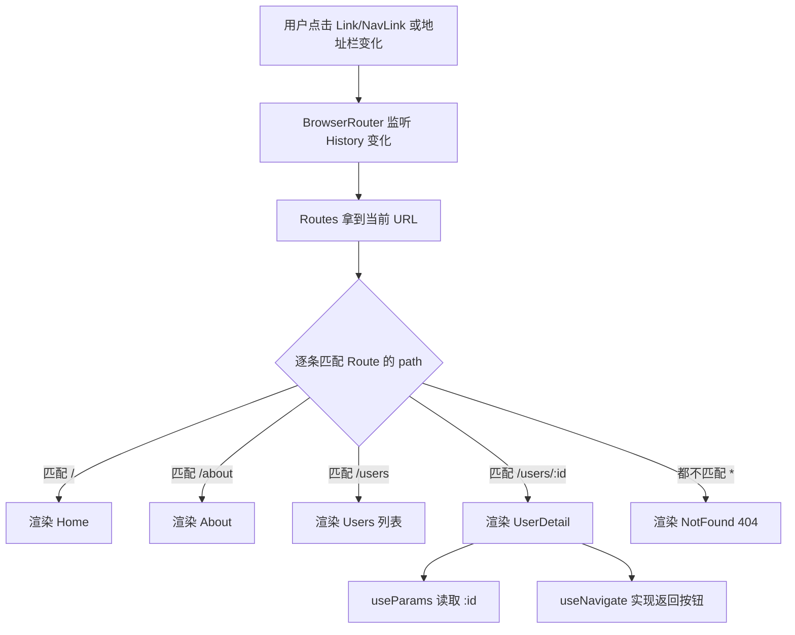

# 17 · React 路由（React Router）
> 用 react-router-dom v6 在单页应用（SPA）里实现"多页面"导航：URL 变化驱动组件切换，页面不整页刷新。

## 📖 知识讲解

传统多页网站每次跳转都向服务器请求一个新 HTML，整页刷新。React 是单页应用（SPA）：只有一个 HTML，页面切换靠 JS 在前端"换组件"完成。**React Router** 就是负责"把当前 URL 映射到要渲染的组件"的库。

核心概念（v6，现代写法）：

- **BrowserRouter**：路由的总开关，基于 HTML5 History API（pushState/popState）。包在应用最外层，地址栏是干净的 `/about`（而不是 `/#/about`）。需要在 `main.jsx` 里包裹 `<App />`。
- **Routes**：一组路由的容器，会在内部所有 `Route` 中挑出**最匹配**的那一个来渲染（v5 的 `Switch` 在 v6 改名为 `Routes`）。
- **Route**：单条路由规则，`path` 指定路径，`element` 指定要渲染的组件。v6 用 `element={<Home />}`，不再用 v5 的 `component={Home}`。
- **Link**：声明式跳转，渲染成 `<a>` 但拦截点击做客户端跳转，**不触发整页刷新**。
- **NavLink**：增强版 Link，能感知"是否为当前激活路由"，方便做导航高亮（`isActive`）。
- **useParams()**：读取动态路由参数，如 `/users/:id` 里的 `id`。
- **useNavigate()**：返回一个函数做"编程式跳转"，例如按钮点击后 `navigate(-1)` 后退、`navigate('/users')` 跳转。

动态路由：`path="/users/:id"` 中 `:id` 是占位符，访问 `/users/2` 时组件里 `useParams()` 得到 `{ id: '2' }`（永远是字符串）。

兜底路由：`path="*"` 匹配所有未命中的地址，常用于 404 页面。

## 🔄 流程图 / 原理图



组件关系：`BrowserRouter`（提供路由上下文）→ 内部任意位置可用 `Link`/`NavLink`（发起跳转）和 `Routes`/`Route`（决定渲染谁）；被渲染的页面组件内可用 `useParams`/`useNavigate` 等 Hook 读取参数、编程跳转。

## 💻 代码说明

- `src/main.jsx`：`createRoot` 渲染，用 `<BrowserRouter>` 包裹 `<App />`，路由能力由此注入。
- `src/App.jsx`：`<NavBar />` + `<Routes>`，集中声明全部路由（`/`、`/about`、`/users`、`/users/:id`、`*`）。
- `src/components/NavBar.jsx`：用 `<NavLink>` 做导航，借 `isActive` 给当前项加高亮；`/` 加 `end` 避免对所有路径都高亮。
- `src/pages/Users.jsx`：用户数组 `map` 成多个 `<Link to={`/users/${u.id}`}>`，点击进入详情。
- `src/pages/UserDetail.jsx`：`useParams()` 读 `id`，`useNavigate()` 实现"返回上一页 / 回列表"。
- `src/pages/NotFound.jsx`：404 提示 + 回首页 `<Link>`。

## ▶️ 运行方式

```bash
# 1. 进入本模块目录
cd 08-react/17-react-router

# 2. 安装依赖
npm install

# 3. 启动开发服务器
npm run dev
```

浏览器打开 **http://localhost:5173** 即可。试着访问 `/users/2`、或随便输入一个不存在的地址（如 `/abc`）查看 404 页面。

## ⚠️ 常见坑 / 最佳实践

- **v6 用 `element` 而非 `component`**：`<Route path="/" element={<Home />} />`，传的是 JSX 元素不是组件名。
- **`Switch` 在 v6 改名为 `Routes`**：v5 的 `<Switch>` 写法已废弃，必须改用 `<Routes>`。
- **嵌套路由用 `<Outlet />`**：父路由组件里放 `<Outlet />` 作为子路由出口，子 `Route` 嵌在父 `Route` 内部，而不是在子组件里重复写一遍完整路径。
- **history 模式部署需服务器 fallback**：`BrowserRouter` 走 History API，直接刷新 `/users/2` 时服务器找不到该文件会 404。需配置服务器把所有路径都回退到 `index.html`（Nginx `try_files $uri /index.html;`、或用 HashRouter 规避）。
- **`Link` 不要用 `<a>` 标签**：用原生 `<a href>` 会触发整页刷新、丢掉 SPA 状态。站内跳转一律用 `<Link>` / `<NavLink>`。
- **`NavLink` 的 `/` 记得加 `end`**：否则首页链接会在所有以 `/` 开头的路径下都显示为激活。
- **`useParams` 返回的值都是字符串**：需要数字时自己 `Number(id)` 转换。

## 🔗 官方文档

- React 官方文档：https://react.dev/
- React Router 官方文档：https://reactrouter.com/
