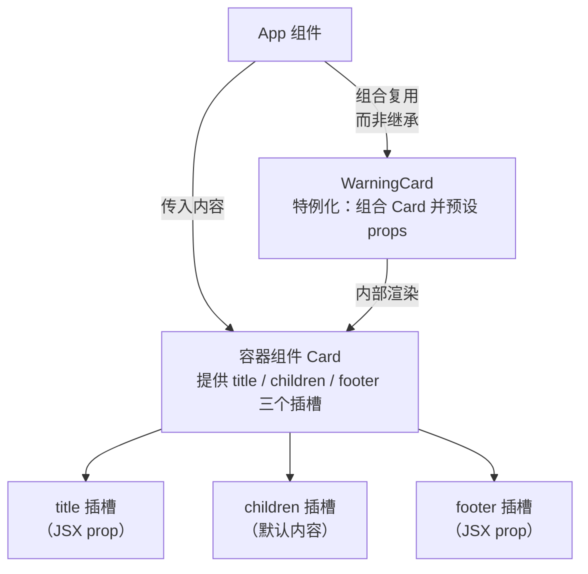

# 18 · 组件组合（Component Composition）
> 通过 `children` 和"把组件 / JSX 作为 props 传入"的方式，把组件像积木一样拼装复用。React 推崇「组合优于继承」——不靠类继承，而靠组合实现 UI 复用与定制。

## 📖 知识讲解
有些组件（如 `Card`、`Dialog`、`Sidebar`）事先并不知道里面要放什么内容，它们只负责"框架/容器"。React 用 **组合** 解决这类复用：

1. **`children` prop（默认插槽）**：写在标签中间的内容会自动成为 `props.children`。
   ```jsx
   <Card>这里的内容就是 children</Card>
   ```
   容器组件用 `{children}` 把它渲染到指定位置，从而接收任意内容。

2. **把 JSX 作为普通 prop 传（具名插槽 / slot 模式）**：当一个容器需要多个"洞"（如标题、主体、底部）时，可以把 JSX 作为具名 prop 传入：
   ```jsx
   <Card title={<h2>标题</h2>} footer={<button>确定</button>}>主体</Card>
   ```
   这就实现了类似 Vue 具名插槽的能力。

3. **特例化组件**：要定制一个更具体的组件（如 `WarningCard`），不用"继承"，而是 **组合**——内部渲染通用的 `Card` 并预设好某些 props。这就是「组合优于继承」。

React 官方明确表示：**没有发现需要用继承来构建组件层次的场景**。需要复用非 UI 逻辑时，提取成普通函数或自定义 Hook，而不是 mixin / 继承。

## 🔄 流程图 / 原理图


## 💻 代码说明
- `Card`（容器组件）：接收 `title` / `children` / `footer` 三个 props。`children` 是默认插槽（标签中间内容），`title` 和 `footer` 是作为 JSX 传入的具名插槽，用 `{title && ...}` 控制有则渲染。
- 三种用法：仅 `children`；`title + children + footer` 三插槽（footer 里的按钮还能操作上层 `count` 状态）；`WarningCard` 特例化。
- `WarningCard`（特例化组件）：内部渲染 `Card`，预设 `title` 和危险样式的 `footer`，体现"用组合复用，而非继承"。

## ▶️ 运行方式
CDN 免构建：浏览器直接打开 `index.html` 即可。

## ⚠️ 常见坑 / 最佳实践
- **滥用继承**：React 不建议用类继承构建组件层次。要复用，优先用组合（`children` / 传组件作 props）和自定义 Hook，几乎用不到 `extends` 业务组件。
- **`children` 是特殊 prop**：标签中间的内容自动成为 `props.children`，不用手动传；别再额外起个 prop 重复传内容。
- **组合实现复用，而非 mixin / 继承**：共享非 UI 逻辑请提取为普通工具函数或自定义 Hook；共享 UI 结构请用组件组合。
- **避免 prop drilling 与万能组件**：如果一个容器堆了太多可选具名插槽，考虑拆分成更小的组合单元；跨多层透传数据可用 `Context`。
- 具名插槽传入的 JSX prop 同样是普通值，里面的事件处理器能闭包访问父组件状态，灵活但注意不要意外造成额外重渲染。

## 🔗 官方文档
- 将 JSX 作为子组件传递（children）：https://zh-hans.react.dev/learn/passing-props-to-a-component#passing-jsx-as-children
- 组合优于继承的理念（旧版文档仍适用）：https://zh-hans.legacy.reactjs.org/docs/composition-vs-inheritance.html
