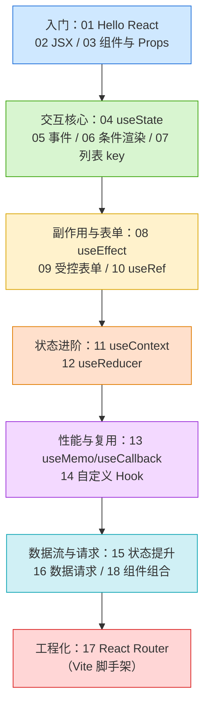

# 08 · React（现代函数组件 + Hooks）

> React 是 Facebook（Meta）开源的声明式 UI 库：你描述「数据长什么样 UI 就长什么样」，React 负责高效地把变化同步到真实 DOM。本工程对照官方文档 [react.dev](https://react.dev/learn)，以**函数组件 + Hooks** 的现代写法，从零讲透 React 核心。

## 📚 React 是什么

- **声明式（Declarative）**：你只描述「当前状态对应的 UI」，状态变了 React 自动重新渲染并最小化更新真实 DOM，无需手动操作 DOM。
- **组件化（Component-Based）**：UI 拆成一个个可复用、可组合的函数组件，自底向上搭积木。
- **单向数据流（One-way Data Flow）**：数据通过 props 从父流向子，状态变化通过回调向上通知，数据流清晰可预测。
- **虚拟 DOM（Virtual DOM）+ Diff**：React 在内存里维护一棵虚拟 DOM，状态变化时先 diff 出最小差异，再批量更新真实 DOM，提升性能。
- **Hooks**：React 16.8+ 引入，让函数组件也能拥有状态（`useState`）、副作用（`useEffect`）、上下文（`useContext`）等能力，彻底取代了 class 组件，是当下的标准写法。

## 🗂️ 模块索引

| 模块 | 知识点 | 核心 API / 概念 | 运行方式 |
| --- | --- | --- | --- |
| [01-hello-react](./01-hello-react/) | 第一个 React 应用 | `createRoot` / 声明式渲染 | CDN |
| [02-jsx](./02-jsx/) | JSX 语法 | `{}` 插值 / `className` / Fragment | CDN |
| [03-components-props](./03-components-props/) | 组件与 Props | 函数组件 / props / children | CDN |
| [04-useState](./04-useState/) | 状态 | `useState` / 函数式更新 / 不可变 | CDN |
| [05-event-handling](./05-event-handling/) | 事件处理 | 合成事件 / `onClick` / `e.preventDefault` | CDN |
| [06-conditional-rendering](./06-conditional-rendering/) | 条件渲染 | 三元 / `&&` / `null` | CDN |
| [07-lists-keys](./07-lists-keys/) | 列表与 Key | `map()` / `key` / diff 复用 | CDN |
| [08-useEffect](./08-useEffect/) | 副作用（含执行时机图） | `useEffect` / 依赖数组 / 清理函数 | CDN |
| [09-forms-controlled](./09-forms-controlled/) | 受控表单 | `value` + `onChange` / 单一数据源 | CDN |
| [10-useRef](./10-useRef/) | 引用 | `useRef` / DOM 访问 / 跨渲染存值 | CDN |
| [11-useContext](./11-useContext/) | 上下文 | `createContext` / `useContext` / Provider | CDN |
| [12-useReducer](./12-useReducer/) | Reducer 状态 | `useReducer` / dispatch / action | CDN |
| [13-useMemo-useCallback](./13-useMemo-useCallback/) | 性能优化 | `useMemo` / `useCallback` / `React.memo` | CDN |
| [14-custom-hooks](./14-custom-hooks/) | 自定义 Hook | `useXxx` / 逻辑复用 | CDN |
| [15-lifting-state](./15-lifting-state/) | 状态提升 | 共享状态 / 数据下行事件上行 | CDN |
| [16-fetching-data](./16-fetching-data/) | 数据请求 | `useEffect` + `fetch` / loading-error-data 三态 | CDN |
| [17-react-router](./17-react-router/) | 路由 | `react-router-dom` v6 / `useParams` | **Vite** |
| [18-component-composition](./18-component-composition/) | 组合 / children | 组合优于继承 / slot 模式 | CDN |

## 🧭 学习路线图



学习建议：按编号**从 01 到 18 顺序学**。01-10 是必须掌握的基础；11-16 是日常开发高频进阶；17 进入工程化（路由）；18 是组件设计思想，可随时回看。

## ▶️ 运行方式（两类）

本工程模块分两类运行方式，对应规范中的「CDN/Vite 结合」：

### 1. CDN / 免构建模块（01-16、18）

无需安装任何依赖，**双击 `index.html` 用浏览器直接打开即可**看到效果。原理：HTML 里通过 `<script>` 引入 React 18 与 ReactDOM 的 UMD 包，再用 **Babel Standalone** 在浏览器里实时把 JSX 编译成 JS。

```html
<script crossorigin src="https://unpkg.com/react@18/umd/react.development.js"></script>
<script crossorigin src="https://unpkg.com/react-dom@18/umd/react-dom.development.js"></script>
<script src="https://unpkg.com/@babel/standalone/babel.min.js"></script>
<!-- 业务代码写在 type="text/babel" 的 script 里 -->
<script type="text/babel"> /* JSX 代码 */ </script>
```

> 注意：Babel 浏览器实时编译**仅用于学习**，性能差、不适合生产。生产环境一律用 Vite/构建工具预编译。首次打开需联网加载 CDN。

### 2. Vite 脚手架模块（17-react-router）

进阶模块（路由）使用官方推荐的 Vite 脚手架，需安装依赖后启动开发服务器：

```bash
cd 08-react/17-react-router
npm install      # 安装 react / react-dom / react-router-dom / vite
npm run dev      # 启动开发服务器
# 浏览器打开终端提示的地址（默认 http://localhost:5173）
```

## 🔗 官方文档

- React 官方教程：https://react.dev/learn
- Hooks 参考：https://react.dev/reference/react/hooks
- React Router：https://reactrouter.com/
- Vite：https://vitejs.dev/
