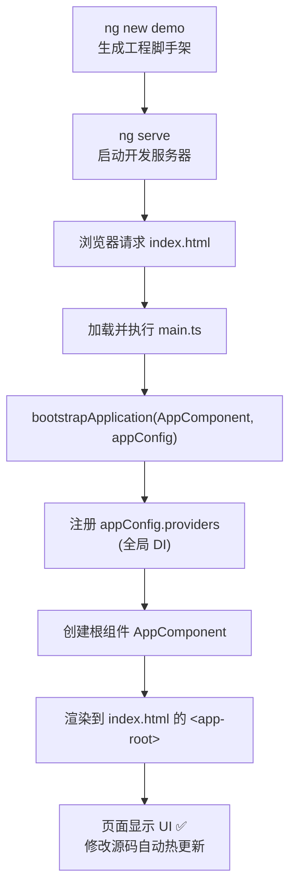

# 01 · Angular 入门 / CLI / 项目结构（Getting Started）
> Angular 是一个用 TypeScript 构建大型 Web 应用的前端框架；本模块带你认识它、用 Angular CLI 创建并启动一个最小的 Standalone 工程。

## 📖 知识讲解

### Angular 是什么
Angular 是 Google 维护的 **组件化、TypeScript 优先** 的前端框架。它内置了路由、依赖注入（DI）、表单、HTTP 客户端、变更检测等一整套能力，适合中大型应用。现代 Angular（v17+，本项目用 v19）默认采用：

- **Standalone Components（独立组件）**：组件自带 `imports`，不再需要 `NgModule`。
- **Signals（信号）**：细粒度响应式状态。
- **新控制流**：`@if` / `@for` / `@switch` 取代 `*ngIf` / `*ngFor`。
- **`inject()` / `input()` / `output()`** 等函数式 API。

### Angular CLI 核心命令
CLI 是官方命令行工具，负责创建工程、本地开发服务器、生成代码、构建打包。

| 命令 | 作用 |
| --- | --- |
| `npm i -g @angular/cli` | 全局安装 CLI |
| `ng new demo` | 创建一个名为 demo 的新工程（默认 Standalone） |
| `ng serve` | 启动开发服务器（默认 http://localhost:4200，热更新） |
| `ng generate component xxx`（简写 `ng g c xxx`） | 生成组件 |
| `ng build` | 生产构建，产物在 `dist/` |

### Standalone 工程结构（关键文件）
```
demo/
├─ src/
│  ├─ main.ts            ← 入口：bootstrapApplication(AppComponent, appConfig)
│  ├─ index.html         ← 宿主页面，内含 <app-root></app-root>
│  └─ app/
│     ├─ app.component.ts   ← 根组件
│     └─ app.config.ts      ← 应用级 Providers（路由 / HttpClient 等）
├─ angular.json          ← CLI 工程配置
├─ package.json
└─ tsconfig.json
```

核心 API：
- **`bootstrapApplication(rootComponent, config)`**：启动应用，取代旧的 `platformBrowserDynamic().bootstrapModule(AppModule)`。
- **`ApplicationConfig`**：放全局 `providers` 的对象。
- **`@Component`**：声明一个组件。

**易错点**：v19 中 `standalone` 默认即 `true`，无需再显式写 `standalone: true`；`provideXxx()` 系列函数都放进 `app.config.ts` 的 `providers`，不要再去找 `AppModule`（它已经不存在了）。

## 🔄 流程图 / 原理图



## 💻 代码说明

本模块给出最小 Standalone 应用的三个核心文件：

1. **`main.ts`** —— 入口。调用 `bootstrapApplication(AppComponent, appConfig)` 启动应用，`.catch()` 捕获启动错误。
2. **`app.config.ts`** —— 导出 `appConfig`，其 `providers` 数组是“全局依赖”的集中地（路由、HttpClient 等都加在这里）。`provideZoneChangeDetection({ eventCoalescing: true })` 用于合并变更、优化性能。
3. **`app.component.ts`** —— 根组件。`selector: 'app-root'` 对应 `index.html` 里的 `<app-root>`；用 `signal('...')` 定义标题状态，模板中 `{{ title() }}` 读取并自动追踪。

**如何放入 `ng new` 工程运行**：用 `ng new demo` 生成工程后，工程里已自带这三个文件。把本目录的 `main.ts` 放到 `src/`，`app.config.ts`、`app.component.ts` 放到 `src/app/`（直接覆盖同名文件即可）。然后 `ng serve`，浏览器打开 http://localhost:4200 就能看到 “欢迎来到 frontend-learning · Angular 🚀”。

## ▶️ 运行方式

```bash
# 1. 安装 CLI（只需一次）
npm i -g @angular/cli

# 2. 创建工程（一路回车或按需选择）
ng new demo
cd demo

# 3. 用本模块的三个文件覆盖 src/main.ts、src/app/app.config.ts、src/app/app.component.ts

# 4. 启动开发服务器
ng serve --open   # 自动打开浏览器 http://localhost:4200
```

## ⚠️ 常见坑 / 最佳实践
- **找不到 `AppModule`**：现代工程默认 Standalone，根本没有 NgModule，不要再去创建它。
- **`standalone: true` 多余**：v19 起默认就是 standalone，写不写都行，新代码可省略。
- **全局服务放错地方**：`provideRouter` / `provideHttpClient` 等必须放 `app.config.ts` 的 `providers`，放组件里只在该组件子树生效。
- **端口被占用**：`ng serve --port 4300` 换端口。
- **Node 版本**：Angular 19 需要较新的 Node LTS（建议 18.19+ / 20+），版本过低会安装/启动失败。

## 🔗 官方文档
- 安装与环境：https://angular.dev/installation
- CLI 总览：https://angular.dev/tools/cli
- `bootstrapApplication`：https://angular.dev/api/platform-browser/bootstrapApplication
- 项目结构：https://angular.dev/reference/configs/file-structure
