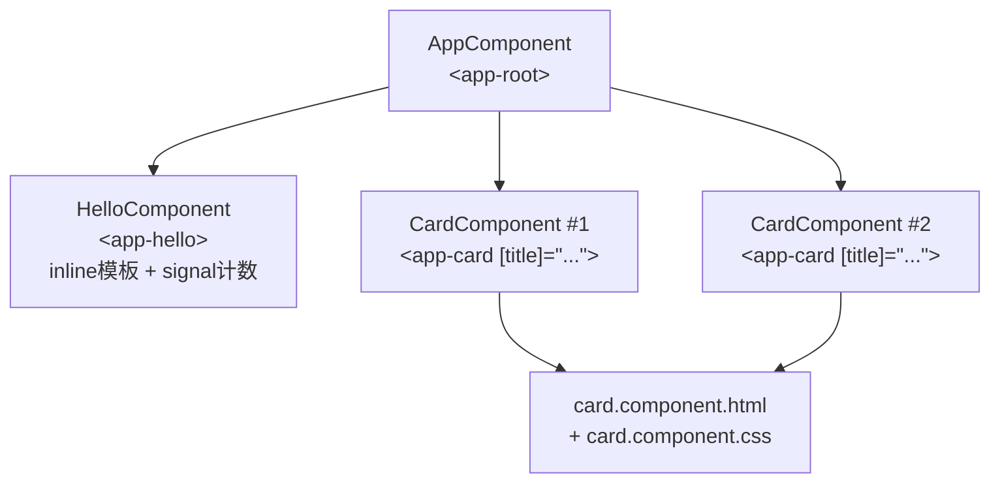

# 02 · 组件（Components）
> 组件是 Angular 应用的 UI 基本单元——一个组件 = 一段模板（HTML）+ 一段逻辑（TS 类）+ 一份样式（CSS）；整个界面由组件树拼装而成。

## 📖 知识讲解

### 什么是组件
每个组件用 `@Component` 装饰器声明，由三部分组成：
- **模板**：决定渲染什么（HTML + Angular 模板语法）。
- **类**：决定数据与行为（属性、方法、signal 状态）。
- **样式**：决定外观（默认作用域隔离到本组件）。

现代 Angular（v19）组件默认 **`standalone: true`**，自带 `imports`，不依赖 NgModule。

### `@Component` 常用配置
| 配置项 | 作用 |
| --- | --- |
| `selector` | 组件在 HTML 中的标签名，如 `'app-hello'` → `<app-hello>` |
| `template` | inline 模板字符串（小组件用） |
| `templateUrl` | 外部 HTML 文件路径（大模板用） |
| `styles` | inline 样式数组 |
| `styleUrl` / `styleUrls` | 外部 CSS 文件（单个用 `styleUrl`，多个用 `styleUrls`） |
| `imports` | 本组件模板用到的其它组件/指令/管道 |

> `template` 与 `templateUrl` 二选一；`styles` 与 `styleUrl(s)` 也是二选一。

### 组件如何被使用
要在 A 组件里用 B 组件，需在 A 的 `imports` 中加入 B，然后在 A 的模板里写 B 的 selector 标签。例如根组件引入 `HelloComponent`、`CardComponent` 后即可在模板使用 `<app-hello>`、`<app-card>`。

### 输入属性 `input()`
`input()` 是函数式输入 API（取代旧的 `@Input()` 装饰器）。父组件通过 `[title]="..."` 传值，子组件用 `title()` 读取，它本质是只读 signal，值变化时视图自动更新。

**易错点**：
- 用了子组件却忘了在父组件 `imports` 里引入 → 报 “xxx is not a known element”。
- `input()` 读取要加括号：`title()` 而不是 `title`。
- `templateUrl` 路径是相对 `.ts` 文件的，写错路径会编译失败。

## 🔄 流程图 / 原理图

组件树（根组件如何包含两个子组件）：



## 💻 代码说明

- **`hello.component.ts`**：`selector: 'app-hello'`，用 **inline `template`** 与 **inline `styles`**。内部 `count = signal(0)`，`increment()` 用 `count.update(n => n + 1)`，`reset()` 用 `count.set(0)`；模板里 `(click)="increment()"` 绑定事件、`{{ count() }}` 显示当前值。
- **`card.component.ts`**：`selector: 'app-card'`，用 **`templateUrl`/`styleUrl`** 拆分文件。两个 `input()`（`title`、`body`）接收父组件传入数据。
- **`card.component.html`**：外部模板，用 `{{ title() }}`、`{{ body() }}` 渲染输入值。
- **`card.component.css`**：外部样式，因「视图封装」只作用于本组件。

**如何在 `ng new` 工程中放置运行**：
1. 把这 5 个文件放到 `src/app/`（与 `app.component.ts` 同级）。
2. 在 `src/app/app.component.ts` 顶部引入并加进 `imports`，再在模板里使用：

```ts
import { Component } from '@angular/core';
import { HelloComponent } from './hello.component';
import { CardComponent } from './card.component';

@Component({
  selector: 'app-root',
  imports: [HelloComponent, CardComponent], // 关键：引入子组件
  template: `
    <app-hello />
    <app-card [title]="'第一张卡片'" [body]="'用 templateUrl 拆分的组件'" />
    <app-card title="第二张卡片" />
  `,
})
export class AppComponent {}
```

3. `ng serve`，即可看到计数器和两张卡片。

## ▶️ 运行方式

```bash
npm i -g @angular/cli
ng new demo
cd demo
# 将本模块 5 个文件复制到 src/app/，并按上方代码修改 src/app/app.component.ts
ng serve --open
```

## ⚠️ 常见坑 / 最佳实践
- **忘记 `imports` 子组件** 是最常见错误，记住：standalone 组件用谁就 import 谁。
- 小组件用 inline `template`，模板超过 ~20 行就拆 `templateUrl`，更易维护。
- selector 用 `app-` 前缀（CLI 默认），避免与原生标签冲突。
- `input()` 是只读的，子组件不应直接改输入值；需要本地可变状态请另开 `signal`。
- 组件类名用 `XxxComponent`，文件名用 `xxx.component.ts`，保持约定一致。

## 🔗 官方文档
- 组件总览：https://angular.dev/guide/components
- selector 与使用：https://angular.dev/guide/components/selectors
- 组件样式：https://angular.dev/guide/components/styling
- 输入 `input()`：https://angular.dev/guide/components/inputs
