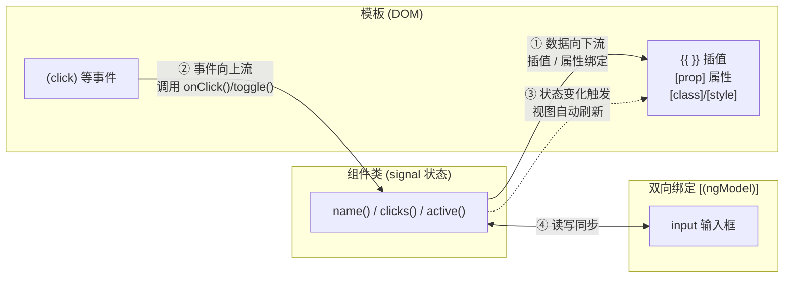

# 03 · 模板与绑定（Templates & Binding）
> 绑定是组件类与模板之间的“数据通道”：数据从类流向模板（插值/属性），用户操作从模板流回类（事件），双向绑定则让两者实时同步。

## 📖 知识讲解

Angular 模板有四种核心绑定，外加 class/style 绑定：

| 绑定类型 | 语法 | 方向 | 说明 |
| --- | --- | --- | --- |
| 插值 Interpolation | `{{ expr }}` | 类 → 模板 | 把数据渲染成文本 |
| 属性绑定 Property | `[prop]="expr"` | 类 → 模板 | 把数据写进元素的 DOM 属性 |
| 事件绑定 Event | `(event)="handler()"` | 模板 → 类 | 把用户操作传回组件方法 |
| 双向绑定 Two-way | `[(ngModel)]="sig"` | 双向 | 输入控件与状态实时同步 |
| class 绑定 | `[class.x]="bool"` | 类 → 模板 | 条件添加 class |
| style 绑定 | `[style.prop]="expr"` | 类 → 模板 | 设置内联样式 |

### 关键点
- **`[prop]` 是属性绑定，`(event)` 是事件绑定**：记忆口诀“**方括号进数据，圆括号出事件，香蕉盒 `[()]` 双向**”。
- **双向绑定两种方式**：
  - `[(ngModel)]`：来自 `FormsModule`，最常用于表单输入，需在组件 `imports: [FormsModule]`。
  - `model()`：组件自定义双向绑定的输入信号（用于父子组件双向通信），不需要 FormsModule。
- **配 signal 使用**：本 demo 状态全用 `signal`，模板读取要加括号 `name()`；`[(ngModel)]="name"` 中绑定的是 signal 本身（不加括号），Angular 会自动读写它。

**易错点**：
- 用 `[(ngModel)]` 忘记 `import { FormsModule }` 并加进 `imports` → 报错 “Can't bind to 'ngModel'”。
- 把属性绑定写成插值：`<button disabled="{{ disabled() }}">` 在布尔属性上行为不可靠，应使用 `[disabled]="disabled()"`。
- signal 在 `{{}}` 和 `[prop]` 里要调用 `name()`，忘记括号会显示函数本身。

## 🔄 流程图 / 原理图

单向数据流（类 → 模板）+ 事件回流（模板 → 类）：



## 💻 代码说明

- **`binding-demo.component.ts`**：声明 5 个 signal——`name`（插值/双向）、`disabled`（属性绑定）、`active`（class/style）、`clicks`（事件计数）。方法 `onClick()`、`toggleActive()`、`toggleDisabled()` 用 `update()` 改状态。因用到 `[(ngModel)]`，`imports: [FormsModule]`。
- **`binding-demo.component.html`** 逐段演示：
  - `{{ name() }}`、`{{ name().length }}` —— 插值。
  - `[disabled]="disabled()"` —— 属性绑定。
  - `(click)="onClick()"` —— 事件绑定。
  - `[(ngModel)]="name"` —— 双向绑定，输入框与 `name` 实时同步，上方插值随之变化。
  - `[class.highlight]="active()"`、`[style.color]="active() ? 'crimson' : 'gray'"` —— class/style 绑定。

**如何在 `ng new` 工程中放置运行**：
1. 把 `binding-demo.component.ts` 和 `binding-demo.component.html` 放到 `src/app/`。
2. 在 `src/app/app.component.ts` 引入并使用：

```ts
import { Component } from '@angular/core';
import { BindingDemoComponent } from './binding-demo.component';

@Component({
  selector: 'app-root',
  imports: [BindingDemoComponent],
  template: `<app-binding-demo />`,
})
export class AppComponent {}
```

3. `ng serve`，在页面里输入名字、点击按钮、切换高亮，观察数据双向流动。

## ▶️ 运行方式

```bash
npm i -g @angular/cli
ng new demo
cd demo
# 复制 binding-demo.component.ts / .html 到 src/app/
# 按上方修改 src/app/app.component.ts
ng serve --open
```

## ⚠️ 常见坑 / 最佳实践
- **`[(ngModel)]` 必须 import `FormsModule`**；父子组件双向通信优先用 `model()`，无需 FormsModule。
- 布尔/受控属性用 `[disabled]` 这类属性绑定，别用字符串插值。
- 模板表达式应保持“简单纯净”——不要在 `{{}}` 里写有副作用的代码或复杂逻辑，复杂运算放到组件方法或 `computed()`。
- signal 在模板里读值记得加括号；`[(ngModel)]` 绑定的是 signal 引用本身（不加括号）。
- class 多个条件可用 `[class]="{ a: x(), b: y() }"` 对象写法，style 同理。

## 🔗 官方文档
- 模板总览：https://angular.dev/guide/templates
- 插值与表达式：https://angular.dev/guide/templates/binding
- 属性绑定：https://angular.dev/guide/templates/property-binding
- 事件绑定：https://angular.dev/guide/templates/event-listeners
- 双向绑定：https://angular.dev/guide/templates/two-way-binding
- class 与 style 绑定：https://angular.dev/guide/templates/class-binding
