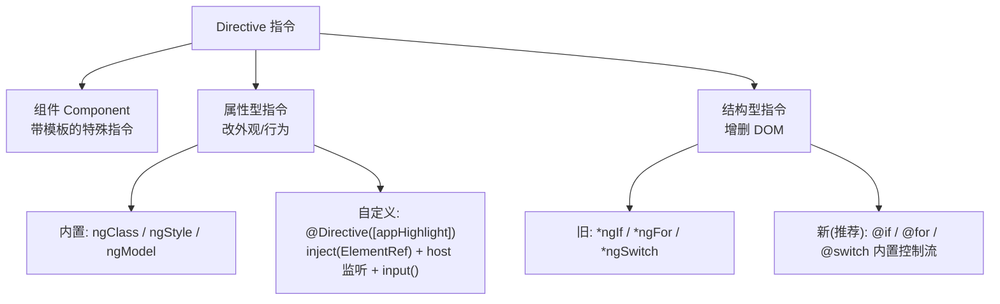

# 05 · 指令（Directives）
> 指令是给 DOM “加能力”的类；分组件、属性型、结构型三类，自定义属性指令用 @Directive + inject + host。

## 📖 知识讲解

在 Angular 里，**指令（Directive）**是带有 `@Directive` / `@Component` 装饰器、用于操作 DOM 的类。共三类：

1. **组件（Components）**——最常用的指令，是“带模板的指令”（`@Component` 继承自 `@Directive`）。它有自己的视图。
2. **属性型指令（Attribute Directives）**——改变元素的外观或行为，不增删 DOM。
   - 内置：`ngClass`、`ngStyle`、`ngModel` 等（来自 `CommonModule` / `FormsModule`）。
   - 自定义：用 `@Directive({ selector: '[appHighlight]' })`，通过 `inject(ElementRef)` 拿宿主、`host` 监听事件、`input()` 接收配置。
3. **结构型指令（Structural Directives）**——通过增删 DOM 改变布局，传统上带 `*` 前缀（`*ngIf` / `*ngFor` / `*ngSwitch`）。**现代 Angular 推荐用内置控制流 `@if` / `@for` / `@switch` 取代它们**（见 04 模块）。

现代写法关键点（本模块自定义指令 `HighlightDirective`）：

- `inject(ElementRef<HTMLElement>)` 取宿主元素，替代构造函数注入。
- `input('yellow', { alias: 'appHighlight' })` 声明 Signal 输入并起别名。
- `@Directive` 的 `host` 字段统一声明 `(mouseenter)` / `(mouseleave)` 事件和 `[style.xxx]` 绑定，替代旧的 `@HostListener` / `@HostBinding`。

## 🔄 流程图 / 原理图



## 💻 代码说明

**`highlight.directive.ts`** —— 自定义属性指令

- `selector: '[appHighlight]'`：以属性形式附着到元素上。
- `private readonly el = inject(ElementRef<HTMLElement>)`：注入宿主元素引用。
- `color = input('yellow', { alias: 'appHighlight' })`：可配置颜色，默认黄色；别名让 `[appHighlight]="'gold'"` 同时充当“开关 + 传参”。
- `host` 字段里 `'(mouseenter)': 'onEnter()'` / `'(mouseleave)': 'onLeave()'` 监听鼠标事件，`onEnter()` 设背景色、`onLeave()` 清空。

**`directives-demo.component.ts` / `.html`** —— 使用方

- 把 `HighlightDirective` 放进组件 `imports`（standalone 用法），模板里即可写 `appHighlight`。
- 演示原生 `[class.is-active]` / `[style.color]` 属性绑定（优先于 ngClass/ngStyle，无需额外引入）。
- 用内置 `@for ... track ... @empty` 渲染列表，并给每个 `<li>` 也挂上 `appHighlight="orange"`。

**如何在 `ng new` 工程中运行：**

1. 创建工程并进入：
   ```bash
   ng new directives-demo --style=css --routing=false
   cd directives-demo
   ```
2. 把 `highlight.directive.ts`、`directives-demo.component.ts`、`directives-demo.component.html` 复制到 `src/app/`。
3. 在 `app.component.ts` 引入：
   ```ts
   import { Component } from '@angular/core';
   import { DirectivesDemoComponent } from './directives-demo.component';

   @Component({
     selector: 'app-root',
     standalone: true,
     imports: [DirectivesDemoComponent],
     template: `<app-directives-demo />`,
   })
   export class AppComponent {}
   ```
4. `ng serve -o`，把鼠标移到文字上观察高亮。

> 也可以用 CLI 生成指令骨架：`ng generate directive highlight`。

## ▶️ 运行方式

```bash
ng serve -o
```

鼠标悬停在带 `appHighlight` 的元素上会变色；点击“切换”按钮观察 class/style 绑定变化。

## ⚠️ 常见坑 / 最佳实践

- **属性指令不要直接操作 DOM 越界**：改宿主样式可以；如需跨平台安全，复杂场景考虑 `Renderer2`，但简单样式直接用 `host` 的 `[style.xxx]` 绑定更声明式。
- **优先用 `[class.x]` / `[style.x]` 绑定**，只有动态对象/多类合并时才用 `ngClass` / `ngStyle`（后者需引入 `CommonModule`）。
- **结构型指令优先用内置控制流**：新项目别再写 `*ngIf` / `*ngFor`，用 `@if` / `@for`。
- 自定义指令 selector 用方括号 `[appHighlight]` 才是属性选择器；忘了括号会变成元素选择器。
- 现代 `input()` 是只读 Signal，读值要加 `()`：`this.color()`。
- standalone 组件使用自定义指令，必须把指令加进该组件的 `imports`，否则模板不识别。

## 🔗 官方文档（angular.dev）

- 指令总览：https://angular.dev/guide/directives
- 属性型指令：https://angular.dev/guide/directives/attribute-directives
- 结构型指令：https://angular.dev/guide/directives/structural-directives
- host 绑定与监听：https://angular.dev/guide/components/host-elements
- `inject()`：https://angular.dev/api/core/inject
- 输入 `input()`：https://angular.dev/guide/components/inputs
