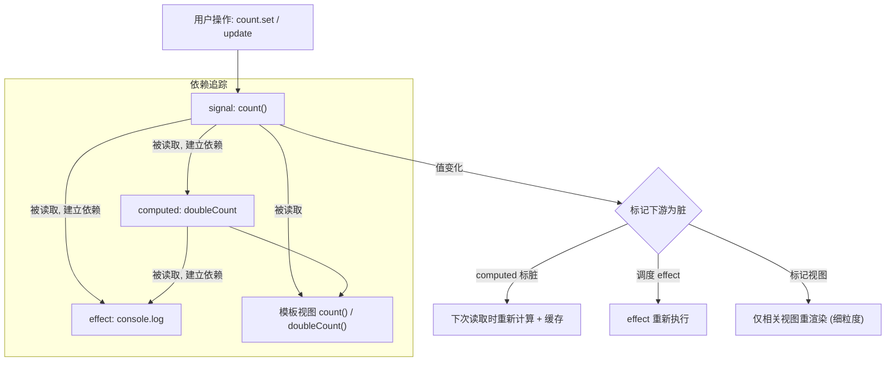

# 06 · 信号响应式（Signals）★
> Signals 是 Angular 的细粒度响应式核心：signal 存值、computed 派生、effect 副作用，依赖自动追踪。

## 📖 知识讲解

**Signal（信号）**是一个“可被订阅其变化的值容器”，是 Angular 现代响应式与变更检测的基石。

- **创建可写信号**：`const count = signal(0)`。
- **读取**：调用它 —— `count()`（**必须加括号**）。读取动作会被自动“依赖追踪”。
- **写入**：
  - `count.set(5)` —— 直接设新值。
  - `count.update(n => n + 1)` —— 基于旧值算新值。
- **派生信号 `computed`**：`const double = computed(() => count() * 2)`。
  - **惰性**：只有被读取时才计算。
  - **缓存（memoized）**：依赖未变时多次读取不重算。
  - **只读**：不能 `set`/`update`。
- **副作用 `effect`**：`effect(() => console.log(count()))`。
  - 首次立即运行一次以收集依赖；之后任一读取过的信号变化就重跑。
  - 必须在**注入上下文**（构造函数 / 字段初始化 / `runInInjectionContext`）中创建。
  - 适合做日志、与 `localStorage`/第三方库同步等；**不要**在 effect 里 `set` 它自己依赖的信号（易死循环）。

**与变更检测的关系**：传统 Zone.js 是“整棵组件树脏检查”，而 Signals 实现**细粒度响应式**——只有真正依赖某信号的视图/computed/effect 才会更新，性能更好，也是 zoneless（无 Zone.js）模式的基础。

## 🔄 流程图 / 原理图



## 💻 代码说明

**`counter.component.ts`**

- `count = signal(0)`：可写信号，作为唯一数据源。
- `doubleCount = computed(() => this.count() * 2)`：派生信号，惰性 + 缓存。
- `parity = computed(...)`：再派生，演示 computed 可层层依赖。
- 构造函数里 `effect(() => console.log(...))`：读取了 `count()` 和 `doubleCount()`，因此它俩任一变化都会重跑并打印日志。
- `increment()/decrement()` 用 `update()`，`reset()` 用 `set()`。
- 模板中 `{{ count() }}`、`{{ doubleCount() }}` —— 读信号都加 `()`。

**如何在 `ng new` 工程中运行：**

1. 创建工程：
   ```bash
   ng new signals-demo --style=css --routing=false
   cd signals-demo
   ```
2. 把 `counter.component.ts` 复制到 `src/app/`（模板用的是内联 `template`，无需额外 html）。
3. 在 `app.component.ts` 引入：
   ```ts
   import { Component } from '@angular/core';
   import { CounterComponent } from './counter.component';

   @Component({
     selector: 'app-root',
     standalone: true,
     imports: [CounterComponent],
     template: `<app-counter />`,
   })
   export class AppComponent {}
   ```
4. `ng serve -o`，点击 ＋1/－1，看页面更新，并打开浏览器控制台看 `[effect]` 日志。

## ▶️ 运行方式

```bash
ng serve -o
```

点击按钮：`count` 与 `doubleCount` 实时变化；浏览器 Console 每次变化打印一条 `[effect]` 日志。

## ⚠️ 常见坑 / 最佳实践

- **读 signal 一定要加 `()`**：`count()` 才是取值，`count` 是函数本身（模板里写 `count` 不会更新）。
- **`computed` 是只读的**：不能对它 `set`/`update`；要可写就用 `signal`。
- **`effect` 别漏依赖**：effect 只追踪它**实际读取过**的信号；放在 `if` 分支里没读到的信号不会触发它。
- **不要在 `effect` 里写它依赖的信号**，否则可能无限循环；确需联动用 `computed` 或 `untracked()`。
- **`effect` 要在注入上下文创建**（构造函数里最稳）；否则报错 `NG0203`。
- 派生计算优先用 `computed` 而不是在模板里写复杂表达式或在 effect 里手动赋值——`computed` 自动缓存、更高效。
- 信号默认用 `===` 判断是否变化；对象引用不变就不触发，更新对象时记得换新引用（或用 `update` 返回新对象）。

## 🔗 官方文档（angular.dev）

- Signals 总览：https://angular.dev/guide/signals
- `signal()`：https://angular.dev/api/core/signal
- `computed()`：https://angular.dev/api/core/computed
- `effect()`：https://angular.dev/api/core/effect
- 信号与变更检测 / zoneless：https://angular.dev/guide/zoneless
