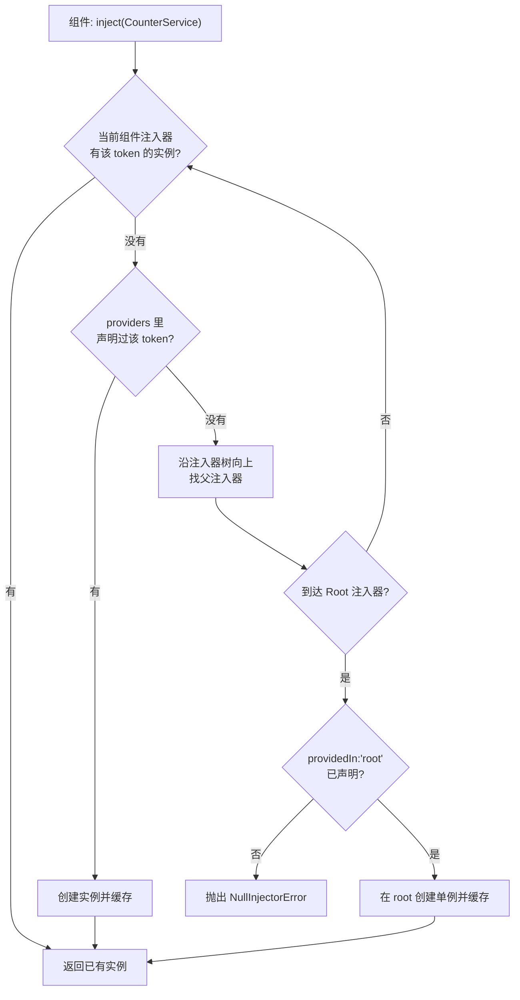
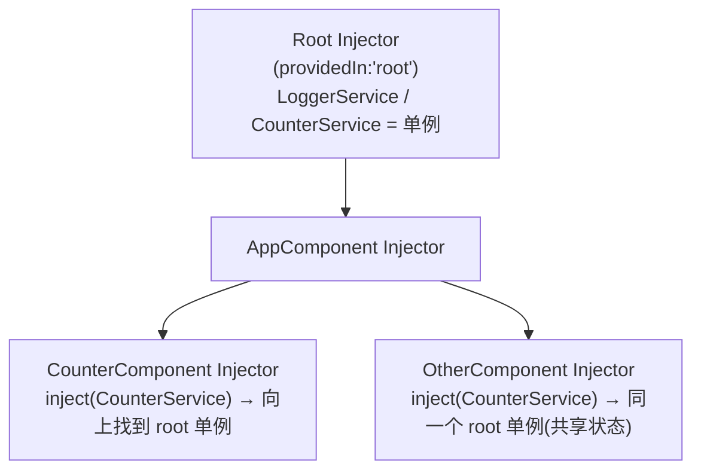

# 07 · 服务与依赖注入（Services & DI）

> 用服务封装业务/状态，再通过依赖注入（DI）把它「送到」需要它的组件里。

## 📖 知识讲解

### 1. 什么是服务（Service）
服务就是一个普通的、可复用的 TypeScript 类，用来封装**与视图无关**的逻辑：业务规则、HTTP 请求、共享状态、日志等。组件负责「展示」，服务负责「干活」，职责分离。

用 `@Injectable()` 装饰器把一个类标记为「可被注入」：

```ts
@Injectable({ providedIn: 'root' })
export class LoggerService {}
```

`providedIn: 'root'` 表示把服务注册到**根注入器**，整个应用共享**同一个实例（单例）**，并且支持 tree-shaking（没人用就不打包）。

### 2. 什么是依赖注入（DI）
你**不需要**自己 `new LoggerService()`。你只是声明「我需要 LoggerService」，Angular 的 **DI 容器（注入器 Injector）** 会负责找到或创建实例，再交给你。好处：

- **解耦**：组件不关心服务如何被创建；
- **可测试**：测试时可注入 Mock 替身；
- **单例共享**：多个组件注入同一个 token，拿到的是同一个实例。

三要素：
- **Token（令牌）**：通常就是类本身，DI 用它当「查找的钥匙」；
- **Provider（提供者）**：告诉注入器「拿到这个 token 该如何造实例」（`providedIn:'root'` 即一种声明）；
- **Injector（注入器）**：真正存放和查找实例的容器。

### 3. 注入器层级（Injector Hierarchy）
注入器是一棵树：

- **Root Injector（根）**：`providedIn:'root'` 的服务住这里，全应用单例；
- **Element/Component Injector（组件级）**：在组件 `providers: [Xxx]` 里声明的服务，每个组件实例一份**独立**实例。

查找规则：组件请求依赖时，**从当前组件注入器开始，沿树向上**找，直到根；找到就用，找不到就报 `NullInjectorError`。

### 4. 两种注入写法
```ts
// ✅ 现代写法：inject() 函数（推荐）
private readonly logger = inject(LoggerService);

// 传统写法：构造函数注入（依然有效）
constructor(private logger: LoggerService) {}
```
`inject()` 更灵活（可用于字段初始化、函数、继承场景），是 Angular 14+ 主推方式。

## 🔄 流程图 / 原理图

### DI 解析流程（组件请求依赖 → 注入器查找 → 返回单例）



### 注入器层级树



## 💻 代码说明

- **`logger.service.ts`**：无状态服务示例。`@Injectable({providedIn:'root'})` 注册为根单例，封装 `log/error/getHistory`。
- **`counter.service.ts`**：有状态服务示例。用 `signal()` 保存计数，`asReadonly()` 对外只读，`computed()` 派生 `doubled/isEven`，用方法 `increment/decrement/reset` 修改。
- **`counter.component.ts`**：组件用 `inject()` 注入两个服务（并注释展示构造函数注入对比），模板里直接 `counter.count()` 读取 signal，新控制流 `@for` 渲染日志。

### 如何在 ng new 工程中放置运行
```bash
ng new di-demo            # 生成 Angular 19 standalone 工程
cd di-demo
# 把本目录三个文件拷到 src/app/ 下
```
然后在 `src/app/app.component.ts` 中引入并使用组件：
```ts
import { Component } from '@angular/core';
import { CounterComponent } from './counter.component';

@Component({
  selector: 'app-root',
  standalone: true,
  imports: [CounterComponent],   // standalone 组件直接 imports
  template: `<app-counter />`,
})
export class AppComponent {}
```

## ▶️ 运行方式
```bash
npm install
ng serve -o      # 浏览器打开 http://localhost:4200
```
点击 +1/-1/重置，观察计数与日志；服务为单例，状态在组件间共享。

## ⚠️ 常见坑 / 最佳实践
- **不要手动 `new` 服务**：那样拿不到 DI 注入的依赖，也破坏单例。
- **`providedIn:'root'` vs 组件 `providers`**：root 是全应用单例；写进组件 `providers:[X]` 会为该组件**每个实例**创建独立实例（适合需要隔离状态的场景）。
- **`inject()` 调用时机**：只能在「注入上下文」中调用（字段初始化、constructor、`runInInjectionContext` 等），不能随便在异步回调里裸调。
- **状态服务对外只读**：用 `asReadonly()` 暴露 signal，避免组件直接 `set` 破坏封装。
- **`NullInjectorError`**：通常是忘了给服务加 `@Injectable` 或 token 没被任何 provider 提供。

## 🔗 官方文档
- 依赖注入概览：https://angular.dev/guide/di
- 创建可注入服务：https://angular.dev/guide/di/creating-injectable-service
- 注入器层级：https://angular.dev/guide/di/hierarchical-dependency-injection
- `inject()` 函数：https://angular.dev/api/core/inject
- Signals：https://angular.dev/guide/signals
