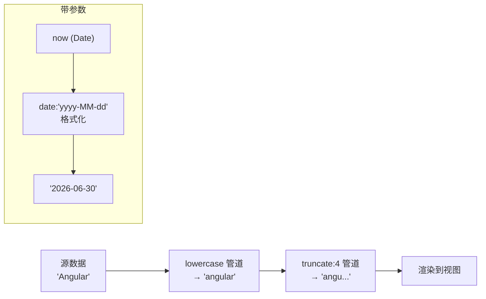
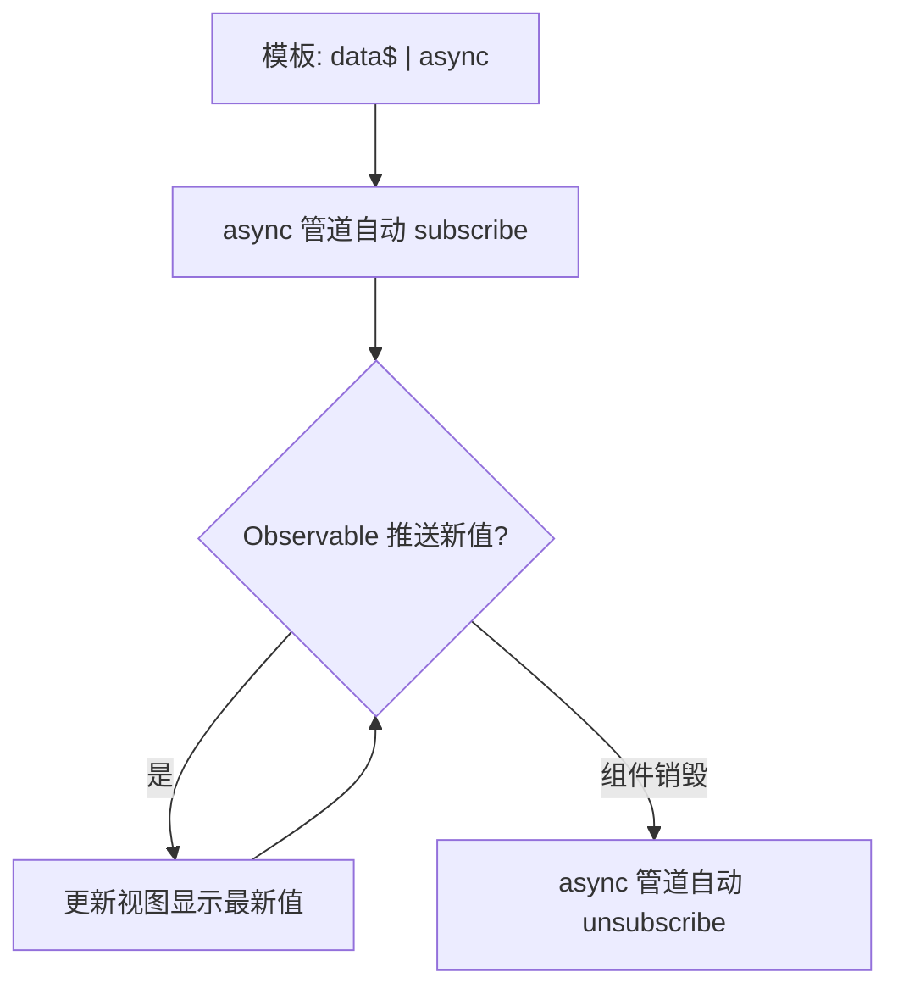

# 08 · 管道（Pipes）

> 管道在模板里「转换显示值」——格式化日期、货币、文本等，不改动源数据。

## 📖 知识讲解

### 1. 什么是管道
管道是模板里的一个「转换函数」，用 `|` 符号调用：

```html
{{ value | pipeName }}
```

它接收左边的值，返回转换后的新值用于显示，**不会修改原始数据**。

### 2. 常用内置管道
| 管道 | 作用 | 示例 |
|------|------|------|
| `date` | 日期格式化 | `{{ now \| date:'yyyy-MM-dd' }}` |
| `currency` | 货币 | `{{ p \| currency:'CNY' }}` |
| `uppercase` / `lowercase` | 大小写 | `{{ s \| uppercase }}` |
| `number`(decimal) | 数字小数位/千分位 | `{{ pi \| number:'1.0-2' }}` |
| `percent` | 百分比 | `{{ r \| percent }}` |
| `slice` | 截取数组/字符串 | `{{ arr \| slice:0:2 }}` |
| `json` | 转 JSON（调试） | `{{ obj \| json }}` |
| `async` | 自动订阅 Observable/Promise | `{{ data$ \| async }}` |

> Angular 19 中这些管道由 `@angular/common` 提供，组件需 `imports: [CommonModule]`（或单独导入对应管道）。

### 3. 带参数 & 链式
- **带参数**：用冒号传参，可多个：`{{ now | date:'yyyy-MM-dd HH:mm' }}`、`{{ pi | number:'1.0-2' }}`。
- **链式**：从左到右依次执行：`{{ name | lowercase | truncate:4 }}`（先转小写，再截断）。

### 4. 自定义管道
实现 `PipeTransform` 接口的 `transform()` 方法即可：

```ts
@Pipe({ name: 'truncate', standalone: true })
export class TruncatePipe implements PipeTransform {
  transform(value: string, limit = 20, ellipsis = '…'): string { /* ... */ }
}
```
`transform` 的第一个参数是管道左值，后续参数对应 `:arg1:arg2`。

### 5. async 管道
`async` 自动 **订阅** Observable/Promise，取出最新值显示；组件销毁时 **自动退订**，避免内存泄漏，无需手写 `subscribe()/unsubscribe()`。

## 🔄 流程图 / 原理图

### 数据经过管道链的转换流程



### async 管道订阅/退订生命周期



## 💻 代码说明

- **`truncate.pipe.ts`**：自定义纯管道，截断字符串，支持 `:limit:ellipsis` 两个参数；`pure:true`（默认）输入不变就不重算。
- **`pipes-demo.component.ts`**：在一个组件里演示内置管道（date/currency/uppercase/number/percent/slice/json）、链式、带参数、自定义 `truncate`，以及 `interval(1000)` + `async` 管道。

### 如何在 ng new 工程中放置运行
```bash
ng new pipes-demo
cd pipes-demo
# 把 truncate.pipe.ts 和 pipes-demo.component.ts 拷到 src/app/
```
在 `app.component.ts` 中使用：
```ts
import { Component } from '@angular/core';
import { PipesDemoComponent } from './pipes-demo.component';

@Component({
  selector: 'app-root',
  standalone: true,
  imports: [PipesDemoComponent],
  template: `<app-pipes-demo />`,
})
export class AppComponent {}
```

## ▶️ 运行方式
```bash
npm install
ng serve -o
```
页面会展示各类管道结果，底部计时器每秒自增（async 管道驱动）。

## ⚠️ 常见坑 / 最佳实践
- **pure vs impure 管道**：
  - 纯管道（`pure:true`，默认）：仅当**输入引用变化**时才重新执行，性能最优。注意：直接 push 到同一个数组**不会**触发纯管道更新（引用没变）。
  - 非纯管道（`pure:false`）：每次变更检测都执行，慎用（易成性能瓶颈）。
- **`async` 管道**：务必让它自己订阅/退订；不要又 `async` 又手动 `subscribe` 同一个流，否则会触发**两次**订阅。
- **别在管道里做副作用**：`transform` 应是纯函数，不要发请求、改全局状态。
- **内置管道忘记 import**：standalone 组件要 `imports:[CommonModule]`，否则模板报「找不到管道」。
- **`json` 仅用于调试**，不要用于生产展示。

## 🔗 官方文档
- 管道概览：https://angular.dev/guide/templates/pipes
- 自定义管道：https://angular.dev/guide/templates/pipes#creating-custom-pipes
- `AsyncPipe`：https://angular.dev/api/common/AsyncPipe
- `DatePipe`：https://angular.dev/api/common/DatePipe
- 内置管道 API 列表：https://angular.dev/api/common
