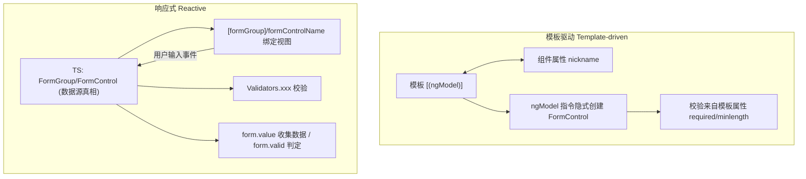

# 09 · 表单（Forms：模板驱动 + 响应式）

> Angular 提供两种表单方案：模板驱动（简单）与响应式（强大可测）。

## 📖 知识讲解

### 1. 两种表单总览
| | 模板驱动 Template-driven | 响应式 Reactive |
|---|---|---|
| 模块 | `FormsModule` | `ReactiveFormsModule` |
| 表单模型 | 模板里 `ngModel` **隐式**创建 | TS 里 `FormGroup/FormControl` **显式**创建 |
| 校验 | 模板属性 `required`/`minlength` | TS `Validators.xxx` |
| 数据流 | 双向绑定 `[(ngModel)]` | 单向：模型 → 视图，事件回写模型 |
| 适合 | 简单表单、原型 | 复杂/动态表单、需单元测试 |

### 2. 模板驱动表单
```html
<form #f="ngForm" (ngSubmit)="onSubmit()">
  <input name="nickname" [(ngModel)]="nickname" required minlength="2" #nick="ngModel">
</form>
```
- `[(ngModel)]`：双向绑定到组件普通属性；
- `name` 必填：`ngModel` 据此注册控件；
- `#nick="ngModel"`：把控件导出，用于读 `nick.invalid/nick.touched`。

### 3. 响应式表单
```ts
form = this.fb.group({
  username: ['', [Validators.required, Validators.minLength(3)]],
  email:    ['', [Validators.required, Validators.email]],
});
```
模板里：
```html
<form [formGroup]="form" (ngSubmit)="onSubmit()">
  <input formControlName="username">
</form>
```
- `FormControl`：单字段（值 + 校验状态）；
- `FormGroup`：整张表单；
- `FormBuilder`：`fb.group({...})` 简化构建；
- `Validators`：内置校验器，可数组组合。

### 4. 校验状态（两种表单通用）
每个控件/表单都有这些布尔状态：
- `valid` / `invalid`：是否通过校验；
- `pristine` / `dirty`：值是否被改动过；
- `untouched` / `touched`：是否失焦过（被「碰过」）；
- `errors`：具体错误对象，如 `{ required: true, minlength: {...} }`。

常用模式：**`invalid && touched`** 才显示错误提示，避免一进页面就满屏报红。

## 🔄 流程图 / 原理图

### 两种表单的数据流对比



## 💻 代码说明

- **`reactive-form.component.ts` / `.html`**：响应式表单核心示例。`FormBuilder` 构建含 username/email/age 的 `FormGroup`，`Validators` 校验，模板用 `[formGroup]`/`formControlName` 绑定，`invalid && touched` 显示错误，`onSubmit` 读取 `form.value`，无效时 `markAllAsTouched()` 暴露所有错误。
- **`template-driven.component.ts`**：模板驱动简短示例。`FormsModule` + `[(ngModel)]` + 原生 `required/minlength`，`#f="ngForm"` 读取整表状态。

### 如何在 ng new 工程中放置运行
```bash
ng new forms-demo
cd forms-demo
# 把 09-forms 下 4 个文件拷到 src/app/
```
在 `app.component.ts` 中同时使用两种表单：
```ts
import { Component } from '@angular/core';
import { ReactiveFormComponent } from './reactive-form.component';
import { TemplateDrivenComponent } from './template-driven.component';

@Component({
  selector: 'app-root',
  standalone: true,
  imports: [ReactiveFormComponent, TemplateDrivenComponent],
  template: `
    <app-reactive-form />
    <hr />
    <app-template-driven />
  `,
})
export class AppComponent {}
```

## ▶️ 运行方式
```bash
npm install
ng serve -o
```
分别填写两张表单，观察错误提示与提交结果；故意留空/输错可看到校验。

## ⚠️ 常见坑 / 最佳实践
- **响应式表单必须 `imports: [ReactiveFormsModule]`**；模板驱动必须 `imports: [FormsModule]`。漏了会报「Can't bind to 'formGroup'/'ngModel'」。
- **错误提示时机**：用 `invalid && touched`（或 `dirty`）控制，别只看 `invalid`，否则初始就报红。
- **提交时强制显示错误**：表单无效时调用 `form.markAllAsTouched()`，让用户看到所有问题。
- **模板驱动里 `ngModel` 必须配 `name`**，否则控件不会注册进表单。
- **不要混用**：同一字段别同时 `formControlName` 和 `[(ngModel)]`。
- **可测试性**：响应式表单的模型在 TS 中，单元测试可直接 `form.setValue()` 断言 `form.valid`，比模板驱动更易测。

## 🔗 官方文档
- 表单总览：https://angular.dev/guide/forms
- 响应式表单：https://angular.dev/guide/forms/reactive-forms
- 模板驱动表单：https://angular.dev/guide/forms/template-driven-forms
- 表单校验：https://angular.dev/guide/forms/form-validation
- `Validators` API：https://angular.dev/api/forms/Validators
