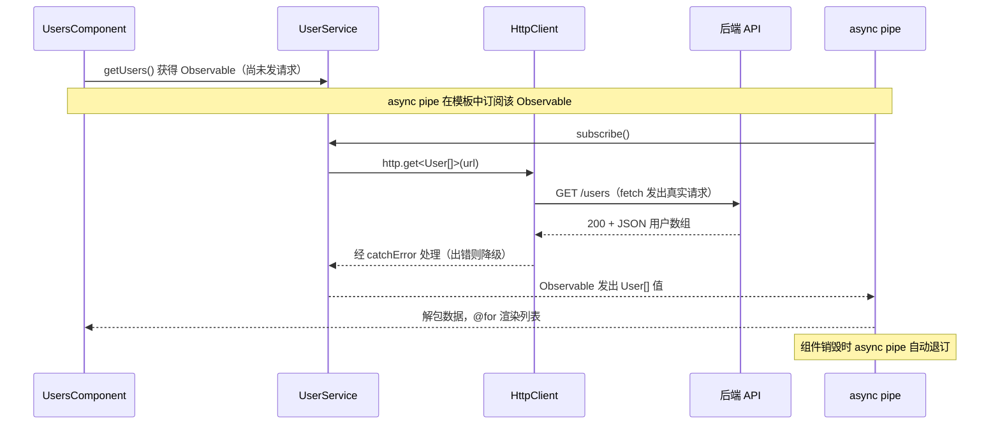

# 10 · HTTP 请求（HttpClient）
> 用 Angular 内置的 HttpClient 发起 REST 请求，以 Observable + async pipe 的响应式方式消费数据。

## 📖 知识讲解

Angular 通过 `@angular/common/http` 提供 `HttpClient` 来发起 HTTP 请求。现代（v15+）用法的几个要点：

- **函数式注册**：在 `app.config.ts` 里写 `provideHttpClient(withFetch())`，取代旧的 `HttpClientModule`。`withFetch()` 让底层用浏览器原生 `fetch` 而非 `XMLHttpRequest`，对 SSR 更友好。
- **注入**：用 `inject(HttpClient)` 在 Service 里获取实例（替代构造函数注入）。
- **返回 Observable**：`http.get/post/put/delete()` 都返回 **Observable**。它是「冷流（cold）」——**惰性**的，只有被订阅时请求才真正发出。
- **消费方式**：
  - 模板里 `users$ | async`（推荐）：自动订阅 + 自动退订，无内存泄漏。
  - 代码里 `.subscribe(...)`：需手动管理订阅生命周期。
- **错误处理**：用 RxJS 的 `catchError` 拦截 4xx/5xx/网络错误，可降级返回兜底数据或重新抛出。
- **类型安全**：`get<User[]>(...)` 用泛型声明响应体类型，得到强类型的数据。

## 🔄 流程图 / 原理图



## 💻 代码说明

**`app.config.ts`** —— 在应用级 providers 注册 HttpClient。**忘记这一步会报 `No provider for HttpClient`**。放置位置：`ng new` 生成的工程里就有 `src/app/app.config.ts`，把 `provideHttpClient(withFetch())` 加进 `providers` 数组即可。

**`user.service.ts`** —— `@Injectable({ providedIn: 'root' })` 声明全应用单例；`inject(HttpClient)` 注入；`getUsers()` 返回 `Observable<User[]>`，`.pipe(catchError(...))` 做错误兜底。放到 `src/app/user.service.ts`（或用 `ng g service user` 生成后替换内容）。

**`users.component.ts`** —— `imports: [AsyncPipe]` 让模板能用 async pipe；`users$` 是未订阅的 Observable；`loading` 用 signal 管理，配合 `finalize` 在流结束时关掉加载态。放到 `src/app/users.component.ts`。

**`users.component.html`** —— `@if (users$ | async; as users)` 解包；`@for ... track` + `@empty` 渲染列表；`@if (loading())` 显示加载提示。放到 `src/app/users.component.html`。

把 `UsersComponent` 加进路由或在 `AppComponent` 模板里 `<app-users />` 即可看到效果。

## ▶️ 运行方式

```bash
ng new my-app           # 选 standalone（v17+ 默认）
cd my-app
# 1) 将上述 4 个文件内容放入 src/app/ 下对应文件
# 2) 确认 app.config.ts 已含 provideHttpClient(withFetch())
# 3) 在 app.component.html 加 <app-users /> 并 import UsersComponent
ng serve                # 打开 http://localhost:4200
```

## ⚠️ 常见坑 / 最佳实践

- **忘记 `provideHttpClient`**：最高频错误，直接报 `No provider for HttpClient`。
- **Observable 是冷流**：拿到 `getUsers()` 的返回值若无人订阅，请求根本不会发出。务必用 async pipe 或 subscribe。
- **手动 subscribe 要退订**：在组件里 `.subscribe()` 必须在 `ngOnDestroy` 退订（或用 `takeUntilDestroyed()`），否则内存泄漏。优先用 async pipe 免去这层心智负担。
- **错误处理别吞掉**：`catchError` 里至少 `console.error` 或上报，避免静默失败难以排查。
- **不要在模板里多次 `| async` 同一个流**：每次 async 都会触发一次订阅 = 多次请求。用 `as` 解包一次复用。

## 🔗 官方文档

- HttpClient 总览：https://angular.dev/guide/http
- 设置 HttpClient：https://angular.dev/guide/http/setup
- 发起请求：https://angular.dev/guide/http/making-requests
- AsyncPipe：https://angular.dev/api/common/AsyncPipe
