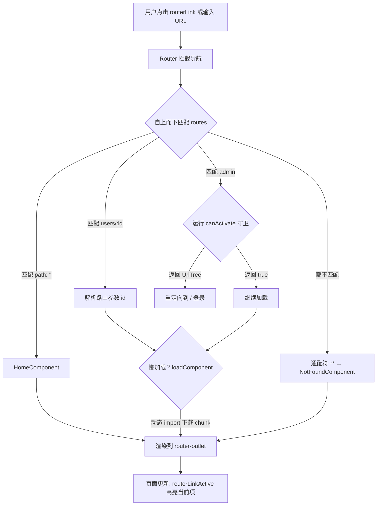

# 11 · 路由（Routing）
> 用 provideRouter 配置路由表，通过 RouterOutlet/routerLink 实现单页应用的导航、参数、懒加载与守卫。

## 📖 知识讲解

Angular Router 把「URL 地址」映射到「要渲染的组件」。现代（v15+）核心要点：

- **注册**：`app.config.ts` 里 `provideRouter(routes, ...features)`，取代旧的 `RouterModule.forRoot()`。
- **路由表 `Routes`**：每条 `{ path, component }`（或 `loadComponent`）。匹配**自上而下、先到先得**。
  - `path: ''` 根路径；`path: 'users/:id'` 含动态参数；`path: '**'` 通配符（404，必须放最后）。
- **占位与导航**：
  - `<router-outlet />` 渲染匹配到的组件。
  - `routerLink` 做客户端导航（不刷新整页）；`routerLinkActive="active"` 在激活时加高亮类。
- **读取路由参数**：
  - 现代：`withComponentInputBinding()` + 组件里 `id = input.required<string>()`，参数自动变成 `@Input()`。
  - 传统：`inject(ActivatedRoute)` 再订阅 `paramMap`。
- **懒加载**：`loadComponent: () => import('...').then(m => m.X)` 把组件拆成独立 chunk，按需下载，优化首屏。`loadChildren` 则懒加载一组子路由。
- **守卫**：`canActivate: [authGuard]`，`authGuard` 是 `CanActivateFn` 函数式守卫，返回 `true`/`false`/`UrlTree`（重定向）。

## 🔄 流程图 / 原理图



## 💻 代码说明

**`app.routes.ts`** —— 路由表：含根路由、参数路由 `users/:id`（懒加载）、守卫路由 `admin`、`loadChildren` 子路由、通配符 `**`。放到 `src/app/app.routes.ts`。注意 `**` 必须在最后。

**`app.config.ts`** —— `provideRouter(routes, withComponentInputBinding(), withViewTransitions())`。`withComponentInputBinding()` 让路由参数自动绑定为组件 `@Input()`。放到 `src/app/app.config.ts`。

**`auth.guard.ts`** —— `CanActivateFn` 函数式守卫，`inject(Router)` 后按登录态返回 `true` 或 `createUrlTree` 重定向。放到 `src/app/auth.guard.ts`（或 `ng g guard auth --functional`）。

**`user-detail.component.ts`** —— 懒加载的目标组件，用 `input.required<string>()` 接收路由参数 `id`。放到 `src/app/user-detail.component.ts`。

**`app.component.html`** —— 顶部 `nav` 用 `routerLink` + `routerLinkActive` 导航，底部 `<router-outlet />` 渲染当前路由组件。放到 `src/app/app.component.html`。
> 注意：`app.component.ts` 的 `imports` 数组需加入 `RouterOutlet, RouterLink, RouterLinkActive`，模板里的这些指令才生效。

## ▶️ 运行方式

```bash
ng new my-app --routing   # 生成时带上路由骨架
cd my-app
# 1) 将上述文件放入 src/app/ 对应位置
# 2) 补齐 home/admin/not-found/settings 等被引用的组件（可先用占位组件）
# 3) app.component.ts 的 imports 加 RouterOutlet, RouterLink, RouterLinkActive
ng serve                  # 访问 http://localhost:4200，点击导航切换路由
```

## ⚠️ 常见坑 / 最佳实践

- **通配符 `**` 没放最后**：会抢先匹配，导致后面的路由永远进不去。
- **忘记导入路由指令**：standalone 组件模板用 `router-outlet`/`routerLink` 前，组件 `imports` 必须包含 `RouterOutlet`/`RouterLink`，否则不渲染/不导航。
- **根路径一直高亮**：`routerLinkActive` 对 `/` 要配 `[routerLinkActiveOptions]="{ exact: true }"`。
- **守卫忘记返回值**：`CanActivateFn` 必须返回 `boolean`/`UrlTree`/对应的 Observable/Promise，否则导航行为不确定。
- **懒加载路径写错**：`loadComponent` 的 import 路径与导出名要对得上，否则运行时报错且只在访问时才暴露。
- **优先用 `withComponentInputBinding`**：比手动订阅 `ActivatedRoute.paramMap` 更简洁，也避免忘记退订。

## 🔗 官方文档

- 路由总览：https://angular.dev/guide/routing
- 定义路由：https://angular.dev/guide/routing/define-routes
- 读取路由状态 / 参数：https://angular.dev/guide/routing/read-route-state
- 懒加载：https://angular.dev/guide/routing/define-routes#lazily-loaded-components
- 路由守卫：https://angular.dev/guide/routing/route-guards
- provideRouter API：https://angular.dev/api/router/provideRouter
