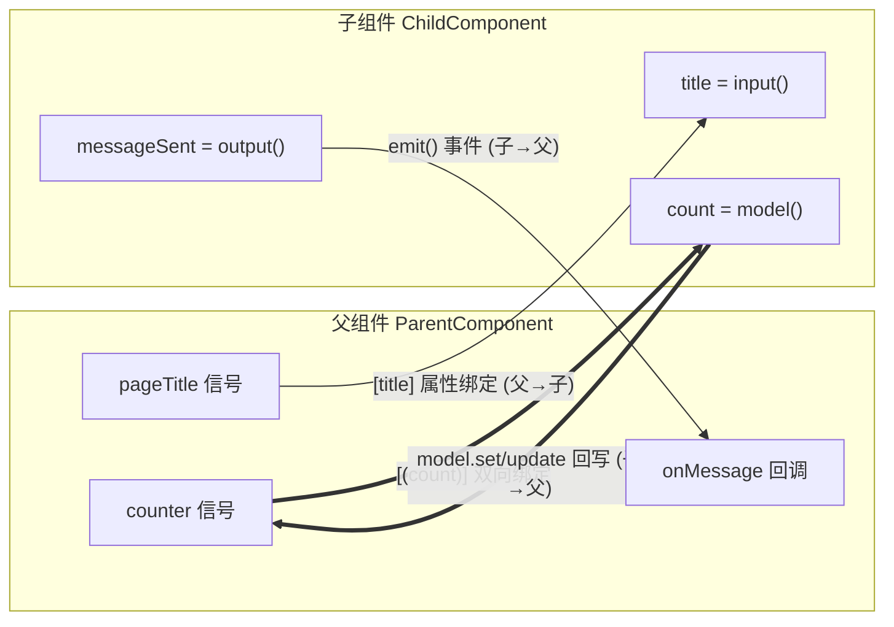

# 13 · 组件通信 Input / Output（Component Communication）

> 用现代 Angular 19 的 `input()` / `output()` / `model()` 实现父子组件之间的数据传递与双向绑定。

## 📖 知识讲解

父子组件通信是 Angular 的核心。Angular 17.1+ 引入、19 中成为推荐写法的**信号化 API**取代了老的装饰器：

| 用途 | 旧写法（装饰器） | 新写法（信号函数） |
| --- | --- | --- |
| 父 → 子 传数据 | `@Input() title: string` | `title = input<string>('默认值')` |
| 父 → 子 必填 | `@Input({ required: true })` | `title = input.required<string>()` |
| 子 → 父 发事件 | `@Output() ev = new EventEmitter()` | `ev = output<T>()` |
| 双向绑定 | `@Input() + @Output()` 配对 | `count = model<number>(0)` |

核心区别与要点：

- **input() 返回只读信号**：在 TS 和模板里读取值都要**加括号调用** `title()`，不能写成 `title`。
- **input.required()** 没有默认值，父组件必须传，否则报错。
- **output() 返回 `OutputEmitterRef`**：用 `.emit(payload)` 发送，不再 `new EventEmitter()`。
- **model() 是可写信号**：既能读 `count()`，也能写 `count.set(x)` / `count.update(fn)`，写入会自动同步回父组件。父组件用 `[(count)]` 语法绑定。
- `[(prop)]` 是语法糖，等价于 `[prop]="x"` + `(propChange)="x.set($event)"`。

## 🔄 流程图 / 原理图



## 💻 代码说明（逐段 + 放置方式）

`ng new ng-demo --standalone` 生成工程后，把本目录文件放到 `src/app/` 下。

- **child.component.ts**
  - `title = input<string>('默认标题')`：可选输入，父不传用默认值。
  - `userName = input.required<string>()`：必填输入。
  - `count = model<number>(0)`：双向模型，`increment()` 里 `this.count.update(v => v + 1)` 修改后自动同步父组件。
  - `messageSent = output<string>()`：`notifyParent()` 里 `this.messageSent.emit(...)` 向上发事件。
  - 模板中读取信号一律加 `()`：`{{ title() }}`、`{{ count() }}`。

- **parent.component.ts / parent.component.html**
  - `imports: [ChildComponent]`：standalone 组件必须导入用到的子组件。
  - 模板里 `[title]`、`[userName]` 传值，`[(count)]="counter"` 双向，`(messageSent)="onMessage($event)"` 收事件。
  - `$event` 即子组件 `emit` 的载荷。

把 `ParentComponent` 作为根组件 `bootstrap`，或在 `app.component.html` 里写 `<app-parent />` 即可看到效果。

## ▶️ 运行方式

```bash
ng new ng-demo --standalone
cd ng-demo
# 复制 child/parent 文件到 src/app/，在 app.component.ts 的 imports 加入 ParentComponent，
# 并在 app.component.html 放 <app-parent />
ng serve -o
```

浏览器打开 `http://localhost:4200`，点击子组件按钮观察 counter 双向同步、消息上报。

## ⚠️ 常见坑 / 最佳实践

- **忘记加 `()`**：`input()`/`model()` 返回信号，写 `{{ title }}` 只会显示函数本身。模板和 TS 都要 `title()`。
- **必填 input 不传**：`input.required()` 必须由父组件提供绑定，否则运行时报错。
- **新旧混用**：不要在同一个属性上同时用 `@Input()` 和 `input()`；迁移时整体替换。
- **model 写入用方法**：信号不能 `count = 5`，要 `count.set(5)` 或 `count.update(fn)`。
- **双向绑定命名约定**：`model('x')` 自动生成 `xChange` 输出，`[(x)]` 才能工作。
- 优先用信号 API，便于与 `computed`/`effect` 联动、获得更好的变更检测性能。

## 🔗 官方文档

- Inputs：https://angular.dev/guide/components/inputs
- Outputs：https://angular.dev/guide/components/outputs
- Model inputs（双向绑定）：https://angular.dev/guide/signals/model
- Signals：https://angular.dev/guide/signals
