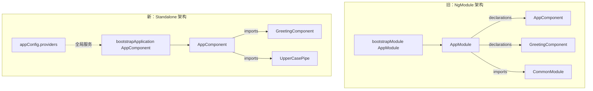

# 14 · 独立组件 Standalone Components

> Angular 19 起组件默认独立（standalone），告别 NgModule，组件自己 `imports` 依赖、用 `bootstrapApplication` 启动。

## 📖 知识讲解

**Standalone 组件**是不依附于任何 `NgModule` 的组件。它把"自己需要哪些依赖"直接写在 `@Component.imports` 里，实现自包含。

- **Angular 19 起 `standalone: true` 是默认值**，无需再显式声明（旧版本需要手写）。
- **不再需要 `NgModule`**：删除 `app.module.ts`、`@NgModule({ declarations, imports })` 这套样板。
- **组件自己声明依赖**：用到子组件、指令、管道，都要在自己的 `imports` 数组里列出。
- **用 `bootstrapApplication(AppComponent, appConfig)` 启动**，取代 `platformBrowserDynamic().bootstrapModule(AppModule)`。
- **全局 provider 写在 `ApplicationConfig.providers`**：如 `provideRouter()`、`provideHttpClient()`。

**对比旧 NgModule 架构：**

| 维度 | NgModule 架构 | Standalone 架构 |
| --- | --- | --- |
| 组织单位 | NgModule 聚合多个组件 | 组件即最小单元，自包含 |
| 声明依赖 | 在 module 的 `declarations` / `imports` | 在组件自己的 `imports` |
| 启动 | `bootstrapModule(AppModule)` | `bootstrapApplication(AppComponent)` |
| 懒加载 | `loadChildren` 加载模块 | `loadComponent` 直接加载组件 |
| Tree-shaking | 模块粒度，较粗 | 组件粒度，更彻底 |

**迁移优势**：心智更简单（无需理解 module 边界）、tree-shaking 更精细、懒加载更直接（按组件而非按模块）、模板里用到什么一眼可知。

## 🔄 流程图 / 原理图



## 💻 代码说明（逐段 + 放置方式）

`ng new ng-demo --standalone` 默认生成的就是 standalone 工程。把本目录文件放到 `src/` 与 `src/app/`：

- **main.ts**（放 `src/main.ts`）
  - `appConfig: ApplicationConfig`：全局 providers 写这里（路由、HttpClient 等）。
  - `bootstrapApplication(AppComponent, appConfig)`：启动根组件，无 NgModule。

- **app.component.ts**（放 `src/app/app.component.ts`）
  - `imports: [GreetingComponent, UpperCasePipe]`：**关键** —— 用到的子组件和管道都要在这里导入，否则模板报错。
  - 模板里 `<app-greeting>` 用到子组件，`{{ framework | uppercase }}` 用到管道。

- **greeting.component.ts**（放 `src/app/greeting.component.ts`）
  - 一个自包含子组件，`name = input<string>()` 接收输入，不依赖任何 module。

## ▶️ 运行方式

```bash
ng new ng-demo --standalone   # Angular 19 默认 standalone
cd ng-demo
# 用本目录的 main.ts / app.component.ts 覆盖，并新增 greeting.component.ts
ng serve -o
```

打开 `http://localhost:4200`，看到问候组件输出和大写管道效果即成功。

## ⚠️ 常见坑 / 最佳实践

- **忘记在 `imports` 里声明依赖**：最常见错误。用了 `<app-greeting>` 却没 `imports: [GreetingComponent]`，会报 `is not a known element`；用了 `| uppercase` 没导入 `UpperCasePipe` 会报 pipe 找不到。
- **还在写 `standalone: true`**：Angular 19 默认即 true，多写无害但冗余；想显式声明非独立才需 `standalone: false`。
- **把全局 provider 写进组件**：路由、HttpClient 等应放 `appConfig.providers`，而非每个组件重复声明。
- **混用 CommonModule**：standalone 下按需导入 `NgIf`/`NgFor` 已被新控制流 `@if`/`@for` 取代，常用管道单独 import 即可，不必整包 `CommonModule`。
- **懒加载用 `loadComponent`**：`{ path: 'x', loadComponent: () => import('./x.component').then(m => m.XComponent) }`。

## 🔗 官方文档

- Standalone 组件总览：https://angular.dev/guide/components/importing
- bootstrapApplication：https://angular.dev/api/platform-browser/bootstrapApplication
- ApplicationConfig：https://angular.dev/api/core/ApplicationConfig
- 从 NgModule 迁移：https://angular.dev/reference/migrations/standalone
