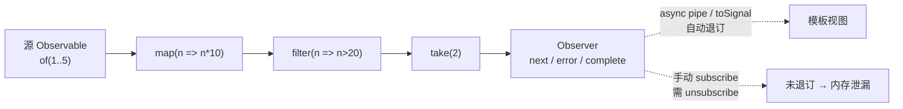
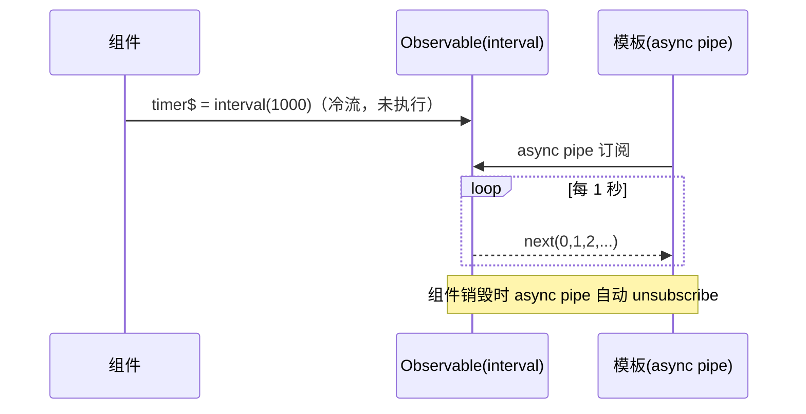

# 15 · RxJS 入门 Observables

> RxJS 用 Observable 描述「随时间推送的数据流」；在 Angular 中优先用 async pipe / toSignal 订阅，避免手动退订导致的内存泄漏。

## 📖 知识讲解

**Observable（可观察对象）** 是一个"随时间产生多个值"的数据源，三大特征：

- **冷流（cold）**：默认惰性，**只有被订阅才开始执行**，每个订阅者独立执行一份（如 `of`、`interval`）。
- **惰性（lazy）**：不订阅就什么都不发生。
- **需要订阅**：调用 `.subscribe(observer)` 才会启动。

**核心概念：**

| 概念 | 说明 |
| --- | --- |
| Observable | 数据流本身 |
| Observer | 接收者，含 `next` / `error` / `complete` 三个回调 |
| Subscription | 订阅句柄，`.unsubscribe()` 取消订阅释放资源 |
| 操作符 Operators | `pipe()` 里串联的纯函数，对流做变换 |
| Subject | 多播热流，既是 Observable 又是 Observer |
| BehaviorSubject | 带"当前值"的 Subject，订阅即收到最新值 |

**常用操作符**：`map`（映射）、`filter`（过滤）、`take(n)`（取前 n 个后完成）、`debounceTime`（防抖，常用于搜索框）、`switchMap`（切换到新内层流并取消上一个，常用于依赖前值的请求）。

**冷流 vs 热流**：冷流每次订阅从头执行（如 HTTP 请求）；热流（Subject / BehaviorSubject）多个订阅者共享同一份发射。

**与 Angular / Signals 的关系：**

- **async pipe**（`| async`）：模板中自动 `subscribe` 取值，并在组件销毁时**自动 unsubscribe**，是首选。
- **toSignal(obs$)**：把 Observable 转成只读信号，模板里像信号一样 `xxx()` 读取，自动退订。
- **toObservable(sig)**：把信号转回 Observable，供操作符管道使用。

## 🔄 流程图 / 原理图





## 💻 代码说明（逐段 + 放置方式）

把 `rxjs-demo.component.ts` 放到 `src/app/`（RxJS 随 Angular 已内置，无需额外安装）：

- **导入**：`of/from/interval/BehaviorSubject` 来自 `rxjs`，`map/filter/take` 来自 `rxjs/operators`；`AsyncPipe` 来自 `@angular/common`，`toSignal/takeUntilDestroyed` 来自 `@angular/core/rxjs-interop`。
- **`timer$ = interval(1000)`**：冷流，模板用 `{{ timer$ | async }}` 订阅，自动退订。
- **`BehaviorSubject<number>(0)`**：`increment()` 用 `.next(value+1)` 推新值；`count$` 暴露只读流给模板。
- **`countSignal = toSignal(count$, { initialValue: 0 })`**：把流转信号，`{{ countSignal() }}` 读取。
- **`ngOnInit` 里的 4 段**：
  1. `of(...).pipe(map, filter, take)` 演示操作符管道（输出 30、40）。
  2. `from([...])` 把数组转流并在 `complete` 时收集结果。
  3. `interval(2000).pipe(takeUntilDestroyed(destroyRef))` —— **推荐的手动订阅自动退订**写法。
  4. `this.sub = interval(3000).subscribe(...)` —— 传统写法，必须在 `ngOnDestroy` 里 `this.sub.unsubscribe()`。

## ▶️ 运行方式

```bash
ng new ng-demo --standalone
cd ng-demo
# 复制 rxjs-demo.component.ts 到 src/app/
# 在根组件 imports 加入 RxjsDemoComponent，模板放 <app-rxjs-demo />
ng serve -o
```

打开 `http://localhost:4200`，看页面计时与计数，并打开浏览器控制台观察操作符管道输出。

## ⚠️ 常见坑 / 最佳实践

- **忘记退订 → 内存泄漏**：手动 `subscribe` 的长生命周期流（`interval`、WebSocket 等）必须退订。优先用 **async pipe** 或 **`takeUntilDestroyed()`**，最后才考虑手动 `unsubscribe()`。
- **冷热流混淆**：冷流每个订阅独立执行（HTTP 会发多次请求）；要共享请用 `shareReplay` 或 Subject。
- **嵌套订阅**：不要在 `subscribe` 里再 `subscribe`，用 `switchMap`/`mergeMap` 等高阶操作符扁平化。
- **搜索/请求竞态**：搜索框用 `debounceTime` + `distinctUntilChanged` + `switchMap`，`switchMap` 会自动取消过期请求。
- **优先 async pipe / toSignal**：减少样板、杜绝泄漏；现代 Angular 推荐用 toSignal 把流接入信号体系。
- **BehaviorSubject 暴露只读**：对外用 `.asObservable()`，避免外部直接 `.next()` 破坏状态封装。

## 🔗 官方文档

- RxJS 与 Angular：https://angular.dev/ecosystem/rxjs-interop
- toSignal / toObservable：https://angular.dev/ecosystem/rxjs-interop#tosignal
- takeUntilDestroyed：https://angular.dev/api/core/rxjs-interop/takeUntilDestroyed
- AsyncPipe：https://angular.dev/api/common/AsyncPipe
- RxJS 官方：https://rxjs.dev/guide/observable
