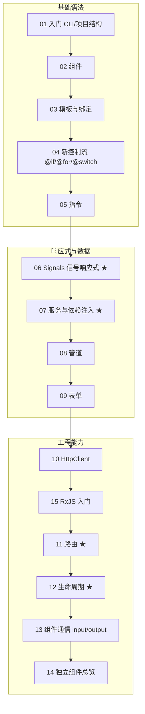

# 09 · Angular（现代 Standalone + Signals 版）

> Angular 是 Google 维护的**企业级前端框架**：开箱即用地提供组件、路由、表单、HTTP、依赖注入等完整能力，配合 TypeScript 与 Angular CLI，适合中大型、长期维护的应用。本合集对照 [angular.dev](https://angular.dev/) 官方文档，全部采用**现代 Angular（v17+ / v19）写法**：Standalone Components（独立组件，无需 NgModule）、Signals（信号响应式）、新控制流 `@if / @for / @switch`、`inject()` 函数式依赖注入、`input()/output()/model()` 信号化组件通信。

## 📚 这是什么

很多教程还停留在「NgModule + `*ngIf` + `@Input()` 装饰器 + RxJS 满天飞」的旧范式。本工程坚持官方当前主推的**现代范式**，让你一上手就学最新、最简、不会过时的写法，同时保留对旧范式的对比说明，便于你阅读老代码。

## 🗂️ 模块索引

| 模块 | 知识点 | 一句话 |
| --- | --- | --- |
| [01-getting-started](./01-getting-started/) | 入门 / CLI / 项目结构 | `ng new` 生成的 Standalone 工程长什么样、怎么跑起来 |
| [02-components](./02-components/) | 组件 Components | `@Component` 装饰器与 UI 的基本构建单元 |
| [03-templates-binding](./03-templates-binding/) | 模板与绑定 | 插值 `{{}}`、属性 `[x]`、事件 `(x)`、双向 `[(x)]` |
| [04-control-flow](./04-control-flow/) | 新控制流 | `@if / @for / @switch / @let` 取代 `*ngIf/*ngFor` |
| [05-directives](./05-directives/) | 指令 Directives | 组件 / 属性型 / 结构型三类指令与自定义指令 |
| [06-signals](./06-signals/) ★ | 信号响应式 Signals | `signal / computed / effect` 细粒度响应式核心 |
| [07-services-di](./07-services-di/) ★ | 服务与依赖注入 | `@Injectable` + `inject()` + 注入器层级 |
| [08-pipes](./08-pipes/) | 管道 Pipes | 模板数据转换：内置管道 + `async` + 自定义管道 |
| [09-forms](./09-forms/) | 表单 Forms | 模板驱动 vs 响应式表单与校验 |
| [10-http-client](./10-http-client/) | HttpClient | `provideHttpClient` + Observable + `async` pipe |
| [11-routing](./11-routing/) ★ | 路由 Routing | `provideRouter` + 懒加载 + 守卫 + 路由参数 |
| [12-lifecycle-hooks](./12-lifecycle-hooks/) ★ | 生命周期钩子 | `ngOnInit → ... → ngOnDestroy` 调用顺序 |
| [13-input-output](./13-input-output/) | 组件通信 | `input() / output() / model()` 父子传值 |
| [14-standalone-components](./14-standalone-components/) | 独立组件 | 去 NgModule 化架构与 `bootstrapApplication` |
| [15-rxjs-observables](./15-rxjs-observables/) | RxJS 入门 | Observable / 操作符 / `async` / `toSignal` |

> ★ = 重点配图模块（变更检测 / 依赖注入 / 生命周期 / 路由原理图）。

## 🧭 学习路线



建议顺序：先打通**基础语法**（01-05），再吃透**响应式与数据**（06-09，Signals 是现代 Angular 的灵魂），最后掌握**工程能力**（10-15，路由 / HTTP / RxJS / 生命周期）。

## ⚙️ 统一脚手架搭建与运行

本工程的每个模块是**教学示例代码 + 讲解 README**。要真正跑起来，先用 Angular CLI 建一个空工程，再按模块 README 的「运行方式」把示例文件放进去。

### 1. 安装 Angular CLI（需要 Node.js ≥ 18.19）

```bash
# 全局安装 Angular CLI
npm i -g @angular/cli

# 验证版本（应为 v17 以上，本合集示例基于 v19 现代写法）
ng version
```

### 2. 新建一个 Standalone 工程

```bash
# 创建工程；现代 CLI 默认生成 standalone（无 NgModule）项目
ng new demo --style=css --ssr=false
cd demo

# 启动开发服务器，默认 http://localhost:4200，保存自动热更新
ng serve -o
```

`ng new` 生成的关键文件：

```
demo/
├── src/
│   ├── main.ts              # 入口：bootstrapApplication(AppComponent, appConfig)
│   ├── index.html           # 宿主页面，含 <app-root></app-root>
│   ├── styles.css           # 全局样式
│   └── app/
│       ├── app.component.ts     # 根组件（standalone）
│       ├── app.component.html   # 根组件模板
│       ├── app.config.ts        # 应用级 providers（路由/HttpClient 等）
│       └── app.routes.ts        # 路由表
├── angular.json             # CLI 工程配置
├── tsconfig.json            # TypeScript 配置
└── package.json
```

### 3. 把模块示例放进工程

每个模块 README 的「💻 代码说明 / ▶️ 运行方式」会写明具体步骤，通用做法：

1. 把模块里的 `*.component.ts / *.html / *.service.ts / *.pipe.ts` 复制到 `src/app/` 下；
2. 在 `app.component.ts` 的 `imports: []` 中引入该组件，并在 `app.component.html` 里用其选择器 `<app-xxx />`；
3. 需要全局 provider 的（如 `provideHttpClient`、`provideRouter`），按 README 加到 `src/app/app.config.ts`；
4. `ng serve` 查看效果。

### 常用 CLI 命令

```bash
ng generate component my-comp   # 生成 standalone 组件（简写 ng g c）
ng generate service my-svc      # 生成服务
ng generate pipe my-pipe        # 生成管道
ng build                        # 生产构建到 dist/
ng test                         # 运行单元测试
```

## 🔗 官方文档

- Angular 官网：https://angular.dev/
- 快速上手：https://angular.dev/tutorials/learn-angular
- Angular CLI：https://angular.dev/tools/cli
- API 参考：https://angular.dev/api
