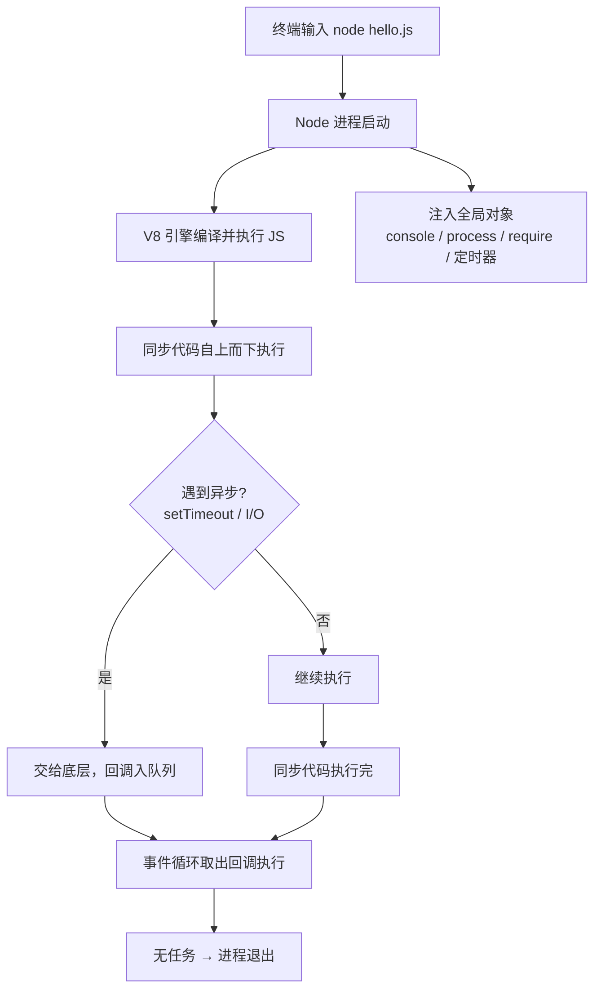

# 01 · 运行第一个 Node 程序（Hello Node）
> Node.js 是「跑在服务端的 JavaScript 运行时」，用 V8 引擎执行 JS，并提供文件、网络等浏览器没有的能力。本模块认识它怎么跑、有哪些全局对象。

## 📖 知识讲解

**Node.js 是什么？** 它不是一门语言，而是一个**运行时（runtime）**：把 Chrome 的 V8 引擎抽出来，加上一套 C++ 写的系统能力（文件 I/O、网络、进程），让 JavaScript 能脱离浏览器、在操作系统上直接运行。

**三种运行方式：**

| 方式 | 命令 | 适用 |
| --- | --- | --- |
| 运行脚本 | `node hello.js` | 最常用，执行一个文件 |
| REPL 交互 | `node`（回车进入） | 临时试代码，`>` 提示符下逐行求值，`.exit` 退出 |
| 直接求值 | `node -e "console.log(1+1)"` | 一行小命令 |

**Node 的全局对象**（浏览器里没有，无需 require 直接用）：

- `console`：日志输出（底层写入 stdout/stderr 流）。
- `process`：当前进程对象（版本、参数、环境变量、退出控制）。
- `globalThis` / `global`：全局对象本身（浏览器是 `window`）。
- `__dirname` / `__filename`：当前文件目录 / 路径（**仅 CommonJS** 可用）。
- `setTimeout` / `setInterval` / `setImmediate`：定时器。
- Node 18+ 内置了浏览器同款 Web API：`fetch`、`URL`、`TextEncoder`、`structuredClone` 等。

**浏览器 JS vs Node JS：**

| | 浏览器 | Node |
| --- | --- | --- |
| 全局对象 | `window` | `global` / `globalThis` |
| DOM/BOM | 有 `document`、`location` | 无 |
| 文件/网络 | 受限（沙箱） | 完整能力（fs、net、http） |
| 模块 | `<script>` / ESM | CommonJS + ESM |

## 🔄 流程图 / 原理图

`node hello.js` 背后发生了什么：



## 💻 代码说明

`hello.js` 逐个演示：`console.log` 打印 → `process.version/platform/argv` 读进程信息 → `setTimeout(…, 0)` 体现「同步先跑、异步后跑」→ 全局 `URL` 解析网址。

关键认知：**第 ⑦ 行的同步 log 会比第 ⑤ 行的 `setTimeout` 回调先打印**，哪怕延迟是 0ms——这是事件循环的核心特征（详见模块 11）。

## ▶️ 运行方式

```bash
node hello.js              # 运行脚本
node hello.js 张三 18       # 传参数，会出现在 process.argv 里
node                       # 进入 REPL，输入 1+1 回车，.exit 退出
```

要求：已安装 Node.js（建议 LTS 18/20/22 及以上，`node -v` 查看）。

## ⚠️ 常见坑 / 最佳实践

- ❌ 在 Node 里写 `document`、`window` → 报错，Node 没有 DOM。
- ⚠️ `__dirname` / `__filename` 只在 CommonJS 有；ESM（.mjs）要用 `import.meta.dirname`。
- ✅ 跨运行时（Node/浏览器/Deno）代码用 `globalThis` 而非 `global`。
- ✅ `setTimeout(fn, 0)` 不是「立刻执行」，只是「尽快排进下一轮事件循环」。

## 🔗 官方文档

- [Node.js 入门介绍](https://nodejs.org/en/learn/getting-started/introduction-to-nodejs)
- [全局对象 Globals](https://nodejs.org/docs/latest/api/globals.html)
- [process 进程](https://nodejs.org/docs/latest/api/process.html)
- [REPL 命令行](https://nodejs.org/docs/latest/api/repl.html)
