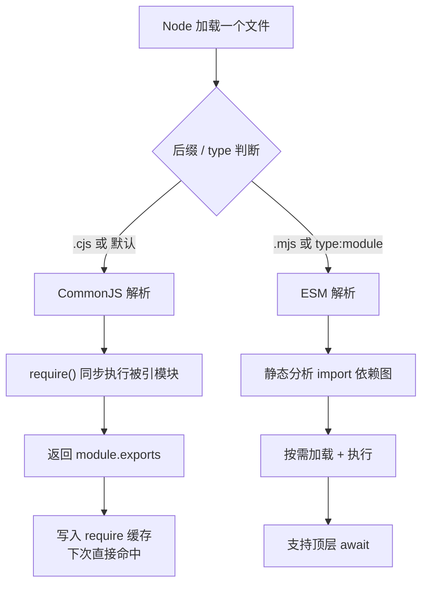

# 02 · 模块系统（CommonJS vs ESM）
> Node 有两套模块系统：老牌的 CommonJS（`require`/`module.exports`）和标准的 ES Module（`import`/`export`）。本模块讲清两者的语法、区别和选择。

## 📖 知识讲解

模块让代码**拆分、复用、隔离**。每个文件就是一个模块，有独立作用域（变量不会污染全局）。

**CommonJS（CJS，Node 的传统方案）：**

```js
// 导出
module.exports = { add };      // 整体导出
exports.add = fn;              // 给 exports 挂属性（exports 是 module.exports 的别名）
// 导入
const m = require('./math');   // 同步加载，返回 module.exports
```

**ES Module（ESM，JS 官方标准，和浏览器一致）：**

```js
// 导出
export function add() {}       // 命名导出（可多个）
export default fn;             // 默认导出（仅一个）
// 导入
import fn, { add } from './math.mjs';
```

**怎么决定一个文件按哪套解析？**

| 情况 | 解析为 |
| --- | --- |
| `.cjs` 后缀 | 强制 CommonJS |
| `.mjs` 后缀 | 强制 ESM |
| `.js` 后缀 + package.json 无 `type` 或 `"type":"commonjs"` | CommonJS |
| `.js` 后缀 + package.json `"type":"module"` | ESM |

**核心区别：**

| | CommonJS | ESM |
| --- | --- | --- |
| 语法 | `require` / `module.exports` | `import` / `export` |
| 加载时机 | **运行时**同步加载 | **编译期**静态分析 |
| 顶层 await | 不支持 | **支持** |
| `__dirname` | 直接可用 | 用 `import.meta.dirname` |
| tree-shaking | 难 | 易（静态依赖） |
| 动态导入 | `require()` 任意位置 | `import()`（返回 Promise） |

## 🔄 流程图 / 原理图



## 💻 代码说明

- `math.cjs` + `app.cjs`：CommonJS 写法。`require('./math.cjs')` 同步拿到导出对象，可解构。
- `math.mjs` + `app.mjs`：ESM 写法。`import multiply, { add } from './math.mjs'` 同时拿默认导出与命名导出；用 `import.meta.url` 还原 `__dirname`；用 `await import()` 动态加载。

## ▶️ 运行方式

```bash
node app.cjs    # 运行 CommonJS 版本
node app.mjs    # 运行 ESM 版本
```

## ⚠️ 常见坑 / 最佳实践

- ❌ ESM 里用 `require` / `__dirname` → 报错 `require is not defined`。
- ❌ CommonJS 里写 `import` 语句（非 import()）→ 报错。
- ❌ 写 `exports = {...}` 无效（断了引用）；要整体导出必须用 `module.exports = {...}`。
- ⚠️ ESM 导入本地文件**必须带扩展名**（`./math.mjs`，不能省略 `.mjs`）。
- ✅ 新项目优先 ESM；维护老项目用 CommonJS；两者可通过 `import()` 互通。

## 🔗 官方文档

- [CommonJS modules](https://nodejs.org/docs/latest/api/modules.html)
- [ECMAScript modules](https://nodejs.org/docs/latest/api/esm.html)
- [Packages 与 type 字段](https://nodejs.org/docs/latest/api/packages.html)
