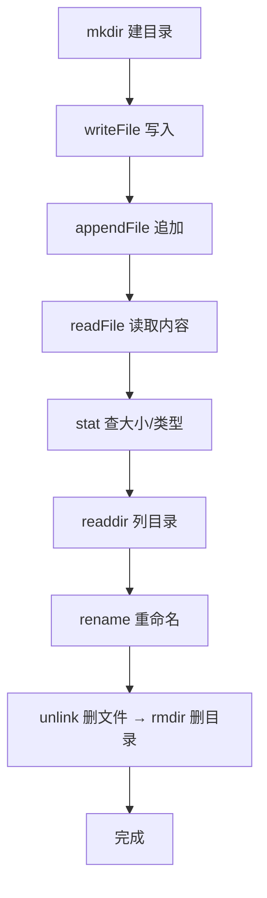

# 03 · 文件系统（File System / fs）
> `fs` 模块让 Node 能读写文件、操作目录。本模块用最推荐的 Promise 版 API 演示完整的「增删改查」文件流程。

## 📖 知识讲解

`fs` 提供三套风格的 API，**功能相同、调用方式不同**：

| 风格 | 引入 | 写法 | 是否阻塞 | 推荐度 |
| --- | --- | --- | --- | --- |
| Promise 版 | `require('node:fs/promises')` | `await fsp.readFile()` | 否 | ⭐⭐⭐ 首选 |
| 回调版 | `require('node:fs')` | `fs.readFile(path, cb)` | 否 | ⭐⭐ 老代码 |
| 同步版 | `require('node:fs')` | `fs.readFileSync()` | **是** | ⭐ 仅脚本/启动期 |

**常用 API：**

| 操作 | API |
| --- | --- |
| 读文件 | `readFile(path, 'utf-8')` |
| 写文件（覆盖） | `writeFile(path, data)` |
| 追加 | `appendFile(path, data)` |
| 建目录 | `mkdir(path, { recursive: true })` |
| 列目录 | `readdir(path)` |
| 文件信息 | `stat(path)` → `.size` `.isFile()` `.isDirectory()` |
| 是否存在 | `access(path)`（不存在则 reject） |
| 重命名/移动 | `rename(old, new)` |
| 删除文件/目录 | `unlink(file)` / `rm(dir,{recursive:true})` |

**关键点：**

- 不传编码 → 得到 **Buffer**（二进制）；传 `'utf-8'` → 得到字符串。
- 大文件不要用 `readFile`（一次性进内存），用**流**（见模块 06）。

## 🔄 流程图 / 原理图



## 💻 代码说明

`fs-demo.js` 用 `async/await` 把上图串成一条完整链路：建 `tmp/` 目录 → 写文件 → 追加 → 读出打印 → 查信息 → 列目录 → 用 `access` 判断存在 → 重命名 → 删除清理。所有异步错误用 `.catch()` 统一兜底。

## ▶️ 运行方式

```bash
node fs-demo.js
```

运行会在本目录临时创建 `tmp/` 并在结束时自动删除，不留垃圾文件。

## ⚠️ 常见坑 / 最佳实践

- ❌ 用同步 API（`readFileSync`）处理高并发请求 → 阻塞事件循环，拖垮整个服务。
- ❌ 用已废弃的 `fs.exists()`；改用 `fsp.access()` 或直接 try 读取。
- ⚠️ `mkdir` 不加 `{ recursive: true }`，父目录不存在会报错；目录已存在也会报错。
- ⚠️ 读出来忘了指定编码 → 拿到 Buffer 而非字符串。
- ✅ 大文件、复制、压缩用流（createReadStream/pipeline），别用 readFile。

## 🔗 官方文档

- [File system 文件系统](https://nodejs.org/docs/latest/api/fs.html)
- [fs/promises API](https://nodejs.org/docs/latest/api/fs.html#promises-api)
- [Learn: 读写文件](https://nodejs.org/en/learn/manipulating-files/reading-files-with-nodejs)
