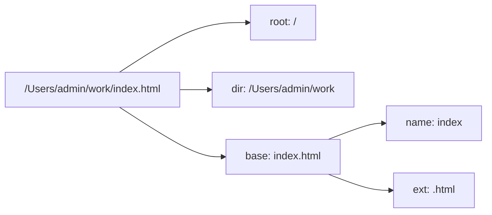

# 04 · 路径处理（Path）
> `path` 模块用来跨平台地拼接、解析、规范化文件路径，避免手写字符串在 Windows / Linux 上出错。

## 📖 知识讲解

不同系统路径分隔符不同：Windows 用 `\`，Linux/macOS 用 `/`。手拼字符串容易出 bug，`path` 会自动适配当前系统。

**核心 API：**

| API | 作用 | 示例 |
| --- | --- | --- |
| `dirname(p)` | 取目录部分 | `/a/b/c.js` → `/a/b` |
| `basename(p, ext?)` | 取文件名（可去扩展名） | `c.js` |
| `extname(p)` | 取扩展名 | `.js` |
| `parse(p)` | 一次拆成对象 `{root,dir,base,name,ext}` | — |
| `join(...)` | 拼接并规范化（处理 `..` `.`） | `a/b/../c` → `a/c` |
| `resolve(...)` | 拼成**绝对路径**（基于 cwd） | → `/当前目录/...` |
| `relative(from,to)` | 计算相对路径 | `../../x` |
| `isAbsolute(p)` | 是否绝对路径 | `true/false` |

**`join` vs `resolve`（高频考点）：**

- `join` 只是「字符串拼接 + 规范化」，结果可能是相对路径。
- `resolve` 从右往左拼，**保证返回绝对路径**（遇到绝对路径片段就停，否则以 `process.cwd()` 当前工作目录为基准）。

**平台常量：** `path.sep`（分隔符 `/` 或 `\`）、`path.delimiter`（PATH 环境变量分隔符 `:` 或 `;`）。

## 🔄 流程图 / 原理图



## 💻 代码说明

`path-demo.js` 演示：用 `dirname/basename/extname/parse` 拆解路径；对比 `join('a','b')`（相对）与 `resolve('a','b')`（绝对）的差异；用 `relative` 求相对路径；最后用 `path.join(__dirname, 'config', 'app.json')` 拼出「相对当前文件的绝对路径」——这是项目里最常见的用法。

## ▶️ 运行方式

```bash
node path-demo.js
```

## ⚠️ 常见坑 / 最佳实践

- ❌ 用 `'目录' + '/' + '文件'` 手拼 → Windows 上分隔符不对、容易出现双斜杠。
- ✅ 拼「相对当前文件」的路径永远用 `path.join(__dirname, ...)`，不要用相对字符串（相对字符串是相对于 `process.cwd()` 启动目录，而非文件所在目录！）。
- ⚠️ `resolve` 不带任何绝对片段时，结果依赖「在哪个目录启动 node」，注意区别于 `join`。
- ✅ 跨平台代码避免硬编码 `/` 或 `\`，用 `path.sep`。

## 🔗 官方文档

- [Path 路径](https://nodejs.org/docs/latest/api/path.html)
- [Learn: 使用 path 模块](https://nodejs.org/en/learn/manipulating-files/nodejs-file-paths)
