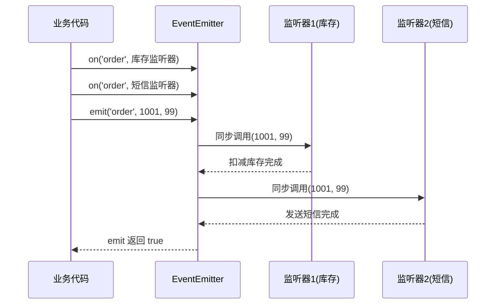

# 05 · 事件发射器(EventEmitter)
> `EventEmitter` 是 Node 的「发布/订阅」核心：用 `on` 订阅事件、`emit` 触发事件。HTTP 服务器、流、process 等几乎所有 Node 对象都建立在它之上。

## 📖 知识讲解

EventEmitter 实现了**观察者模式**：一方触发事件，多方监听响应，彼此解耦。

**核心方法：**

| 方法 | 作用 |
| --- | --- |
| `on(event, fn)` / `addListener` | 订阅事件（可注册多个，按顺序触发） |
| `once(event, fn)` | 只触发一次，触发后自动移除 |
| `emit(event, ...args)` | 触发事件，参数原样传给所有监听器 |
| `off(event, fn)` / `removeListener` | 移除指定监听器 |
| `removeAllListeners(event?)` | 移除全部监听器 |
| `listenerCount(event)` | 查监听器数量 |

**两个重要特性：**

1. **`'error'` 事件特殊**：若 `emit('error')` 时没有任何监听器，Node 会**抛出异常并让进程崩溃**。所以业务里务必监听 `error`。
2. **同步执行**：`emit` 会**同步**地依次调用所有监听器，全部跑完才返回（不是异步排队）。

**默认监听器上限**：同一事件超过 10 个监听器会打印「内存泄漏警告」，可用 `setMaxListeners(n)` 调整。

## 🔄 流程图 / 原理图



## 💻 代码说明

`events-demo.js`：先用 `new EventEmitter()` 注册多个 `order` 监听器 + 一个 `once` 监听器，两次 `emit` 观察 `once` 只触发一次；演示 `off` 移除；演示监听 `error` 事件避免崩溃；最后用 `class Downloader extends EventEmitter` 封装一个带 `start/progress/done` 事件的下载器——这是真实项目中最常见的用法。

## ▶️ 运行方式

```bash
node events-demo.js
```

## ⚠️ 常见坑 / 最佳实践

- ❌ 不监听 `'error'` 事件 → 一旦 `emit('error')` 进程直接崩溃退出。
- ⚠️ `emit` 是**同步**的；若监听器里有耗时操作会阻塞后续监听器。
- ⚠️ 监听器忘了 `off` 移除 → 长生命周期对象上会内存泄漏（超过 10 个有警告）。
- ✅ 用箭头函数当监听器时无法 `off`（拿不到同一引用），需要移除的监听器要用具名函数。

## 🔗 官方文档

- [Events 事件](https://nodejs.org/docs/latest/api/events.html)
- [Learn: 事件发射器](https://nodejs.org/en/learn/asynchronous-work/the-nodejs-event-emitter)
