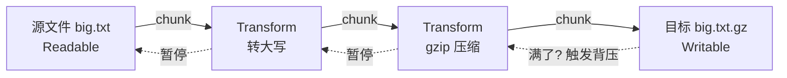
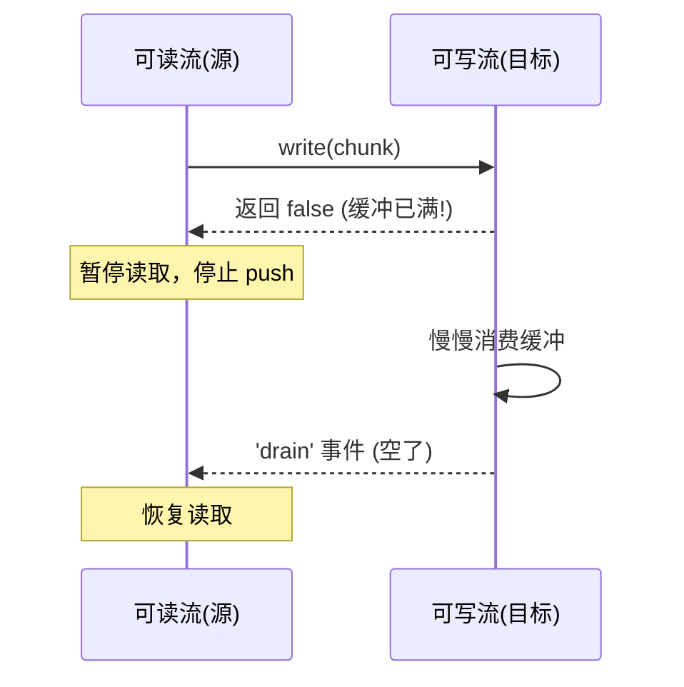

# 06 · 流(Streams)
> 流让你「边读边处理」数据，而不是一次性全部装进内存。处理大文件、网络数据、压缩时，流能让内存占用恒定，还能用「管道」把多个处理步骤串起来。

## 📖 知识讲解

**为什么要流？** 用 `readFile` 读 2GB 文件 = 把 2GB 全塞进内存，可能直接 OOM。流把数据切成一块块（**chunk**）依次流过，内存占用只跟「单块大小」有关，与文件总大小无关。

**四种流：**

| 类型 | 角色 | 例子 |
| --- | --- | --- |
| Readable 可读流 | 数据**来源** | `fs.createReadStream`、HTTP 请求体 `req` |
| Writable 可写流 | 数据**去处** | `fs.createWriteStream`、HTTP 响应 `res` |
| Duplex 双工流 | 既可读又可写 | TCP `socket` |
| Transform 转换流 | 边读边改 | `zlib.createGzip()`（压缩）、加密 |

**可读流的两种模式：**

- **流动模式**：监听 `'data'` 事件，数据自动一块块推过来。
- 配合 `'end'`（读完）、`'error'`（出错）事件。

**管道 pipeline（最推荐）：** 把「读流 → 转换流 → 写流」像水管一样接起来，自动处理三件难事：

1. **背压（backpressure）**：下游处理慢时，自动让上游暂停，防止内存爆。
2. **错误传播**：任一环节出错，整条管道一起报错。
3. **资源清理**：结束/出错时自动关闭所有流。

`stream/promises` 的 `pipeline` 返回 Promise，可直接 `await`。

## 🔄 流程图 / 原理图

下图是 demo 里的管道：读文件 → 转大写 → gzip 压缩 → 写盘，数据一块块流过。



背压机制（下游忙不过来时，信号逆流而上让源头暂停）：



## 💻 代码说明

`streams-demo.js`：① 用**可写流** `createWriteStream` + `write/end` 逐行造一个示例文件；② 用**可读流** `createReadStream` 设置 `highWaterMark`（每块大小），监听 `'data'` 统计分了几块；③ 用 `pipeline` 把「读流 → 自定义 `Transform`（转大写）→ `zlib.createGzip()` → 写流」串成管道，自动处理背压与错误。

## ▶️ 运行方式

```bash
node streams-demo.js
```

运行会在 `tmp/` 临时生成文件并演示后自动清理。

## ⚠️ 常见坑 / 最佳实践

- ❌ 手动 `readable.pipe(writable)` 不处理 `error` → 出错时句柄泄漏。**优先用 `pipeline`**。
- ⚠️ 忽视背压（疯狂 `write` 不看返回值）→ 内存暴涨。`pipeline`/`pipe` 会自动处理。
- ⚠️ `'data'` 事件里的 `chunk` 是 Buffer，处理文本要 `chunk.toString()`，注意中文可能跨块（见模块 12）。
- ✅ 复制/压缩/转码大文件、转发 HTTP body 一律用流，不要 `readFile` 全量加载。

## 🔗 官方文档

- [Stream 流](https://nodejs.org/docs/latest/api/stream.html)
- [stream/promises pipeline](https://nodejs.org/docs/latest/api/stream.html#streampipelinesource-transforms-destination-options)
- [Learn: 背压 Backpressuring](https://nodejs.org/en/learn/modules/backpressuring-in-streams)
