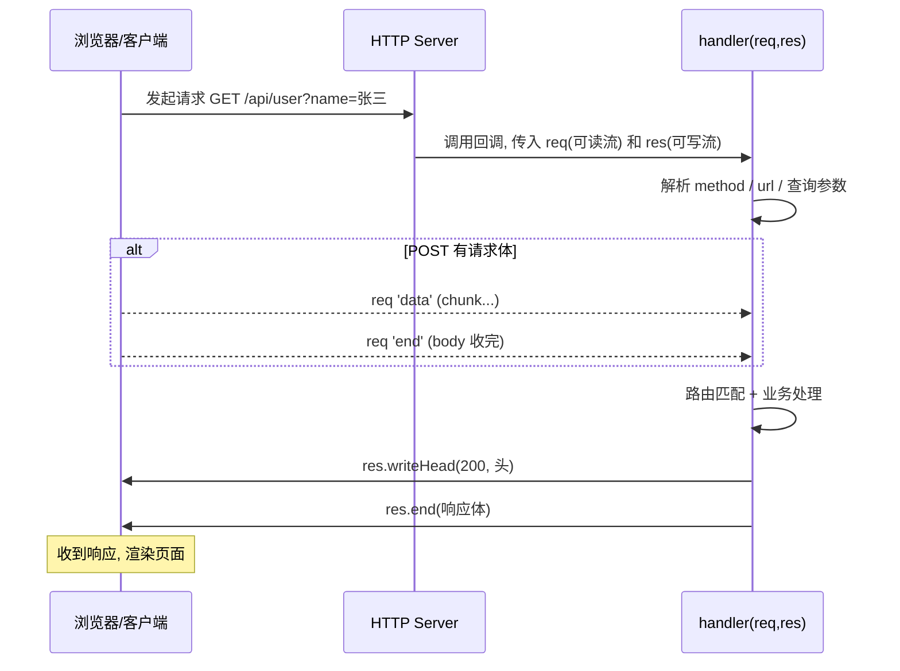
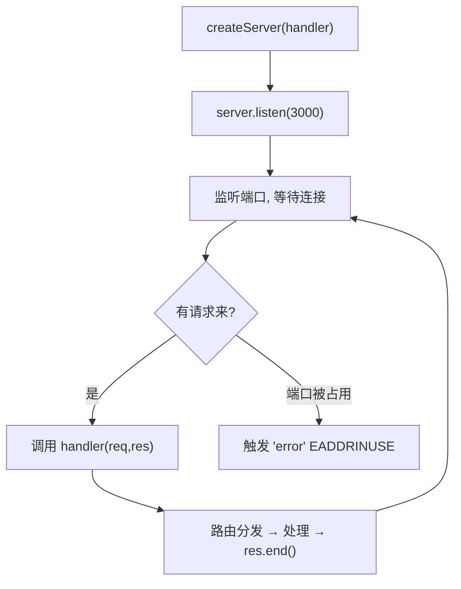

# 07 · 原生 HTTP 服务器
> 不用任何框架，用内置 `http` 模块手写一个 Web 服务器，彻底搞懂「请求进来、处理、响应出去」的完整流程——这是 Express 等框架的底层。

## 📖 知识讲解

`http.createServer(handler)` 创建服务器，`handler(req, res)` 在**每个请求到达时**被调用一次：

- **`req`（IncomingMessage）**：是一个**可读流**，包含：
  - `req.method`：请求方法（GET/POST/...）
  - `req.url`：请求路径 + 查询串（如 `/api/user?name=张三`）
  - `req.headers`：请求头对象
  - 请求体：通过监听 `'data'`/`'end'` 一块块读出来
- **`res`（ServerResponse）**：是一个**可写流**，用来回复：
  - `res.writeHead(状态码, 头对象)`：设置状态码和响应头
  - `res.write(chunk)` / `res.end(data)`：写响应体并结束（**必须调用 `end`**，否则请求一直挂着）

**路由**：根据 `method + pathname` 用 if/switch 分发到不同处理逻辑。

**读请求体**：因为 `req` 是流，body 不是一次性给你的，要拼接：

```js
let body = '';
req.on('data', chunk => body += chunk);
req.on('end', () => { /* body 完整了，处理它 */ });
```

**响应必须设对 `Content-Type`**（`text/html` / `application/json` / `text/plain`）并带 `charset=utf-8`，否则中文乱码。

## 🔄 流程图 / 原理图

一次 HTTP 请求的完整处理时序：



服务器整体生命周期：



## 💻 代码说明

`server.js` 用 `http.createServer` 实现一个微型路由：`GET /` 返回 HTML；`GET /api/user` 读 `?name=` 查询参数返回 JSON；`POST /api/echo` 监听 `req` 的 `data`/`end` 读请求体后原样返回；其它路径返回 404。用全局 `URL` 解析 `req.url`，用 `res.writeHead` 设状态码和 `Content-Type`。

## ▶️ 运行方式

```bash
node server.js
# 然后另开终端或浏览器测试：
curl http://localhost:3000/
curl "http://localhost:3000/api/user?name=张三"
curl -X POST -d '{"a":1}' http://localhost:3000/api/echo
```

按 `Ctrl + C` 停止服务。

## ⚠️ 常见坑 / 最佳实践

- ❌ 忘了调用 `res.end()` → 浏览器一直转圈，请求超时。
- ❌ 响应头不设 `charset=utf-8` → 中文乱码。
- ⚠️ `writeHead` 必须在 `write/end` **之前**调用（响应头要先于响应体发送）。
- ⚠️ 端口被占用会报 `EADDRINUSE`，要监听 `server.on('error')`。
- ✅ 原生 http 写大型应用太繁琐（路由、body 解析全手写），实战用 Express（见模块 14/15），但理解原生是基础。

## 🔗 官方文档

- [HTTP 模块](https://nodejs.org/docs/latest/api/http.html)
- [Learn: HTTP 事务剖析](https://nodejs.org/en/learn/modules/anatomy-of-an-http-transaction)
