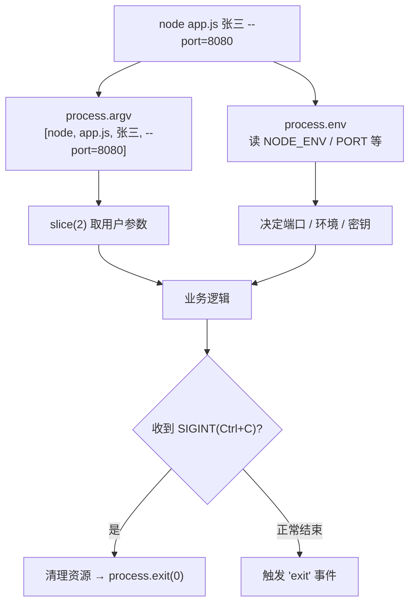

# 09 · process 进程对象（环境变量 / argv）
> `process` 是全局对象，代表当前 Node 进程：读命令行参数、环境变量、运行信息，控制进程退出。配置、CLI 工具都离不开它。

## 📖 知识讲解

**命令行参数 `process.argv`**：一个数组，`[node路径, 脚本路径, ...用户参数]`。取用户参数用 `process.argv.slice(2)`。

**环境变量 `process.env`**：键值对对象，用于**区分环境、读端口/密钥**，避免把配置写死在代码里：

```bash
NODE_ENV=production PORT=8080 node app.js
```

```js
const port = process.env.PORT || 3000;       // 经典写法
const isProd = process.env.NODE_ENV === 'production';
```

**运行信息**：`process.version`（Node 版本）、`process.platform`（darwin/win32/linux）、`process.arch`、`process.pid`、`process.cwd()`（当前工作目录）、`process.uptime()`、`process.memoryUsage()`。

**标准流**：`process.stdout`（可写，`console.log` 底层就是它）、`process.stderr`、`process.stdin`（可读）。

**进程控制与事件**：

| 名称 | 说明 |
| --- | --- |
| `process.exit(code)` | 立即退出，0 正常、非 0 异常 |
| `'exit'` 事件 | 即将退出（回调内只能同步代码） |
| `'SIGINT'` 事件 | 收到 Ctrl+C，做优雅退出/清理 |
| `process.nextTick(fn)` | 把回调排到「当前操作后、事件循环继续前」执行（优先级最高） |

## 🔄 流程图 / 原理图



## 💻 代码说明

`process-demo.js`：打印 `argv` 并 `slice(2)` 取用户参数；读 `NODE_ENV`/`PORT`/`HOME` 环境变量；打印版本、平台、PID、cwd、内存等运行信息；用 `process.stdout.write` 演示底层输出；注册 `'exit'` / `'SIGINT'` 事件和 `process.nextTick`，观察 nextTick 比同步代码晚、比 setTimeout 早。

## ▶️ 运行方式

```bash
node process-demo.js 张三 18
NODE_ENV=production PORT=8080 node process-demo.js 张三   # 带环境变量
```

## ⚠️ 常见坑 / 最佳实践

- ⚠️ `process.env.PORT` 永远是**字符串**，做数值用要 `Number(...)`。
- ⚠️ `'exit'` 事件回调里**不能写异步代码**（不会执行），清理工作要放 `SIGINT`/`beforeExit`。
- ✅ 敏感信息（数据库密码、API Key）放环境变量或 `.env` 文件（配合 Node 20+ 的 `--env-file` 或 dotenv），别硬编码进源码。
- ✅ 长驻服务监听 `SIGINT`/`SIGTERM` 做优雅关闭（关连接、存数据）。

## 🔗 官方文档

- [process 进程](https://nodejs.org/docs/latest/api/process.html)
- [Learn: 环境变量](https://nodejs.org/en/learn/command-line/how-to-read-environment-variables-from-nodejs)
- [Learn: 接收命令行参数](https://nodejs.org/en/learn/command-line/accept-input-from-the-command-line-in-nodejs)
