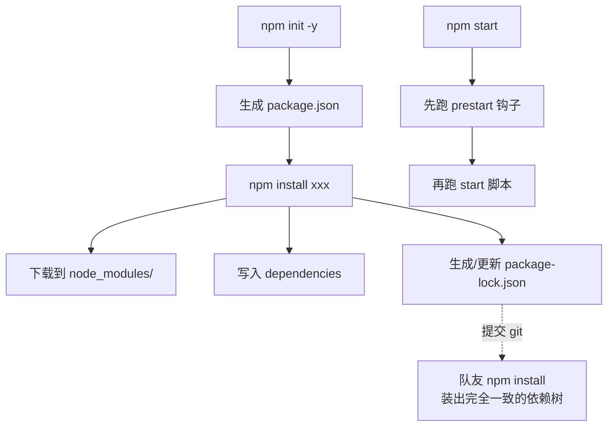

# 10 · npm 与 package.json
> `package.json` 是 Node 项目的「身份证 + 说明书」，`npm` 是包管理器。本模块讲清字段含义、依赖管理、scripts 脚本和版本号规则。

## 📖 知识讲解

**`package.json` 常见字段：**

| 字段 | 作用 |
| --- | --- |
| `name` / `version` | 包名 / 版本（遵循语义化版本 SemVer：`主.次.修订`） |
| `main` | 入口文件（别人 `require` 这个包时加载它） |
| `type` | `"commonjs"`(默认) 或 `"module"`(让 `.js` 走 ESM) |
| `scripts` | 自定义命令，`npm run <名>` 执行 |
| `dependencies` | 生产依赖（运行时需要） |
| `devDependencies` | 开发依赖（测试、打包、lint，上线不需要） |
| `engines` | 声明所需 Node 版本 |

**语义化版本与 `^` `~`：**

| 写法 | 含义 | 允许升级范围 |
| --- | --- | --- |
| `^4.18.2` | 兼容次版本 | `>=4.18.2 <5.0.0` |
| `~4.18.2` | 仅修订号 | `>=4.18.2 <4.19.0` |
| `4.18.2` | 锁定精确版本 | 只此一版 |

**常用命令：**

```bash
npm init -y               # 快速生成 package.json
npm install               # 按 package.json 装全部依赖
npm install axios         # 装生产依赖（写入 dependencies）
npm install -D eslint     # 装开发依赖（写入 devDependencies）
npm install -g nodemon    # 全局装命令行工具
npm uninstall axios       # 卸载
npm run <script>          # 运行 scripts 里的命令
```

**`scripts` 生命周期钩子**：`start` 前会自动跑 `prestart`，后跑 `poststart`（`pre`/`post` 前缀对任意脚本生效）。`npm start` / `npm test` 是特例，可省略 `run`。

**两个产物**：`node_modules/`（实际依赖代码，**不提交 git**）、`package-lock.json`（锁定整棵依赖树精确版本，**必须提交**，保证团队/CI 安装结果一致）。

## 🔄 流程图 / 原理图



## 💻 代码说明

`package.json` 定义了 `start`/`hello`/`show-env` 脚本和 `prestart` 钩子。`index.js` 用 `require('./package.json')` 读自身清单并打印字段，再根据命令行参数演示脚本分支。注释里详列了 `^`/`~`、各 npm 命令和 `package-lock.json` 的作用。

## ▶️ 运行方式

```bash
node index.js          # 直接运行
npm start              # 等价，会先触发 prestart 钩子
npm run hello          # 运行自定义脚本
```

（本模块无第三方依赖，无需 `npm install`。）

## ⚠️ 常见坑 / 最佳实践

- ❌ 把 `node_modules/` 提交进 git（体积巨大）；应在 `.gitignore` 忽略它。
- ✅ **务必提交 `package-lock.json`**，否则团队成员可能装到不同版本导致「在我机器上能跑」。
- ⚠️ 运行时真正用到的包放 `dependencies`，仅开发用的（测试/打包/lint）放 `devDependencies`。
- ✅ CI/生产环境用 `npm ci`（严格按 lock 文件安装，更快更可复现）。

## 🔗 官方文档

- [npm package.json 字段](https://docs.npmjs.com/cli/v10/configuring-npm/package-json)
- [Node Packages 文档](https://nodejs.org/docs/latest/api/packages.html)
- [语义化版本 semver](https://semver.org/lang/zh-CN/)
