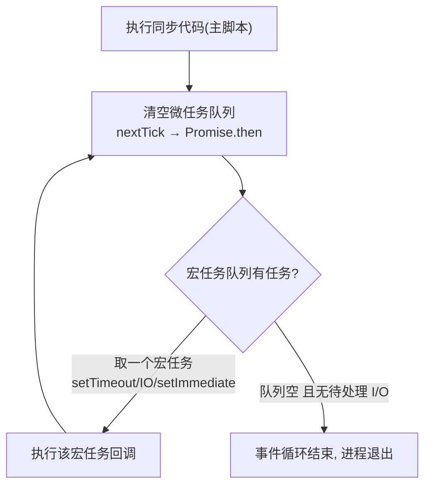
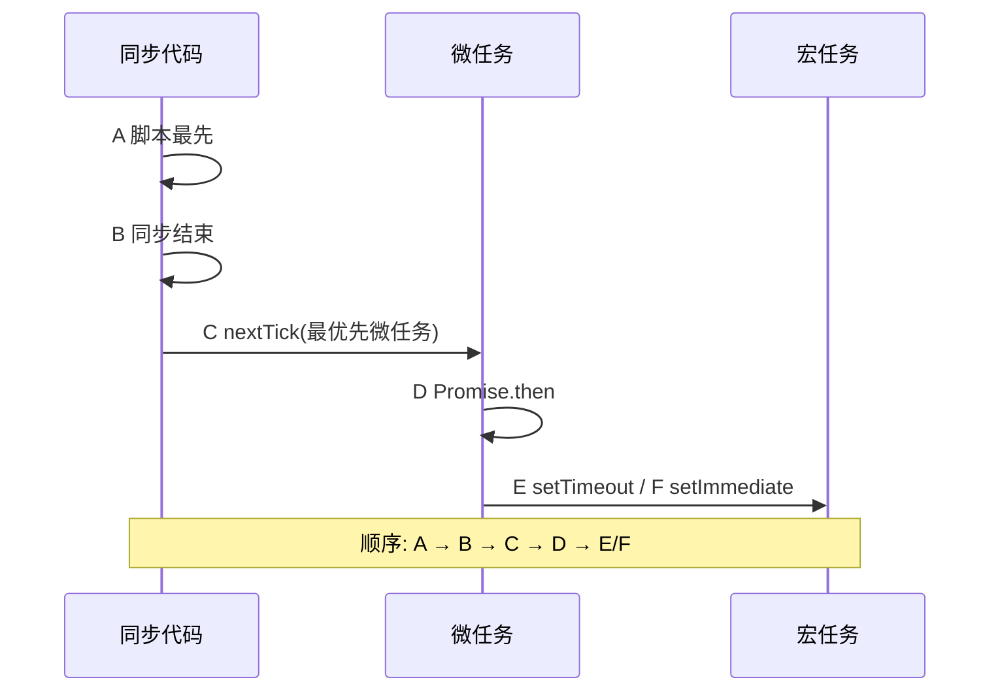

# 11 · 异步编程与事件循环
> Node 单线程却能高并发，靠的是「事件循环 + 非阻塞 I/O」。本模块讲清回调、Promise、async/await 三种异步写法，以及它们的执行顺序。

## 📖 知识讲解

Node 是**单线程**执行 JS，但耗时的 I/O（读文件、网络请求）交给底层 libuv（线程池/操作系统），完成后把回调放进队列，主线程空闲时再取出执行——这就是**非阻塞**。

**三种异步写法的演进：**

1. **回调（Callback）**：Node 约定「error-first」——回调第一个参数是错误。多层嵌套会变成「**回调地狱**」。
2. **Promise**：把异步结果封装成对象，`.then()` 链式调用避免嵌套，`.catch()` 统一捕错。
3. **async/await**：用同步的写法写异步（Promise 的语法糖），最易读。`try/catch` 捕错。

**串行 vs 并行**（性能关键）：

```js
// 串行：一个等一个，总耗时 = 累加（慢）
const a = await taskA(); const b = await taskB();
// 并行：同时发起，总耗时 = 最慢的那个（快）✅
const [a, b] = await Promise.all([taskA(), taskB()]);
```

**事件循环执行优先级**（面试高频）：

```
同步代码  >  微任务(microtask)  >  宏任务(macrotask)
              ├ process.nextTick（最优先）
              └ Promise.then            ├ setTimeout / setInterval
                                        └ setImmediate
```

规则：每执行完一段同步代码，**先清空所有微任务**，再取**一个**宏任务，如此循环。

## 🔄 流程图 / 原理图

事件循环主循环：



demo 里 `④` 部分的打印顺序：



## 💻 代码说明

`async-demo.js`：① 用回调实现 error-first 的 `readUserById`；② 用 Promise 封装并 `.then` 链式查两次；③ 用 `async/await` + `Promise.all` 并行查三个用户；④ 同时安排 `setTimeout`/`setImmediate`/`Promise.then`/`process.nextTick`/同步 log，运行后对照打印顺序理解优先级。

## ▶️ 运行方式

```bash
node async-demo.js
```

重点看 `④` 标记那几行的输出顺序：`A → B → C(nextTick) → D(Promise) → E/F`。

## ⚠️ 常见坑 / 最佳实践

- ❌ 回调地狱（嵌套 5 层以上）→ 改用 async/await 拍平。
- ❌ 该并行的任务写成串行 `await`（一个等一个）→ 用 `Promise.all` 并行。
- ⚠️ `async` 函数里抛错不 `try/catch` 或不 `.catch()` → 变成「未处理的 Promise 拒绝」(UnhandledRejection)。
- ⚠️ `forEach` 里用 `await` 不会等待；要顺序等待用 `for...of`，要并行用 `Promise.all(arr.map(...))`。
- ✅ `process.nextTick` 优先级高于 `Promise.then`，滥用会「饿死」事件循环，慎用。

## 🔗 官方文档

- [Learn: 事件循环详解](https://nodejs.org/en/learn/asynchronous-work/event-loop-timers-and-nexttick)
- [Learn: 阻塞 vs 非阻塞](https://nodejs.org/en/learn/asynchronous-work/overview-of-blocking-vs-non-blocking)
- [Learn: 理解 process.nextTick](https://nodejs.org/en/learn/asynchronous-work/understanding-processnexttick)
