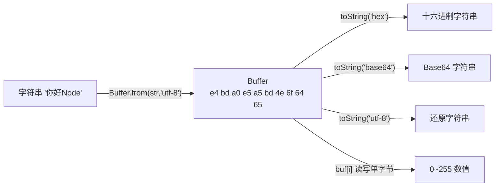

# 12 · Buffer 二进制缓冲区
> JS 原生擅长字符串/数字，但文件、网络、图片都是「二进制字节」。`Buffer` 是 Node 表示一段固定长度原始字节的类，是处理底层数据的基础。

## 📖 知识讲解

`Buffer` 底层是 `Uint8Array`（每个元素是 0~255 的字节），用于流、文件、加密、网络协议等场景。

**创建方式：**

| 方法 | 说明 |
| --- | --- |
| `Buffer.from('字符串', 'utf-8')` | 从字符串创建（默认 utf-8） |
| `Buffer.from([72, 105])` | 从字节数组创建 |
| `Buffer.alloc(n)` | 创建 n 字节、**全 0** 的安全 Buffer |
| `Buffer.allocUnsafe(n)` | 更快但**不清零**（含旧内存脏数据），写满前别读 |

**字符长度 ≠ 字节长度（核心坑）：** utf-8 下一个汉字占 **3 字节**：

```js
'你好'.length              // 2（字符数）
Buffer.byteLength('你好')  // 6（字节数）
```

做网络/文件/协议时按**字节**算，必须用 `Buffer.byteLength`，不能用 `str.length`。

**编码互转：** `buf.toString(编码)` 支持 `'utf-8'` / `'hex'` / `'base64'` / `'ascii'` / `'latin1'`。Base64 编解码、十六进制 dump 都靠它。

**操作：** 像数组一样按索引读写单字节；`Buffer.concat([...])` 合并；`buf.subarray(start,end)` 切片（**共享底层内存**，改一个影响另一个）。

## 🔄 流程图 / 原理图



## 💻 代码说明

`buffer-demo.js`：用 `from`/`alloc` 三种方式造 Buffer；对比 `'你好'.length`(2) 与 `Buffer.byteLength`(6)；演示 utf-8/hex/base64 互转及 base64 解码；按索引改单字节（A→Z）；`concat` 合并、`subarray` 切片；最后演示「在第 4 字节处截断 6 字节的中文」会把汉字切碎成乱码——提醒中文按字节切的边界陷阱。

## ▶️ 运行方式

```bash
node buffer-demo.js
```

## ⚠️ 常见坑 / 最佳实践

- ⚠️ **中文按字节切片会乱码**（一个汉字 3 字节，切到中间就碎了）。跨块解码用 `string_decoder` 模块，它会缓存不完整字符等下一块。
- ⚠️ 计算字节数用 `Buffer.byteLength(str)`，别用 `str.length`（中文/emoji 会算错）。
- ⚠️ `Buffer.allocUnsafe` 不清零，可能泄漏旧内存内容；不确定就用 `alloc`。
- ⚠️ `subarray` 是**视图**共享内存，要独立副本用 `Buffer.from(buf)`。
- ✅ 大量二进制拼接优先 `Buffer.concat`，别用字符串 `+`（会反复编解码）。

## 🔗 官方文档

- [Buffer 缓冲区](https://nodejs.org/docs/latest/api/buffer.html)
- [String Decoder（安全解码 utf-8）](https://nodejs.org/docs/latest/api/string_decoder.html)
