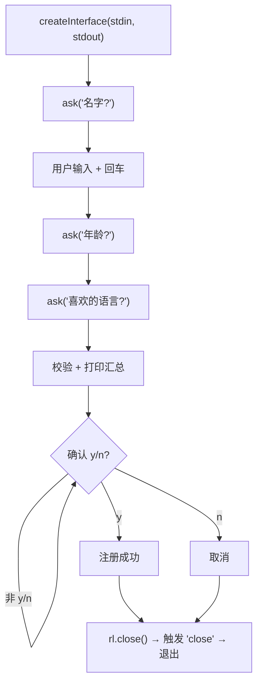

# 13 · readline 命令行交互
> `readline` 模块逐行读取输入，是写交互式命令行工具（CLI）、问答脚本、简易 REPL 的利器。本模块做一个能提问、校验、确认的注册小工具。

## 📖 知识讲解

`readline.createInterface({ input, output })` 创建一个接口，`input` 绑定 `process.stdin`（键盘），`output` 绑定 `process.stdout`（屏幕）。

**核心 API：**

| 成员 | 作用 |
| --- | --- |
| `rl.question(query, cb)` | 抛出问题，用户回车后把输入交给回调 |
| `rl.on('line', cb)` | 每按一次回车触发，做持续命令解析 |
| `rl.on('close', cb)` | 接口关闭时触发（Ctrl+C 或调用 close） |
| `rl.close()` | 关闭接口（**用完必须调用**，否则进程不退出） |
| `rl.setPrompt()` / `rl.prompt()` | 设置并显示提示符（做循环交互界面） |

**关键技巧**：`rl.question` 是回调风格，把它包成返回 Promise 的 `ask()` 函数，就能用 `async/await` 顺序提问，代码像同步一样直白：

```js
const ask = q => new Promise(r => rl.question(q, r));
const name = await ask('名字？');
const age  = await ask('年龄？');
```

## 🔄 流程图 / 原理图



## 💻 代码说明

`cli.js`：把 `rl.question` 封装成 Promise 版 `ask()`，用 `async/await` 依次问名字、年龄、最爱语言；校验年龄是否数字、判断是否成年；用 `do...while` 循环追问直到输入合法的 `y/n`；最后 `rl.close()` 关闭，并在 `'close'` 事件里 `process.exit(0)` 退出。

## ▶️ 运行方式

```bash
node cli.js
# 按提示逐行输入，回车确认；任意时刻 Ctrl+C 退出
```

## ⚠️ 常见坑 / 最佳实践

- ❌ 用完忘了 `rl.close()` → 程序一直挂着等输入，不会退出。
- ⚠️ `question` 回调嵌套多个问题会变回调地狱；用 Promise 封装 + `await` 拍平。
- ⚠️ 用户输入带首尾空格/大小写不一致，比较前先 `.trim().toLowerCase()`。
- ✅ 复杂 CLI（带子命令、选项解析、彩色输出）可用成熟库 `commander` / `inquirer`，但理解 readline 是基础。

## 🔗 官方文档

- [Readline](https://nodejs.org/docs/latest/api/readline.html)
- [Learn: 从命令行接收输入](https://nodejs.org/en/learn/command-line/accept-input-from-the-command-line-in-nodejs)
