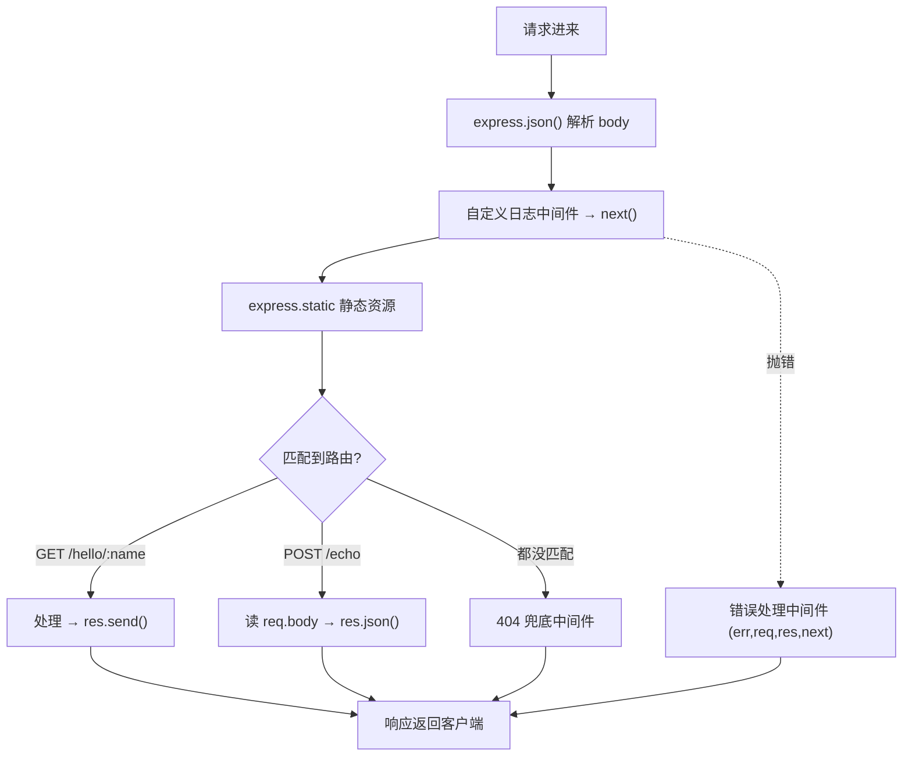

# 14 · Express 入门
> Express 是最流行的 Node Web 框架，把原生 `http` 的繁琐（手写路由、解析 body）封装成简洁的「路由 + 中间件」模型。本模块讲清这两个核心概念。

## 📖 知识讲解

**中间件（Middleware）** 是 Express 的灵魂：一个 `(req, res, next)` 函数，请求像流水线一样**依次穿过**它们。

- 调 `next()` → 进入下一个中间件；
- 不调 `next()` 且不响应 → 请求**卡住**；
- 直接 `res.send()` → **截断**流水线，提前返回。

**中间件分类：**

| 类型 | 例子 |
| --- | --- |
| 内置 | `express.json()`（解析 JSON body）、`express.static()`（静态资源） |
| 自定义 | 日志、鉴权、限流等自己写的 `(req,res,next)` |
| 错误处理 | **4 个参数** `(err,req,res,next)`，Express 专门识别 |

**顺序至关重要**：中间件按 `app.use` 的注册顺序执行。解析 body 的中间件要在用到 `req.body` 的路由**之前**；404 兜底要放所有路由**之后**；错误处理放**最后**。

**路由**：`app.METHOD(path, handler)`，`handler(req, res)` 里：

| 读取 | API |
| --- | --- |
| 路径参数 `/user/:id` | `req.params.id` |
| 查询参数 `?q=x` | `req.query.q` |
| 请求体（JSON） | `req.body`（需先 `express.json()`） |

| 响应 | API |
| --- | --- |
| 文本/HTML | `res.send(...)` |
| JSON | `res.json(...)` |
| 状态码 | `res.status(404).json(...)` |

## 🔄 流程图 / 原理图

请求穿过中间件流水线：



## 💻 代码说明

`app.js`：`app.use(express.json())` 解析 JSON；自定义日志中间件打印每个请求并 `next()`；`express.static('public')` 提供静态文件；路由演示路径参数（`/hello/:name` → `req.params`）、查询参数（`/search` → `req.query`）、读 body（`POST /echo` → `req.body`）；末尾放 404 兜底和错误处理中间件。

## ▶️ 运行方式

```bash
npm install        # 安装 express（首次必须）
node app.js        # 或 npm start
# 测试：
curl http://localhost:3000/hello/张三
curl "http://localhost:3000/search?q=node"
curl -X POST http://localhost:3000/echo -H "Content-Type: application/json" -d '{"a":1}'
# 浏览器打开 http://localhost:3000/index.html 看静态资源
```

> ⚠️ 本模块需联网执行 `npm install` 安装依赖（约几 MB）。

## ⚠️ 常见坑 / 最佳实践

- ❌ 忘了 `express.json()` → `req.body` 是 `undefined`。
- ❌ 自定义中间件忘了 `next()`（且没响应）→ 请求永久挂起。
- ⚠️ 中间件**顺序**错了：404 放在了正常路由前面 → 所有请求都 404。
- ⚠️ 错误处理中间件必须是**4 个参数**，少一个 Express 就不当它是错误处理器。
- ✅ 异步路由里的错误（Express 4）要手动 `next(err)` 或 try/catch 传递（Express 5 已能自动捕获）。

## 🔗 官方文档

- [Express 官方（中文）](https://expressjs.com/zh-cn/)
- [Express 路由](https://expressjs.com/zh-cn/guide/routing.html)
- [Express 中间件](https://expressjs.com/zh-cn/guide/using-middleware.html)
