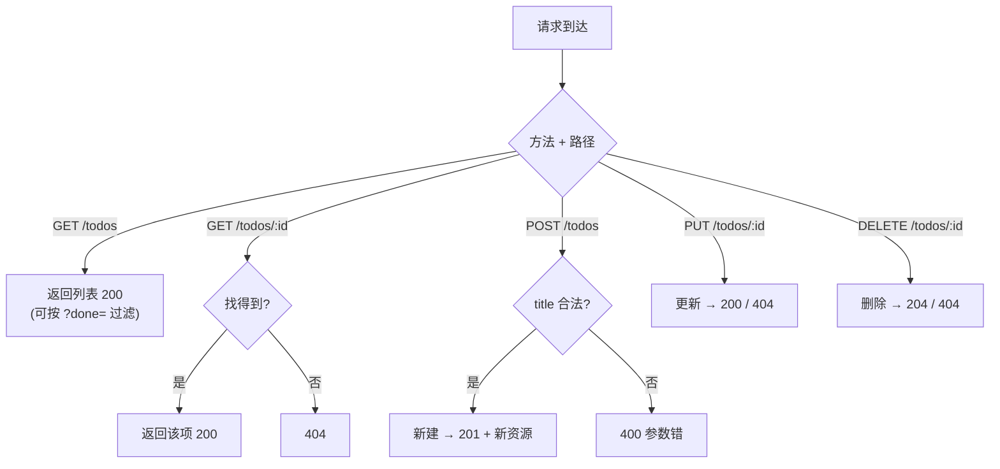

# 15 · REST API（用 Express 实现 CRUD）
> 用 Express 写一套标准的 RESTful 接口，对 `todos` 资源做增删改查（CRUD），理解「HTTP 方法 + 资源 URL + 状态码」的 REST 设计风格。

## 📖 知识讲解

**REST 风格**：用 **HTTP 方法**表达操作、**URL**表达资源、**状态码**表达结果，接口语义清晰统一。

| 操作 | 方法 + 路径 | 含义 | 成功状态码 |
| --- | --- | --- | --- |
| 查列表 | `GET /todos` | 获取所有 | 200 |
| 查单个 | `GET /todos/:id` | 获取一个 | 200 / 404 |
| 新建 | `POST /todos` | 创建 | 201 |
| 全量改 | `PUT /todos/:id` | 替换 | 200 / 404 |
| 删除 | `DELETE /todos/:id` | 删除 | 204 / 404 |

**常用状态码语义：**

| 码 | 含义 |
| --- | --- |
| 200 OK | 成功（有响应体） |
| 201 Created | 创建成功 |
| 204 No Content | 成功但无响应体（常用于删除） |
| 400 Bad Request | 参数错误（如必填项缺失） |
| 404 Not Found | 资源不存在 |
| 500 | 服务器内部错误 |

**REST 设计要点**：URL 用**名词复数**（`/todos` 而非 `/getTodos`）；用方法区分动作，别把动词塞进 URL；正确使用状态码而非永远返回 200。

## 🔄 流程图 / 原理图

CRUD 请求的处理与状态码分支：



## 💻 代码说明

`server.js`：用数组当内存数据库存 `todos`。五个路由分别实现 CRUD：`GET /todos` 支持 `?done=true` 过滤；`GET /todos/:id` 找不到返回 404；`POST` 校验 `title` 必填（否则 400），成功返回 201 + 新资源；`PUT` 部分更新字段；`DELETE` 成功返回 204 无响应体。统一用 `res.status(码).json(...)` 表达结果。

## ▶️ 运行方式

```bash
npm install        # 安装 express（首次必须）
node server.js     # 或 npm start
```

完整 CRUD 测试：

```bash
curl http://localhost:3000/todos                       # 查列表
curl "http://localhost:3000/todos?done=false"          # 过滤未完成
curl http://localhost:3000/todos/1                      # 查单个
curl -X POST http://localhost:3000/todos \
     -H "Content-Type: application/json" -d '{"title":"写代码"}'   # 新建 → 201
curl -X PUT http://localhost:3000/todos/2 \
     -H "Content-Type: application/json" -d '{"done":true}'        # 更新
curl -X DELETE http://localhost:3000/todos/1           # 删除 → 204
```

> ⚠️ 数据存在内存，重启服务即清空（仅教学；真实项目接数据库）。需联网 `npm install`。

## ⚠️ 常见坑 / 最佳实践

- ❌ 所有响应都返回 200 → 客户端无法区分成功/失败/找不到；要按语义用状态码。
- ❌ URL 里塞动词（`/createTodo`、`/deleteTodo`）→ 不符合 REST；用名词 + HTTP 方法。
- ⚠️ `req.params.id` 是**字符串**，和数字 id 比较要 `Number(...)` 转换。
- ✅ 生产环境必做：参数校验（如 zod/joi）、统一错误处理、分页、鉴权、接数据库持久化。
- ✅ `PUT`（全量替换）与 `PATCH`（局部更新）语义不同，按需选用。

## 🔗 官方文档

- [Express 路由](https://expressjs.com/zh-cn/guide/routing.html)
- [MDN: HTTP 响应状态码](https://developer.mozilla.org/zh-CN/docs/Web/HTTP/Status)
- [MDN: HTTP 请求方法](https://developer.mozilla.org/zh-CN/docs/Web/HTTP/Methods)
