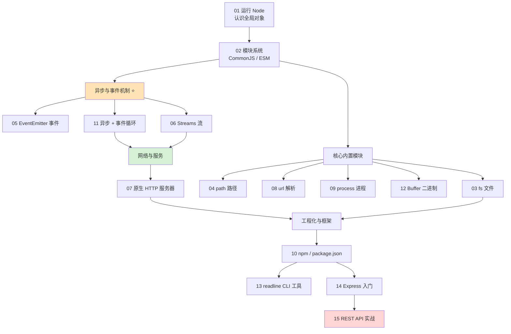

# 10 · Node.js —— 服务端 JavaScript 运行时

> Node.js 是基于 Chrome V8 引擎的 JavaScript 运行时，让 JS 走出浏览器、运行在服务器和命令行上。它以「单线程 + 事件循环 + 非阻塞 I/O」著称，擅长高并发的网络应用、命令行工具和构建工具链。本工程从「跑第一个程序」到「用 Express 写 REST API」，循序渐进掌握 Node 核心。

## 📚 模块索引

| 模块 | 知识点 | 核心内容 | 运行命令 |
| --- | --- | --- | --- |
| [01-hello-node](./01-hello-node/) | 运行 Node | REPL、全局对象、process、运行方式 | `node hello.js` |
| [02-modules](./02-modules/) | 模块系统 | CommonJS `require` vs ESM `import` | `node app.cjs` / `node app.mjs` |
| [03-fs-filesystem](./03-fs-filesystem/) | 文件系统 | 读写/目录/stat（Promise 版 fs） | `node fs-demo.js` |
| [04-path](./04-path/) | 路径处理 | join/resolve/parse 跨平台拼路径 | `node path-demo.js` |
| [05-events-emitter](./05-events-emitter/) | 事件发射器 | on/once/emit 发布订阅 | `node events-demo.js` |
| [06-streams](./06-streams/) | 流 📊 | Readable/Writable/Transform、管道、背压 | `node streams-demo.js` |
| [07-http-server](./07-http-server/) | HTTP 服务器 📊 | 原生 http、请求/响应处理流程 | `node server.js` |
| [08-url-querystring](./08-url-querystring/) | URL 解析 | URL / URLSearchParams | `node url-demo.js` |
| [09-process-env](./09-process-env/) | 进程对象 | argv/env/退出控制 | `node process-demo.js` |
| [10-npm-package](./10-npm-package/) | npm 与 package.json | 依赖/scripts/版本号 | `node index.js` |
| [11-async-patterns](./11-async-patterns/) | 异步与事件循环 📊 | 回调/Promise/async、执行顺序 | `node async-demo.js` |
| [12-buffer](./12-buffer/) | Buffer | 二进制字节、编码、中文坑 | `node buffer-demo.js` |
| [13-readline-cli](./13-readline-cli/) | 命令行交互 | readline 问答式 CLI | `node cli.js` |
| [14-express-intro](./14-express-intro/) | Express 入门 | 路由 + 中间件（需 npm install） | `npm install && node app.js` |
| [15-rest-api](./15-rest-api/) | REST API | Express CRUD + 状态码（需 npm install） | `npm install && node server.js` |

📊 = 含重点流程图/原理图（事件循环、流、HTTP 请求处理）。

## 🗺️ 学习路线



**建议顺序**：先 01→02 打基础；再横扫核心内置模块（03/04/08/09/12）；重点攻克异步三件套（05 事件 → 11 事件循环 → 06 流）——这是 Node 的灵魂；然后 07 用原生 http 理解 Web 服务底层；最后进入工程化（10 npm）与框架实战（14 Express → 15 REST API）。

## ▶️ 运行说明

### 环境要求

- **Node.js**：建议 LTS 18 / 20 / 22 及以上（核心 API 均兼容到 Node 26）。检查版本：

  ```bash
  node -v    # 看 Node 版本
  npm -v     # 看 npm 版本
  ```

- 未安装请到 [nodejs.org](https://nodejs.org/zh-cn) 下载 LTS 版，或用 [nvm](https://github.com/nvm-sh/nvm) 管理多版本。

### 运行单个模块

```bash
cd 10-nodejs/01-hello-node
node hello.js
```

- **模块 01–13**：纯内置模块，无需安装依赖，进入目录 `node 对应文件` 直接运行（具体命令见上表 / 各模块 README）。
- **模块 02**：分别运行 `node app.cjs`（CommonJS）和 `node app.mjs`（ESM）对比。
- **模块 07 / 14 / 15** 是服务器，启动后用浏览器或 `curl` 访问，`Ctrl + C` 停止。

### 运行需依赖的模块（14 / 15）

```bash
cd 10-nodejs/14-express-intro
npm install        # 安装 express（需联网，首次必须）
node app.js        # 或 npm start
```

模块 15 同理。这两个模块各有独立的 `package.json`，依赖装在各自目录的 `node_modules/` 下。

## 🔗 官方文档

- [Node.js 官网（中文）](https://nodejs.org/zh-cn)
- [API 参考文档（latest）](https://nodejs.org/docs/latest/api/)
- [官方学习指南 Learn](https://nodejs.org/en/learn)
- [npm 官方文档](https://docs.npmjs.com/)
- [Express 官方（中文）](https://expressjs.com/zh-cn/)
