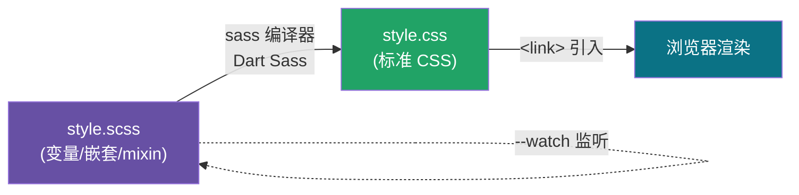

# 01 · 安装与编译（Setup & Compile）

> Sass 是「写起来更爽的 CSS」，但浏览器不认识它，必须先把 `.scss` **编译**成标准 `.css` 才能用。本模块讲清这条编译链路怎么搭、怎么跑。

## 📖 知识讲解

**Sass vs SCSS：** Sass 有两种语法。`.sass` 是缩进语法（无大括号无分号）；`.scss` 是「Sassy CSS」，完全兼容 CSS 语法（有大括号和分号）。**官方与社区现在都主推 `.scss`**，因为任何合法 CSS 都是合法 SCSS，迁移零成本。本工程统一用 `.scss`。

**编译器：** 官方实现是 **Dart Sass**（唯一仍在维护的实现，LibSass / Ruby Sass 已弃用）。安装方式有三种：

| 方式 | 命令 | 适用场景 |
| --- | --- | --- |
| npm（推荐） | `npm i -D sass` | 前端工程，跟项目一起锁版本 |
| 全局 CLI | `npm i -g sass` 或 `brew install sass/sass/sass` | 命令行随手编译 |
| 构建工具内置 | Vite / Webpack + `sass` | 工程化项目自动编译 |

**编译命令：**

```bash
# 单次编译：input.scss → output.css
npx sass input.scss output.css

# 监听模式：源文件一改就自动重编译（开发必备）
npx sass --watch input.scss output.css

# 指定输出风格：expanded(展开,默认) / compressed(压缩,生产用)
npx sass --style=compressed input.scss output.min.css

# 整个目录映射：src 下所有 scss 编译到 dist
npx sass src:dist --watch
```

**编译产物：** 默认还会生成一个 `.css.map`（source map），方便浏览器调试时定位到 `.scss` 源码行。生产环境可用 `--no-source-map` 关闭。

## 🔄 流程图 / 原理图



> 记住一句话：**浏览器只吃 CSS，Sass 是写给开发者看的，编译器是中间的翻译官。**

## 💻 代码说明

`style.scss` 里：

- `$brand / $radius / $gap` 是**变量**，把颜色和尺寸集中起来。
- `.card { &__title {...} &:hover {...} }` 是**嵌套**，`&` 代表父选择器。
- `lighten($brand, 8%)` 是内置**颜色函数**。

编译后打开 `style.css` 会发现：变量被替换成了真实值，嵌套被展开成了 `.card__title`、`.card:hover` 这样的扁平选择器——这正是 Sass 的价值：**源码省心，产物标准**。

## ▶️ 运行方式

```bash
# 在 11-sass 目录下安装依赖
npm i -D sass

# 编译本模块
npx sass 01-setup-compile/style.scss 01-setup-compile/style.css

# 或监听模式边改边看
npx sass --watch 01-setup-compile/style.scss 01-setup-compile/style.css
```

然后用浏览器打开 `01-setup-compile/index.html` 即可看到卡片效果。

> 没有 Node 也行：`brew install sass/sass/sass` 后用 `sass style.scss style.css`。

## ⚠️ 常见坑 / 最佳实践

- **别把 `.scss` 直接 `<link>` 进 HTML**——浏览器不认识，必须引编译后的 `.css`。
- `.css.map` 和 `.css` 一般加进 `.gitignore`（产物不入库），本教学项目为了开箱即看而保留。
- 生产环境用 `--style=compressed` 压缩体积。
- LibSass / `node-sass` 已停止维护，新项目一律用 `sass`（Dart Sass）。

## 🔗 官方文档

- 安装：https://sass-lang.com/install/
- 命令行用法：https://sass-lang.com/documentation/cli/dart-sass/
- 语法概览：https://sass-lang.com/documentation/syntax/
