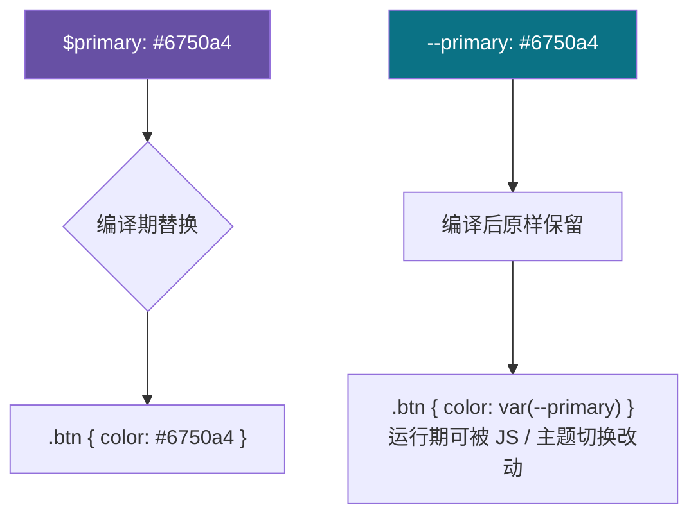

# 02 · 变量（Variables）

> 用 `$名字: 值;` 把颜色、尺寸、字体等「设计 token」集中存起来，改一处全局生效——这是 Sass 最常用、最直观的能力。

## 📖 知识讲解

**声明与使用：**

```scss
$primary: #6750a4;   // 声明
.btn { color: $primary; }  // 使用
```

**Sass 变量支持的数据类型：** 数字（`16px`、`1.6`）、字符串（`"sans-serif"`）、颜色（`#6750a4`、`red`）、布尔（`true/false`）、空值（`null`）、列表（`1px solid red`）、映射（`(key: value)`，见 10 模块）。

**核心关键字：**

| 语法 | 作用 |
| --- | --- |
| `!default` | 仅当变量**尚未定义**时才赋值。用于库的「可覆盖默认值」。 |
| `!global` | 在选择器/局部作用域内修改**全局**变量（否则只是新建局部变量）。 |
| `#{$var}` | **插值**：把变量嵌进选择器名、属性名或字符串里。 |

**作用域：** 顶层声明的是全局变量；写在 `{}` 内的是局部变量，只在该块可见。

**⭐ Sass 变量 vs CSS 自定义属性（`--var`）——别混淆：**

| | Sass `$var` | CSS `--var` |
| --- | --- | --- |
| 生效时机 | **编译期**，编译后消失 | **运行期**，保留在 CSS 里 |
| 能否被 JS 改 | 不能 | 能（`element.style.setProperty`） |
| 能否响应媒体查询/主题切换动态变化 | 不能（值已固化） | 能 |

经验法则：**静态设计 token 用 `$`；需要运行时动态切换（如暗色主题）用 `--var`**，两者常配合使用。

## 🔄 流程图 / 原理图



## 💻 代码说明

- `$primary / $base-size / $font-stack` 演示了不同数据类型的变量。
- `$primary: #6750a4 !default;` 因为上方已定义，`!default` 不生效——这正是「默认值」语义。
- `.dark-mode { $theme: dark !global; }` 用 `!global` 修改全局 `$theme`。
- `.#{$prefix}-banner` 用插值动态生成选择器名 `.app-banner`；`border-#{$side}` 生成 `border-left`。
- `padding: ($base-size * 0.5) ...` 显示变量可直接参与运算。

## ▶️ 运行方式

```bash
npx sass 02-variables/style.scss 02-variables/style.css
```

浏览器打开 `index.html`。

## ⚠️ 常见坑 / 最佳实践

- **Sass 变量在编译后就没了**，运行时无法改；需要动态主题请用 CSS `--var`。
- 在字符串或选择器里用变量**必须插值** `#{}`，直接写 `$var` 不会被识别。
- `!default` 必须写在「可能已被定义」的变量之后才有意义（常见于配置文件被 `@use ... with` 覆盖）。
- 变量名用 kebab-case（`$base-size`），别用驼峰，保持 CSS 风格统一。

## 🔗 官方文档

- 变量：https://sass-lang.com/documentation/variables/
- 插值：https://sass-lang.com/documentation/interpolation/
