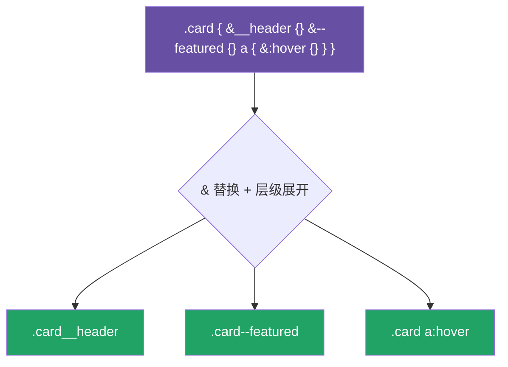

# 03 · 嵌套与父选择器 &（Nesting & Parent Selector）

> 把子选择器写进父级 `{}` 里，让 CSS 层级跟 HTML 一样直观；`&` 代表「父选择器」，是写 BEM、伪类、状态类的核心工具。

## 📖 知识讲解

**基础嵌套：** 选择器嵌套后，编译会自动用**空格**拼成后代选择器：

```scss
.nav { a { color: #fff; } }   // 编译成  .nav a { color: #fff; }
```

**父选择器 `&`：** `&` 会被替换为「当前所在的父选择器」。它的位置决定拼接方式：

| 写法 | 编译结果 | 用途 |
| --- | --- | --- |
| `&:hover` | `.nav:hover` | 伪类（紧贴，无空格） |
| `&__title` | `.card__title` | BEM 元素 |
| `&--active` | `.card--active` | BEM 修饰符 |
| `.dark &` | `.dark .card` | **上下文**：放右边表示「在某祖先下」 |

**嵌套属性：** 共享前缀的属性（`font-*`、`margin-*`）可以写成 `font: { size: ...; weight: ... }`。

**嵌套 `@media`：** 媒体查询可以写在选择器**内部**，编译时会自动提升为独立的 `@media` 块——大幅减少重复的选择器书写。

## 🔄 流程图 / 原理图



## 💻 代码说明

- `.nav { ul {} a { &:hover {} } }` → `.nav ul`、`.nav a`、`.nav a:hover`。
- `.card { &__header &--featured }` 用 `&` 拼出 BEM 类名，避免重复写 `.card`。
- `.dark-theme & {}` 把 `&` 放右边，得到 `.dark-theme .btn`——表达「上下文样式」。
- `font: { family:...; size:...; }` 是嵌套属性，展开成 `font-family`、`font-size`。
- `.container` 内嵌 `@media` 自动提升为媒体查询块。

## ▶️ 运行方式

```bash
npx sass 03-nesting/style.scss 03-nesting/style.css
```

打开 `index.html`，把鼠标移到导航链接上看 `:hover` 效果。

## ⚠️ 常见坑 / 最佳实践

- **嵌套别超过 3 层！** 深层嵌套会编译出 `.a .b .c .d` 这种超长选择器，权重高、难覆盖、难维护——这是新手最大的坑。
- 别滥用后代嵌套，优先用 `&__xxx`（BEM）生成扁平的单类选择器。
- `&:hover` 紧贴没空格，`& .child` 有空格——位置不同含义完全不同。
- 嵌套 `@media` 很香，但同一个值的媒体查询会生成多个 `@media` 块（编译器不会合并），数量多时注意产物体积。

## 🔗 官方文档

- 嵌套规则：https://sass-lang.com/documentation/style-rules/declarations/#nesting
- 父选择器 &：https://sass-lang.com/documentation/style-rules/parent-selector/
