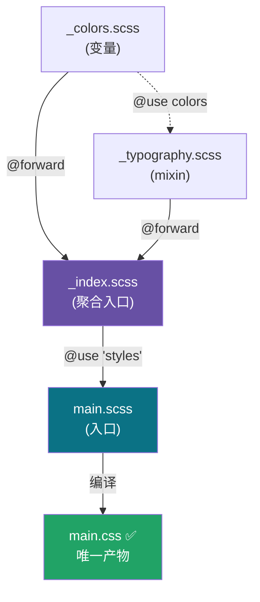

# 04 · 模块化：Partials 与 @use / @forward

> 把样式拆成多个文件（partial），再用现代的 `@use` 引入、`@forward` 转发，构建带**命名空间**、**可控可见性**的模块系统。这是取代老旧 `@import` 的正确方式。

## 📖 知识讲解

**Partial（局部文件）：** 文件名以 `_` 开头（如 `_colors.scss`）。编译器**不会**把它单独编译成 `.css`，它只能被其他文件引用。这样就能把变量、mixin 按职责拆分到多个小文件。

**`@use`（引入模块）：** 把另一个文件作为「模块」加载，成员默认带**命名空间**（默认是文件名）：

```scss
@use "colors";              // 访问要写 colors.$primary
@use "colors" as c;         // 自定义命名空间：c.$primary
@use "colors" as *;         // 去掉命名空间（不推荐，易冲突）
```

- 同一个文件无论被 `@use` 多少次，**只编译一次**（解决了 `@import` 的重复输出问题）。
- 引用文件夹时（`@use "styles"`），Sass 自动加载该文件夹下的 `_index.scss`。

**`@forward`（转发模块）：** 把一个模块的成员「再导出」，常用于做**聚合入口**（`_index.scss`），让使用方一行 `@use "styles"` 就拿到所有东西：

```scss
@forward "colors";
@forward "typography";
@forward "colors" as color-*;   // 可加前缀转发
@forward "src/list" hide list-reset;  // 可隐藏部分成员
```

**`@use ... with`（配置模块）：** 引入时覆盖模块里用 `!default` 声明的变量：

```scss
@use "library" with ($primary: #f00, $radius: 4px);
```

**⛔ 为什么不用 `@import`？** `@import` 会把所有变量/mixin 倒进**全局**命名空间，导致命名冲突、重复编译、无法判断变量来源。**Sass 官方已弃用 `@import`**，新项目一律用 `@use` / `@forward`。

## 🔄 流程图 / 原理图



## 💻 代码说明

- `styles/_colors.scss`、`styles/_typography.scss`：两个 partial，分别管颜色和排版。`_typography` 内部用 `@use "colors"` 依赖颜色模块，访问时写 `colors.$text`。
- `styles/_index.scss`：用两条 `@forward` 把上面两个模块聚合成统一入口。
- `main.scss`：`@use "styles"`（自动找 `_index.scss`），之后用 `styles.$bg`、`@include styles.heading` 访问转发来的成员。
- 最终**只有 `main.scss` 编译出 `main.css`**，三个 partial 都不单独产出文件。

## ▶️ 运行方式

```bash
# 只需编译入口文件，依赖会被自动解析
npx sass 04-partials-use/main.scss 04-partials-use/main.css
```

打开 `index.html`。

## ⚠️ 常见坑 / 最佳实践

- **别再用 `@import`**——已弃用，未来版本会移除。
- partial 文件名必须以 `_` 开头，但 `@use "colors"` 引用时**不写下划线也不写扩展名**。
- `@use` 默认带命名空间，访问成员忘了写 `colors.` 前缀会报 "Undefined variable"。
- `@use` 规则必须写在文件**最顶部**（在任何样式规则之前）。
- 谨慎使用 `@use "..." as *`，它会把成员塞进全局，重新带来命名冲突风险。

## 🔗 官方文档

- @use：https://sass-lang.com/documentation/at-rules/use/
- @forward：https://sass-lang.com/documentation/at-rules/forward/
- 从 @import 迁移：https://sass-lang.com/documentation/at-rules/import/
