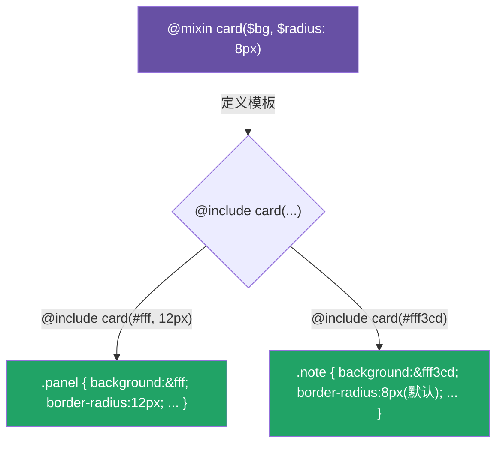

# 05 · 混入（Mixins）：@mixin / @include

> Mixin 是「可复用的样式片段」——定义一次，到处 `@include`，还能传参。它消灭重复 CSS、封装媒体查询、做厂商前缀工具。

## 📖 知识讲解

**定义与调用：**

```scss
@mixin flex-center { display: flex; align-items: center; justify-content: center; }
.box { @include flex-center; }   // 调用
```

**参数能力：**

| 特性 | 写法 | 说明 |
| --- | --- | --- |
| 默认值 | `@mixin card($r: 8px)` | 调用时可省略该参数 |
| 关键字参数 | `@include card($pad: 24px)` | 按名字传、可乱序、可只传部分 |
| 可变参数 | `@mixin shadow($s...)` | 把任意个实参打包成列表 |
| 内容块 | `@content` | 把 `@include x { ... }` 里的 `{}` 注入 mixin |

**`@content` 是精髓：** 它让 mixin 能「包裹」一段样式，最经典的用途是封装响应式断点：

```scss
@include respond(mobile) { font-size: 20px; }
```

**Mixin vs 占位符 `%`（见 07 模块）的区别：** mixin **每次调用都会复制一份**输出（带参数时只能用 mixin）；`@extend %placeholder` 则是**合并选择器**、不复制属性。需要参数 → 用 mixin；纯静态样式想省体积 → 用 `%placeholder`。

## 🔄 流程图 / 原理图



## 💻 代码说明

- `flex-center`：无参 mixin，`@include flex-center` 无需括号。
- `card($bg, $radius: 8px, $pad: 16px)`：带默认值；`.panel` 用关键字参数只改 `$bg`、`$pad`，`.note` 只传 `$bg` 其余走默认。
- `shadow($shadows...)`：可变参数，`.fancy` 一次传两个阴影，原样赋给 `box-shadow`。
- `respond($breakpoint) { @content }`：用 `@content` 注入样式块，`.headline` 在 mobile 下改字号。

## ▶️ 运行方式

```bash
npx sass 05-mixins/style.scss 05-mixins/style.css
```

打开 `index.html`，缩小窗口宽度观察标题字号变化。

## ⚠️ 常见坑 / 最佳实践

- 需要**传参** → 必须用 mixin；纯静态共享样式优先考虑 `%placeholder`（少产出重复代码）。
- mixin **每次 `@include` 都复制全部属性**，滥用会让 CSS 体积膨胀。
- `@content` 里的变量作用域是「调用处」，不是 mixin 内部，注意变量可见性。
- 在 mixin 里用内置函数（如 `color.adjust`）记得 `@use "sass:color"`。

## 🔗 官方文档

- @mixin / @include：https://sass-lang.com/documentation/at-rules/mixin/
- @content：https://sass-lang.com/documentation/at-rules/mixin/#content-blocks
