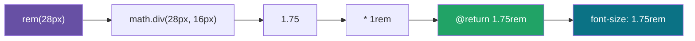

# 06 · 自定义函数（Functions）：@function / @return

> `@function` 定义返回**一个值**的函数（mixin 返回的是一段样式）。用它做单位换算、计算、根据输入派生颜色等纯逻辑，让样式表「会算数」。

## 📖 知识讲解

**定义与调用：**

```scss
@function rem($px) { @return math.div($px, 16px) * 1rem; }
.title { font-size: rem(28px); }   // → 1.75rem
```

**Function vs Mixin——核心区别：**

| | `@function` | `@mixin` |
| --- | --- | --- |
| 产出 | `@return` **一个值** | `@include` **一段 CSS 声明** |
| 用在哪 | 属性值的位置：`font-size: rem(28px)` | 声明块的位置：`@include card` |
| 能否带参数 | 能 | 能 |

口诀：**要算出一个值用 function，要塞一堆样式用 mixin。**

**常配合内置模块：**

- `sass:math` —— `math.div(a, b)`（除法，**`/` 已弃用必须用它**）、`math.percentage()`、`math.round()`、`math.max()`。
- `sass:color` —— `color.adjust()`、`color.scale()`、`color.channel()`。
- `sass:string` / `sass:list` / `sass:map`（见 10 模块）。

函数体内可以用 `@if/@else`、`@each` 等控制流（见 09 模块）做复杂逻辑。

## 🔄 流程图 / 原理图



## 💻 代码说明

- `rem($px)`：用 `math.div` 做除法（不能写 `$px / 16px`，已弃用），再乘 `1rem`。
- `spacing($factor: 1)`：带默认值，`spacing(2)=16px`、`spacing()=8px`。
- `contrast-color($bg)`：用 `color.lightness($bg)` 取亮度，`@if` 判断后返回深色或白色文字——让标签文字始终可读。

## ▶️ 运行方式

```bash
npx sass 06-functions/style.scss 06-functions/style.css
```

打开 `index.html`，观察两个标签自动选用了对比文字色。

## ⚠️ 常见坑 / 最佳实践

- **除法必须用 `math.div(a, b)`**，老写法 `a / b` 已弃用（`/` 在 CSS 里有歧义，如 `font: 16px/1.5`）。
- 函数只能 `@return` 值，**不能输出样式声明**；想输出声明请用 mixin。
- 给数字拼单位用 `* 1rem` 或插值 `#{}`，别直接字符串拼数字。
- 函数名别和内置函数重名（如 `rgb`、`map-get`），否则可能覆盖或冲突。
- 颜色操作优先用新 API `color.adjust` / `color.scale`，旧的 `lighten/darken` 已弃用。

## 🔗 官方文档

- @function：https://sass-lang.com/documentation/at-rules/function/
- sass:math：https://sass-lang.com/documentation/modules/math/
- sass:color：https://sass-lang.com/documentation/modules/color/
