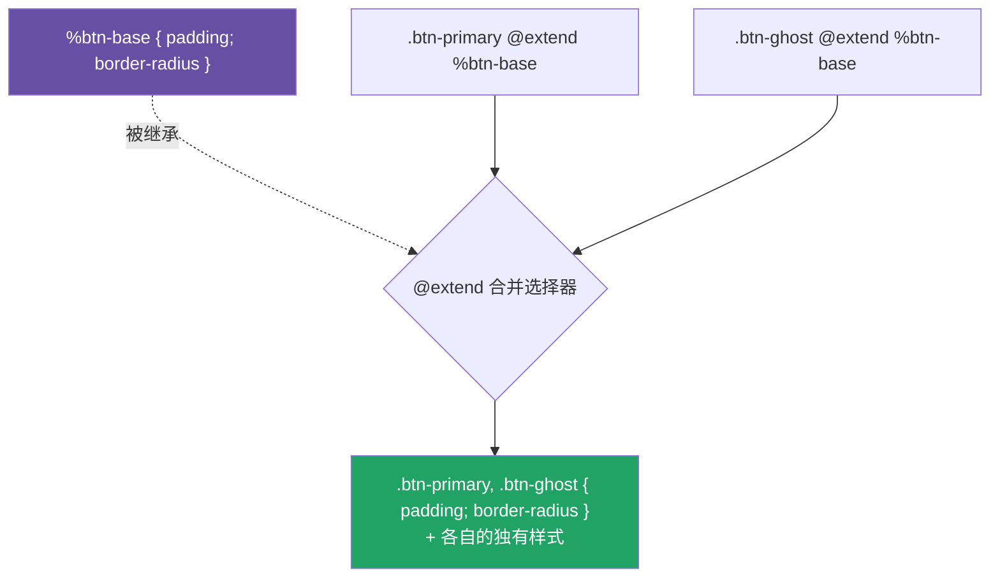

# 07 · 继承 @extend 与占位符 %placeholder

> `@extend` 让一个选择器「继承」另一个的样式，编译时把它们**合并进同一条规则**（共享样式、不复制属性）。`%placeholder` 是专为被继承而生的占位选择器，自己不输出任何 CSS。

## 📖 知识讲解

**`%placeholder`（占位符）：** 用 `%` 开头声明。它**本身永远不会出现在编译后的 CSS** 里，只有被 `@extend` 时才「激活」并把自己的选择器合并进去：

```scss
%btn-base { padding: 10px 18px; border-radius: 8px; }
.btn-primary { @extend %btn-base; background: #6750a4; }
.btn-ghost   { @extend %btn-base; background: transparent; }
```

编译结果（关键）——**两个类共享一条规则**：

```css
.btn-primary, .btn-ghost { padding: 10px 18px; border-radius: 8px; }
.btn-primary { background: #6750a4; }
.btn-ghost   { background: transparent; }
```

**`@extend` 真实类也可以**，但会让那个类的样式参与合并，可能牵连意料外的选择器；**占位符更干净、更可控**，是推荐做法。

**`@extend` vs `@mixin`——本质区别（重点）：**

| | `@extend %x` | `@include mixin` |
| --- | --- | --- |
| 编译产物 | **合并选择器**，属性只出现一次 | **复制属性**到每个调用处 |
| 体积 | 小（共享） | 大（重复） |
| 能否带参数 | 不能 | 能 |
| 媒体查询内继承外部 | **不允许**（报错） | 没问题 |

口诀：**静态、无参、想省体积 → `%placeholder + @extend`；要传参或跨媒体查询 → mixin。**

## 🔄 流程图 / 原理图



## 💻 代码说明

- `%btn-base`：占位符，单独不输出；被 `.btn-primary`、`.btn-ghost` 继承后合并成一条共享规则。
- `.message-success / .message-error` 演示 `@extend` **真实类** `.message`，把公共样式合并过来。
- `%clearfix` 带嵌套 `&::after`，被 `.row` 继承时连嵌套一起带过去。

## ▶️ 运行方式

```bash
npx sass 07-extend-inheritance/style.scss 07-extend-inheritance/style.css
```

打开 `index.html`。打开生成的 `style.css` 看「选择器被合并」的效果。

## ⚠️ 常见坑 / 最佳实践

- **不能从 `@media` 块内部 `@extend` 块外的选择器**——会直接编译报错。需要跨断点复用时改用 mixin。
- `@extend` 会改变选择器的**源码顺序与组合**，可能产生你没预期的长选择器，过度使用难以追踪。
- 优先 `@extend %placeholder` 而不是 `@extend .real-class`，避免牵连真实类的所有用法。
- 要传参数 → 只能用 mixin，`@extend` 不支持参数。

## 🔗 官方文档

- @extend：https://sass-lang.com/documentation/at-rules/extend/
- 占位符选择器：https://sass-lang.com/documentation/style-rules/placeholder-selectors/
