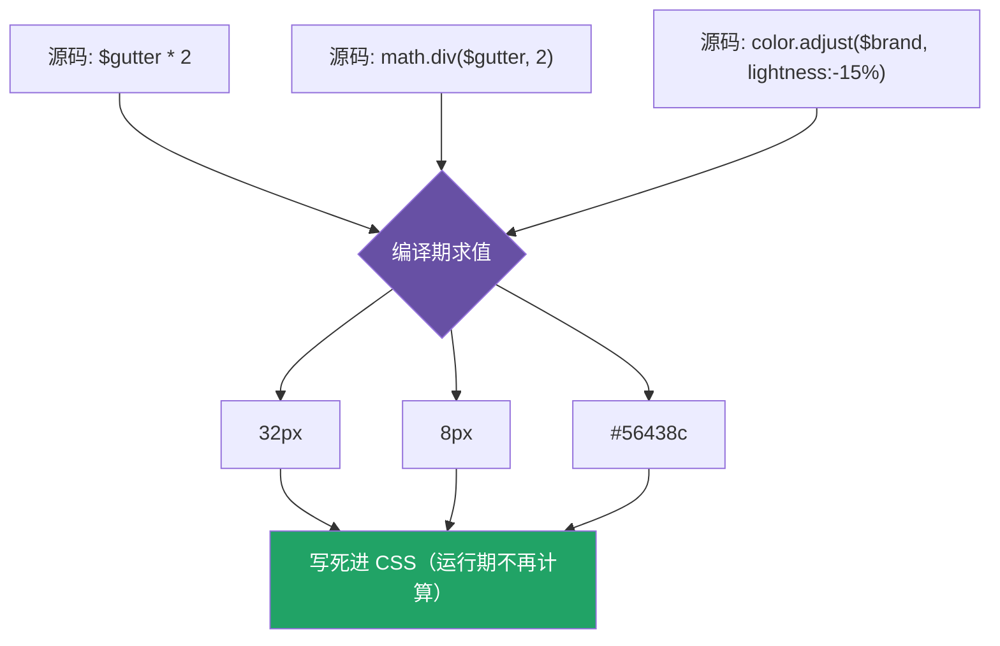

# 08 · 运算（Operators）：数学 / 颜色 / 比较 / 逻辑

> Sass 能在**编译期**做算术、单位换算、比较、逻辑、字符串拼接和颜色运算，让样式表「会计算」。

## 📖 知识讲解

**运算符总览：**

| 类别 | 运算符 | 例子 |
| --- | --- | --- |
| 数学 | `+ - * / %` | `$gutter * 2` |
| 比较 | `== != < > <= >=` | `$size >= 16px` |
| 逻辑 | `and` `or` `not` | `$a and $b` |
| 字符串 | `+`（拼接） | `"/assets" + "/x.png"` |

**⚠️ 除法的大坑：** 因为 CSS 里 `/` 有特殊含义（如 `font: 16px/1.5`、`grid-row: 1/3`），Sass **已弃用 `/` 做除法**，必须改用 **`math.div(a, b)`**。

**单位运算规则：**

- 同单位相加减：`100px + 20px = 120px`。
- 数 × 单位：`10px * 3 = 30px`；但 `10px * 10px` 会得到 `100px*px` 这种非法单位（要避免）。
- 不同单位相加（`10px + 1em`）会**报错**。
- `math.percentage()` 把无单位比值转成百分比。

**颜色运算（现代写法）：** 不要再用 `lighten()/darken()/saturate()`（已弃用），改用 `sass:color` 模块：

| 旧（弃用） | 新（推荐） |
| --- | --- |
| `lighten($c, 10%)` | `color.scale($c, $lightness: 10%)` |
| `darken($c, 10%)` | `color.adjust($c, $lightness: -10%)` |
| `rgba($c, .5)` | `color.adjust($c, $alpha: -0.5)` |
| `mix($a, $b, 50%)` | `color.mix($a, $b, 50%)` |

`color.adjust` 按通道**绝对增减**；`color.scale` 按比例**朝端点缩放**（变化更自然，不会越界）。

## 🔄 流程图 / 原理图



## 💻 代码说明

- `.layout`：`$gutter * 2`、`$gutter + 8px`、`math.div($gutter,2)`、`10 % 3` 演示四则与取模。
- `.unit-demo`：单位相加、数乘单位、`math.percentage(math.div(3,12))=25%`。
- `.color-demo`：`color.adjust`（调暗/调透明）、`color.mix`（混色）。
- `.conditional`：比较 `>=` 与逻辑 `and` 得到布尔值，配合 `@if`。
- `.hero`：字符串 `+` 拼接资源路径。

## ▶️ 运行方式

```bash
npx sass 08-operators/style.scss 08-operators/style.css
```

打开 `index.html`，打开 `style.css` 看所有运算已被算成固定值。

## ⚠️ 常见坑 / 最佳实践

- **除法一律 `math.div()`**，写 `$a / $b` 会触发弃用警告甚至报错。
- 颜色函数用 `color.*` 新 API，`lighten/darken` 已弃用。
- 别让单位相乘失控（`px * px`），运算前理清量纲。
- 运算都在**编译期**完成、结果写死；要运行期动态计算请用 CSS `calc()`（calc 会原样保留到 CSS）。
- `calc()` 里若要用 Sass 变量，需插值：`calc(100% - #{$gutter})`。

## 🔗 官方文档

- 运算符：https://sass-lang.com/documentation/operators/
- sass:math：https://sass-lang.com/documentation/modules/math/
- sass:color：https://sass-lang.com/documentation/modules/color/
