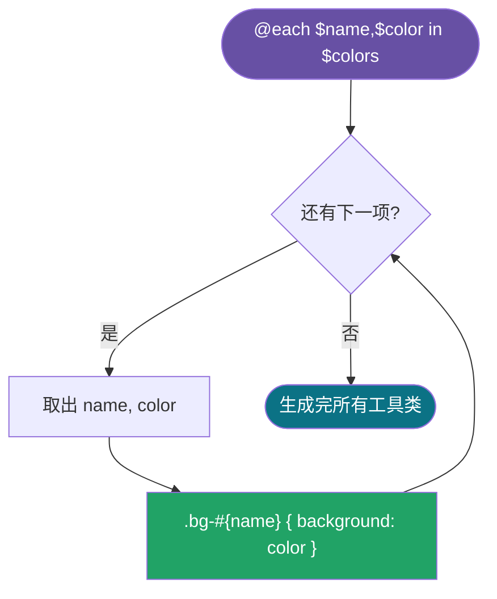

# 09 · 控制流（Control Flow）：@if / @each / @for / @while

> 控制流让 Sass 像编程语言一样**批量生成 CSS**：按条件分支选样式、按列表/区间循环造工具类。这是 Sass 从「变量替换」升级到「样式生成器」的关键。

## 📖 知识讲解

**`@if / @else if / @else`——条件分支：**

```scss
@if $mode == dark { ... } @else if $mode == light { ... } @else { @error "..."; }
```

常配合 `@error`（中断并报错）、`@warn`（警告但继续）、`@debug`（打印调试值）。

**`@each`——遍历列表 / map（最常用）：**

```scss
@each $name, $color in $colors {   // 解构 map 的 key/value
  .bg-#{$name} { background: $color; }
}
```

一次循环就能批量造出一整组工具类，是设计系统生成器的核心。

**`@for`——数值区间循环：**

```scss
@for $i from 1 through 5 { .m-#{$i} { margin: 4px * $i; } }
```

- `through`：**包含**末尾（`1 through 5` → 1,2,3,4,5）。
- `to`：**不含**末尾（`1 to 5` → 1,2,3,4）。

**`@while`——条件循环：** 满足条件就一直执行，**必须手动改变循环变量否则死循环**。能用 `@for/@each` 就别用 `@while`。

**插值是循环的灵魂：** 循环变量要拼进选择器名/属性名，必须用 `#{$var}`（如 `.text-#{$size}`）。

## 🔄 流程图 / 原理图



## 💻 代码说明

- `@mixin theme($mode)`：`@if/@else if/@else` 三分支，非法值用 `@error` 抛错。
- `@each $size in $sizes`：遍历**列表**生成 `.text-small/medium/large`。
- `@each $name, $color in $colors`：遍历 **map**（解构 key,value）批量造 `.bg-*`、`.text-*`。
- `@for $i from 1 through 5`：生成 `.m-1`~`.m-5` 间距阶梯与 `.col-*` 宽度。
- `@while $i <= 3`：演示条件循环，注意结尾 `$i: $i + 1` 自增防死循环。

## ▶️ 运行方式

```bash
npx sass 09-control-flow/style.scss 09-control-flow/style.css
```

打开 `index.html`，可见 `@each`/`@for` 一次性生成的成组工具类。

## ⚠️ 常见坑 / 最佳实践

- 循环变量进选择器/属性名**必须插值** `#{}`，否则编译报错或拼不进去。
- `@for` 分清 `through`（含尾）与 `to`（不含尾），差一个值是高频 bug。
- `@while` 忘记自增 = **死循环编译卡死**；优先用 `@for/@each`。
- 循环造工具类很爽，但别无脑生成几百个类导致 CSS 暴肥——只生成真正用到的。
- `@error` 让函数/mixin 在收到非法参数时「早失败」，比生成错误 CSS 更好排查。

## 🔗 官方文档

- @if/@else：https://sass-lang.com/documentation/at-rules/control/if/
- @each：https://sass-lang.com/documentation/at-rules/control/each/
- @for：https://sass-lang.com/documentation/at-rules/control/for/
- @while：https://sass-lang.com/documentation/at-rules/control/while/
