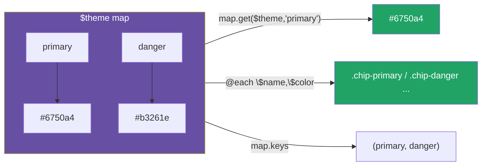

# 10 · 映射（Maps）：键值对数据结构 + sass:map

> Map 是 Sass 的「字典 / 对象」——`(key: value, ...)`。它是组织主题色板、响应式断点、设计 token 的最佳数据结构，配合 `sass:map` 模块和 `@each` 能驱动整套设计系统。

## 📖 知识讲解

**定义：**

```scss
$theme: ("primary": #6750a4, "danger": #b3261e);
```

**`sass:map` 模块常用函数**（现代写法，旧的全局 `map-get` 已不推荐）：

| 函数 | 作用 |
| --- | --- |
| `map.get($map, $key)` | 按 key 取值（最常用）；取不到返回 `null` |
| `map.has-key($map, $key)` | 判断 key 是否存在（取值前先校验） |
| `map.keys($map)` / `map.values($map)` | 取所有键 / 所有值（返回列表） |
| `map.merge($a, $b)` | 合并两 map，`$b` 覆盖 `$a` 的同名键，**返回新 map** |
| `map.set($map, $key, $val)` | 返回设置某键后的新 map |
| `map.remove($map, $key)` | 返回删除某键后的新 map |

**Map 是不可变的：** `map.merge / map.set / map.remove` 都**返回新 map，不修改原值**——这是函数式风格，避免意外副作用。

**两大经典用法：**

1. **遍历生成工具类**：`@each $name, $color in $theme { .bg-#{$name} {...} }`。
2. **配置合并**：`$config: map.merge($defaults, $overrides)`，做「默认值 + 用户覆盖」。

Map 还能**嵌套**（值本身是另一个 map），用 `map.get($map, $k1, $k2)` 多级取值。

## 🔄 流程图 / 原理图



## 💻 代码说明

- `$theme / $breakpoints / $spacing`：三个 map，分别管颜色、断点、间距。
- `.btn` 用 `map.get($theme, "primary")` 取色、`map.get($spacing, "md")` 取间距。
- `@mixin bg($name)` 先 `map.has-key` 校验，不存在就 `@error` 并用 `map.keys` 列出可选项。
- `@each $name, $color in $theme` 批量生成 `.chip-*`。
- `map.merge($base-config, $user-config)` 演示「默认 + 覆盖」，`radius` 被改成 16px、`border` 保留。
- `@mixin respond-to($bp)` 从 `$breakpoints` 取断点值封装媒体查询。

## ▶️ 运行方式

```bash
npx sass 10-maps/style.scss 10-maps/style.css
```

打开 `index.html`。

## ⚠️ 常见坑 / 最佳实践

- 用 `sass:map` 模块函数（`map.get`），别用旧全局 `map-get`（虽仍可用但不推荐）。
- `map.get` 取不存在的 key 返回 `null` 而非报错——关键路径上先用 `map.has-key` 校验或 `@error` 兜底。
- map 是**不可变**的，`map.merge` 等返回新值，记得用变量接住：`$x: map.merge(...)`。
- map 的 key 建议统一用带引号字符串（`"primary"`），避免裸字符串与变量歧义。
- 把主题、断点、间距都建成 map + `@each`，是构建可维护设计系统的标准范式。

## 🔗 官方文档

- Maps 值类型：https://sass-lang.com/documentation/values/maps/
- sass:map 模块：https://sass-lang.com/documentation/modules/map/
