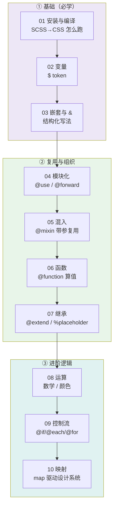

# 11 · Sass / SCSS 预处理器

> **Sass（Syntactically Awesome Style Sheets）是世界上最成熟的 CSS 预处理器。** 它给 CSS 加上了变量、嵌套、模块、混入、函数、继承、运算和控制流，写完后**编译成标准 CSS** 交给浏览器。一句话：用编程的方式写样式，产物仍是纯 CSS。

本工程用 **SCSS 语法**（`.scss`，完全兼容 CSS）+ **现代模块系统**（`@use` / `@forward`，不用已弃用的 `@import`）+ **内置模块**（`sass:math` / `sass:color` / `sass:map`），对照 [Sass 官方文档](https://sass-lang.com/documentation/) 系统讲解。

## 📚 模块索引

| 模块 | 知识点 | 核心语法 | 一句话 |
| --- | --- | --- | --- |
| [01](./01-setup-compile/) | 安装与编译 | `sass in.scss out.css` | 打通 SCSS→CSS 编译链路 |
| [02](./02-variables/) | 变量 | `$name: value` `!default` `#{}` | 集中管理设计 token |
| [03](./03-nesting/) | 嵌套与父选择器 | `&` `&__el` `&--mod` | 让 CSS 有层级感 |
| [04](./04-partials-use/) | 模块化 | `@use` `@forward` `_partial` | 拆文件、带命名空间 |
| [05](./05-mixins/) | 混入 | `@mixin` `@include` `@content` | 可复用的带参样式片段 |
| [06](./06-functions/) | 自定义函数 | `@function` `@return` | 返回一个值的纯逻辑 |
| [07](./07-extend-inheritance/) | 继承 | `@extend` `%placeholder` | 合并选择器、省体积 |
| [08](./08-operators/) | 运算 | `+ - * math.div` `color.*` | 编译期算数学与颜色 |
| [09](./09-control-flow/) | 控制流 | `@if/@each/@for/@while` | 批量生成 CSS |
| [10](./10-maps/) | 映射 | `(k: v)` `map.get` `@each` | 字典结构驱动设计系统 |

## 🗺️ 学习路线



**建议顺序：** 01→03 打基础（编译、变量、嵌套）→ 04→07 学组织与复用（模块、混入、函数、继承）→ 08→10 进阶逻辑（运算、控制流、映射）。学完即可独立搭建一套可维护的设计系统。

## ⚙️ 环境与运行

**安装 Sass（任选其一）：**

```bash
# 方式一：npm（推荐，跟项目锁版本）
npm i -D sass

# 方式二：全局 CLI
npm i -g sass          # 或  brew install sass/sass/sass

# 方式三：下载官方 Dart Sass 独立包（无需 Node）
# https://github.com/sass/dart-sass/releases
```

**编译命令：**

```bash
# 单次编译某个模块
npx sass 02-variables/style.scss 02-variables/style.css

# 监听模式（开发推荐，改即重编译）
npx sass --watch 02-variables/style.scss 02-variables/style.css

# 一键编译本工程所有模块（目录映射，源与产物同目录）
npx sass --no-source-map ./:./

# 生产压缩
npx sass --style=compressed in.scss out.min.css
```

**看效果：** 每个模块编译出 `.css` 后，用浏览器直接打开该模块的 `index.html`（HTML 始终只引入编译后的 `.css`，浏览器不认识 `.scss`）。

## 🧭 现代 Sass 速记（避免踩坑）

| 场景 | ✅ 现代写法 | ⛔ 已弃用 |
| --- | --- | --- |
| 引入文件 | `@use` / `@forward` | `@import` |
| 除法 | `math.div($a, $b)` | `$a / $b` |
| 调亮/调暗 | `color.scale` / `color.adjust` | `lighten` / `darken` |
| map 取值 | `map.get`（`@use "sass:map"`） | 全局 `map-get` |

## 🔗 官方文档

- 文档首页：https://sass-lang.com/documentation/
- 安装：https://sass-lang.com/install/
- 内置模块：https://sass-lang.com/documentation/modules/
- 从 @import 迁移到 @use：https://sass-lang.com/documentation/at-rules/import/
