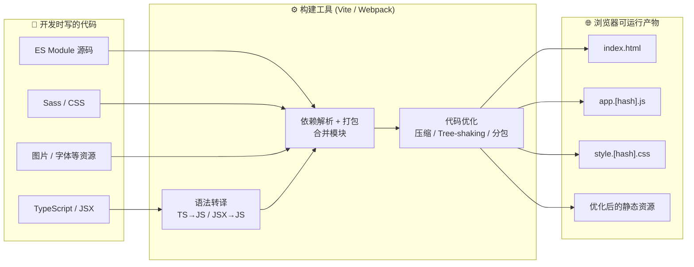
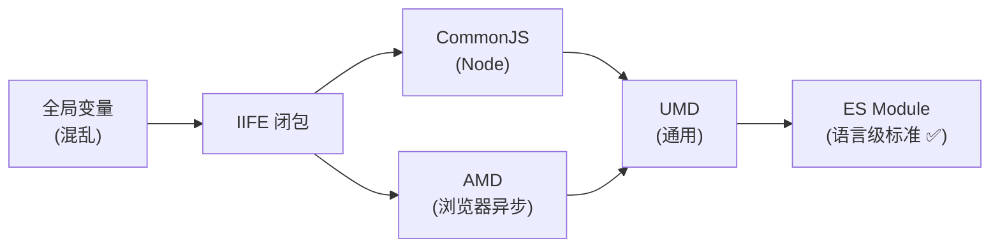

# 01 · 为什么需要构建工具（Why Build Tools）
> 浏览器只认 HTML/CSS/JS，而现代前端写的是模块化的、需要编译的、需要打包压缩的代码。构建工具就是把「开发时写的代码」转换成「浏览器能跑、还跑得快」的代码的那座桥。

## 📖 知识讲解

### 一、没有构建工具的「远古时代」

最早写网页，是一堆 `<script>` 直接往 HTML 里塞：

```html
<script src="jquery.js"></script>
<script src="utils.js"></script>   <!-- 必须排在 app.js 前面 -->
<script src="app.js"></script>      <!-- 否则用到 utils 里的变量会报错 -->
```

这种方式有三大痛点：

1. **全局变量污染**：每个文件里的变量都挂在 `window` 上，文件一多就互相覆盖。
2. **依赖顺序靠人脑维护**：谁依赖谁，全靠手动调整 `<script>` 顺序，错一个就白屏。
3. **请求数量爆炸**：几十个 JS 文件就是几十个 HTTP 请求，首屏极慢。

### 二、模块化的演进史

为了解决「全局污染」和「依赖管理」，社区一步步发明了模块化方案：

| 方案 | 全称 | 运行环境 | 语法示例 | 特点 |
| --- | --- | --- | --- | --- |
| **IIFE** | 立即执行函数 | 浏览器 | `(function(){...})()` | 用闭包造一个私有作用域，最原始的「模块」 |
| **CommonJS** | CJS | Node.js | `require()` / `module.exports` | **同步**加载，服务端文件在本地读取快，不适合浏览器 |
| **AMD** | 异步模块定义 | 浏览器 | `define([...], fn)` | 异步加载（RequireJS），语法啰嗦 |
| **UMD** | 通用模块定义 | 通用 | 兼容上面几种 | 一份代码同时兼容 CJS/AMD/全局，库作者常用 |
| **ES Module** | ESM | 浏览器 + Node | `import` / `export` | **语言级标准**，静态结构、支持 Tree-shaking，现代首选 |

ES Module（ESM）是 2015 年 ES6 引入的官方标准，今天所有现代浏览器都原生支持。它是 Vite 的立身之本（见模块 06）。

### 三、为什么「光有模块化」还不够，必须上构建工具？

即便用了 ESM，现代前端开发依然需要构建工具来做这些事：

1. **语法转译（Transpile）**：把 TypeScript、JSX、最新 ES 语法转成浏览器兼容的代码（Babel / esbuild / SWC）。
2. **依赖打包（Bundle）**：把成百上千个小模块合并成少数几个文件，减少 HTTP 请求。
3. **资源处理**：让你能 `import './style.css'`、`import logo from './logo.png'`，把 CSS、图片、字体也当模块管理。
4. **代码优化**：压缩（minify）、Tree-shaking 摇掉没用到的代码、代码分割（code splitting）按需加载。
5. **开发体验**：热模块替换（HMR，见模块 07）改代码后页面局部刷新、本地开发服务器、Source Map 调试。
6. **工程化能力**：环境变量、CSS 预处理器（Sass）、自动加浏览器前缀、产物 hash 缓存。

### 四、主流构建工具一览

| 工具 | 定位 | 特点 |
| --- | --- | --- |
| **Vite** | 新一代构建工具（本工程主角） | 开发态基于原生 ESM 免打包，启动极快；生产态用 Rollup/Rolldown 打包 |
| **Webpack** | 老牌打包器（本工程对比对象） | 生态最全、配置最灵活，但配置复杂、大项目启动慢 |
| **esbuild** | Go 写的超快打包器/转译器 | 速度是 JS 工具的 10~100 倍，Vite 用它做依赖预构建 |
| **Rollup** | 库打包器 | Tree-shaking 优秀，Vite 生产构建底层用它 |
| **Parcel** | 零配置打包器 | 开箱即用，不用写配置 |

本工程**以 Vite 为主线**讲解现代前端工程化，**用 Webpack 作对比**帮你理解传统打包思路。

## 🔄 流程图 / 原理图

下图展示「源代码」经过构建工具，变成「浏览器可运行产物」的整体流程：



模块化演进的关系图：



## 💻 代码说明

本目录提供两个对照 demo，直接用浏览器打开即可感受「模块化前 vs 后」的区别：

- `no-module.html`：用传统多 `<script>` + 全局变量，演示变量污染问题（打开控制台看冲突）。
- `with-esm.html` + `math.js` + `main.js`：用原生 ES Module（`<script type="module">`），演示 `import`/`export` 如何优雅管理依赖。

`math.js` 用 `export` 导出函数：

```js
export function add(a, b) { return a + b }   // 命名导出
```

`main.js` 用 `import` 按需引入，无需关心加载顺序：

```js
import { add } from './math.js'   // 浏览器自动按依赖图加载
console.log(add(2, 3))
```

注意：原生 ESM 在浏览器里直接用时，每个 `import` 都是一个独立 HTTP 请求——这正是「为什么生产环境仍要打包」的直观体现。

## ▶️ 运行方式

- `no-module.html`：直接双击用浏览器打开，按 F12 看控制台输出。
- `with-esm.html`：⚠️ ES Module 受同源策略限制，**不能用 `file://` 直接打开**，必须通过本地服务器访问。最简单方式：

```bash
# 在本目录下，用任意静态服务器起一个本地服务
npx serve .
# 或者 Python 自带的
python3 -m http.server 8080
```

然后浏览器访问 `http://localhost:8080/with-esm.html`。

## ⚠️ 常见坑 / 最佳实践

- ❌ 直接 `file://` 打开含 `<script type="module">` 的页面会报 CORS 错误，必须起本地服务器。
- ❌ 把模块化（ESM 语法）和构建工具（Vite/Webpack）混为一谈。模块化是「语法规范」，构建工具是「把代码转换打包的程序」，两者配合但不等价。
- ✅ 现代项目无脑选 ESM 语法 + Vite 工具链。
- ✅ 理解「开发态」和「生产态」是两套不同诉求：开发要快（免打包、HMR），生产要小要快（打包、压缩、分包）。Vite 正是把这两态分开对待（见模块 06、08）。

## 🔗 官方文档

- [Vite 官方中文文档 · 为什么选 Vite](https://cn.vitejs.dev/guide/why.html)
- [MDN · JavaScript 模块](https://developer.mozilla.org/zh-CN/docs/Web/JavaScript/Guide/Modules)
- [MDN · import / export](https://developer.mozilla.org/zh-CN/docs/Web/JavaScript/Reference/Statements/import)
