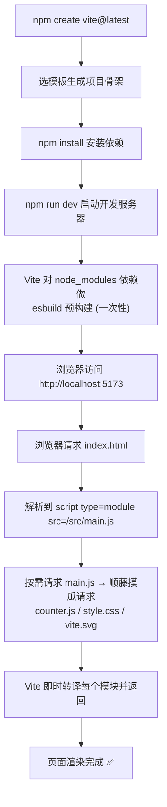

# 02 · 创建第一个 Vite 项目（Vite Getting Started）
> 用一条命令脚手架出一个 Vite 项目，跑起来感受「秒开」的开发服务器，并搞懂 Vite 项目的目录结构和 `index.html` 为什么是入口。

## 📖 知识讲解

### 一、用官方脚手架创建项目

Vite 提供了交互式脚手架，一条命令选模板即可：

```bash
npm create vite@latest
# 然后按提示输入项目名、选框架（Vanilla/Vue/React/Svelte...）、选语言（JS/TS）
```

也可以一步到位指定模板（`--template` 后面跟模板名）：

```bash
# 创建一个名为 my-app 的原生 JS 项目
npm create vite@latest my-app -- --template vanilla

# 常用模板：vanilla / vanilla-ts / vue / vue-ts / react / react-ts / svelte
npm create vite@latest my-vue-app -- --template vue
```

> `npm create vite` 等价于 `npm exec create-vite`，会临时下载并运行 `create-vite` 脚手架包。
> 要求 Node.js 版本 18+（新版 Vite 要求更高，见官方文档）。

### 二、Vite 项目的标准目录结构

```
my-app/
├── index.html          ← ⭐ 入口文件（在项目根目录，不是 public 里！）
├── package.json        ← 依赖 + npm scripts
├── vite.config.js      ← Vite 配置（见模块 03，可选）
├── public/             ← 静态资源「原样拷贝」目录（不经过构建处理）
│   └── vite.svg
└── src/                ← 你的源代码
    ├── main.js         ← JS 入口（被 index.html 引用）
    ├── counter.js
    └── style.css
```

两个最容易困惑的点：

1. **`index.html` 在根目录，是「真入口」**。传统 Webpack 里 HTML 是通过 `html-webpack-plugin` 生成的「产物」；而 Vite 反过来，把 `index.html` 当成源码图的入口，从里面的 `<script type="module" src="/src/main.js">` 开始解析整棵依赖树。
2. **`public/` vs `src/import` 的资源**：
   - 放 `public/` 的文件会被**原样拷贝**到产物根目录，引用时用绝对路径 `/vite.svg`，不会被处理（不加 hash、不压缩）。适合 `robots.txt`、`favicon` 等。
   - 在 JS 里 `import logo from './logo.png'` 的资源会**经过构建处理**（加 hash、可内联小图为 base64），是推荐做法。

### 三、三条核心 npm scripts

| 命令 | 作用 | 底层 |
| --- | --- | --- |
| `npm run dev` | 启动开发服务器（默认 `http://localhost:5173`） | 原生 ESM + esbuild 预构建，**无需打包，秒启动** |
| `npm run build` | 生产构建，输出到 `dist/` | 用 Rollup 打包、压缩、分包 |
| `npm run preview` | 本地预览 `dist/` 产物 | 起一个静态服务器跑构建结果，用于上线前自测 |

### 四、为什么 `npm run dev` 这么快？

传统打包器（Webpack）启动时要**先把整个应用打包一遍**才能让你访问，项目越大越慢。Vite 不同：

- 开发服务器启动时**几乎不打包**，只对第三方依赖做一次性「预构建」（esbuild，极快）。
- 浏览器请求哪个模块，Vite 就**按需**编译、即时返回哪个模块。
- 所以无论项目多大，`dev` 启动都是「秒级」。原理详见模块 06、07。

## 🔄 流程图 / 原理图

下图展示从「敲命令」到「浏览器看到页面」的完整流程：



## 💻 代码说明

`index.html` 的关键是这一行——它是整个应用的起点：

```html
<script type="module" src="/src/main.js"></script>
```

`src/main.js` 演示了 Vite 的核心能力「万物皆模块」：

```js
import './style.css';            // ① 直接 import CSS，Vite 注入到页面
import { setupCounter } from './counter.js'; // ② import 本地 JS 模块
import viteLogo from '/vite.svg'; // ③ import 静态资源，拿到最终 URL 字符串
```

注意 ③：`import` 一个图片资源，得到的不是图片内容，而是一个**可在浏览器访问的 URL**。开发时是原路径，构建后会变成带 hash 的路径（如 `/assets/vite.4a1f.svg`）。

## ▶️ 运行方式

```bash
# 在本模块目录下
cd 12-build-tools/02-vite-getting-started

# 1. 安装依赖（首次）
npm install

# 2. 启动开发服务器，浏览器打开提示的地址（默认 http://localhost:5173）
npm run dev

# 3. 生产构建，产物在 dist/
npm run build

# 4. 预览构建产物
npm run preview
```

跑起来后，试着修改 `src/main.js` 里的文字保存，观察页面**局部热更新**（不整页刷新）。再打开 Network 面板，看每个 `.js`/`.css` 都是独立请求——这就是免打包开发服务器。

## ⚠️ 常见坑 / 最佳实践

- ❌ 把 `index.html` 放进 `public/`。它必须在**项目根目录**，否则 Vite 找不到入口。
- ❌ 在 `public/` 里的资源用相对路径引用。`public` 资源**只能用绝对路径** `/xxx.svg`，且引用时不要带 `public` 前缀。
- ❌ 忘了 `package.json` 里的 `"type": "module"`，导致 `vite.config.js` 里用 `export default` 报错（或需改用 `.mjs`）。
- ✅ 端口被占用？Vite 会自动 +1 换端口，或在配置里指定 `server.port`（见模块 03）。
- ✅ 想让局域网其他设备访问？`npm run dev -- --host`。
- ✅ 上线前务必 `npm run build && npm run preview` 自测一遍产物，开发态能跑不代表构建产物没问题。

## 🔗 官方文档

- [Vite · 开始（脚手架）](https://cn.vitejs.dev/guide/#搭建第一个-vite-项目)
- [Vite · 命令行界面](https://cn.vitejs.dev/guide/cli.html)
- [Vite · 静态资源处理](https://cn.vitejs.dev/guide/assets.html)
- [Vite · public 目录](https://cn.vitejs.dev/guide/assets.html#public-目录)
