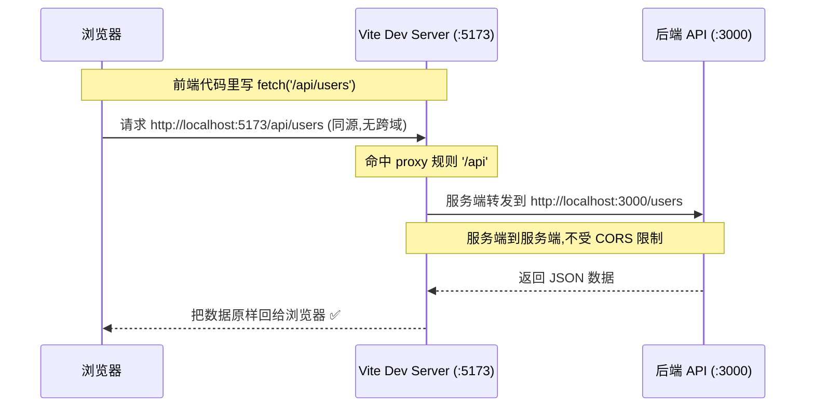
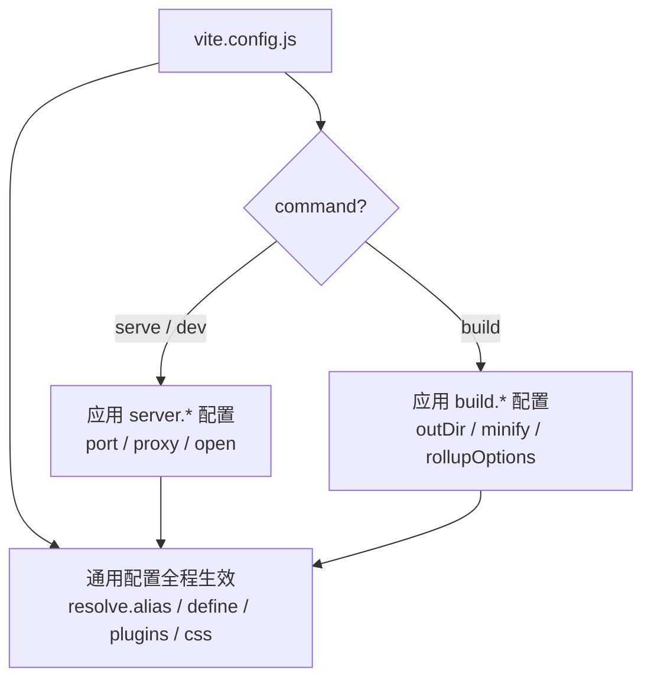

# 03 · Vite 配置文件（vite.config.js）
> `vite.config.js` 是 Vite 项目的「控制台」：改端口、配代理、设别名、调构建产物，全在这里。本模块过一遍最常用的配置项。

## 📖 知识讲解

### 一、配置文件长什么样

在项目根目录新建 `vite.config.js`（或 `.ts` / `.mjs`），用 `defineConfig` 包裹导出：

```js
import { defineConfig } from 'vite';

export default defineConfig({
  // 各种配置项...
});
```

`defineConfig` 本身不做事，纯粹是为了**让编辑器给你完整的类型提示和自动补全**，强烈建议用它包一层。

配置也可以是个函数，根据「命令」或「模式」返回不同配置：

```js
export default defineConfig(({ command, mode }) => {
  // command 是 'serve'(dev) 或 'build'
  if (command === 'serve') {
    return { /* 开发专属配置 */ };
  }
  return { /* 构建专属配置 */ };
});
```

### 二、最常用的配置项速查

| 配置项 | 作用 | 典型值 |
| --- | --- | --- |
| `root` | 项目根目录 | `.`（默认） |
| `base` | 部署的公共基础路径 | `/` 或 `/子路径/` |
| `resolve.alias` | 路径别名 | `{ '@': '/src' }` |
| `server.port` | 开发服务器端口 | `5173`（默认） |
| `server.open` | 启动后自动开浏览器 | `true` |
| `server.host` | 是否监听局域网 | `true` |
| `server.proxy` | 接口代理（解决跨域） | `{ '/api': {...} }` |
| `build.outDir` | 构建输出目录 | `dist`（默认） |
| `build.sourcemap` | 是否生成 sourcemap | `false`（默认） |
| `build.minify` | 压缩器 | `esbuild`（默认） |
| `build.rollupOptions` | Rollup 底层选项（分包等） | `{ output: {...} }` |
| `define` | 全局常量替换 | `{ __VER__: '"1.0"' }` |
| `css` | CSS / 预处理器配置 | `{ modules, preprocessorOptions }` |
| `plugins` | 插件数组 | `[vue(), ...]`（见模块 05） |
| `envPrefix` | 暴露给客户端的环境变量前缀 | `VITE_`（见模块 04） |

### 三、两个高频实战场景

**① 路径别名 `@`** —— 告别 `../../../`：

```js
import { resolve } from 'node:path';
export default defineConfig({
  resolve: { alias: { '@': resolve(__dirname, 'src') } },
});
// 之后 import x from '@/utils.js' 就等于 src/utils.js
```

**② 接口代理 `proxy`** —— 解决开发跨域：

开发时前端在 `:5173`、后端在 `:3000`，直接 `fetch('http://localhost:3000/api')` 会被浏览器 CORS 拦截。配代理后，前端只请求同源的 `/api`，由 Vite 服务器在「服务端」转发给后端（服务端之间没有跨域限制）：

```js
server: {
  proxy: {
    '/api': {
      target: 'http://localhost:3000',
      changeOrigin: true,
      rewrite: (p) => p.replace(/^\/api/, ''), // 去掉 /api 前缀
    },
  },
}
```

## 🔄 流程图 / 原理图

下图展示 `server.proxy` 代理如何绕过浏览器跨域限制：



配置加载与生效的整体关系：



## 💻 代码说明

本模块的 `vite.config.js` 是一个「全景注释版」，覆盖了路径、server、build、define、css 五大块。重点看两处与 demo 联动的配置：

```js
resolve: { alias: { '@': resolve(__dirname, 'src') } }, // 让 main.js 能 import '@/utils.js'
define: { __APP_VERSION__: JSON.stringify('1.0.0') },    // 让 main.js 能用 __APP_VERSION__
```

`src/main.js` 验证这两项确实生效（页面会显示别名导入的时间和被替换的版本号）。

> 注意 `define` 的值必须是「JSON 字符串」。要替换成字符串 `"1.0.0"`，得写 `JSON.stringify('1.0.0')`，直接写 `'1.0.0'` 会被当成变量名导致语法错误。

## ▶️ 运行方式

```bash
cd 12-build-tools/03-vite-config
npm install
npm run dev      # 因为配了 server.open:true 和 port:5180，会自动打开 http://localhost:5180
npm run build    # 看 dist/ 产物
```

试一试：把 `vite.config.js` 里的 `server.port` 改成别的数字，重启 `npm run dev`，地址栏端口会跟着变。

## ⚠️ 常见坑 / 最佳实践

- ❌ `define` 的值忘了 `JSON.stringify`。`define: { X: '1.0.0' }` 会把代码里的 `X` 替换成「变量 1.0.0」而非字符串，报错。
- ❌ `alias` 用了相对路径字符串 `'./src'`。建议用 `resolve(__dirname, 'src')` 得到绝对路径，避免不同启动目录下解析错乱。
- ❌ 部署到子路径忘了配 `base`，导致线上资源 404（路径全错）。
- ✅ `server.proxy` 只在**开发态**有效；生产环境的跨域要靠 Nginx 反向代理或后端 CORS 头解决。
- ✅ 配置文件支持 `.ts`，大项目用 TS 写配置能获得更强的类型校验。
- ✅ 别名 `@` 配好后，记得在 `jsconfig.json`/`tsconfig.json` 里也配 `paths`，让编辑器跳转和补全也认识 `@`。

## 🔗 官方文档

- [Vite · 配置 Vite](https://cn.vitejs.dev/config/)
- [Vite · 共享选项（root/base/resolve/define/css）](https://cn.vitejs.dev/config/shared-options.html)
- [Vite · 开发服务器选项（server.*）](https://cn.vitejs.dev/config/server-options.html)
- [Vite · 构建选项（build.*）](https://cn.vitejs.dev/config/build-options.html)
- [Vite · server.proxy 代理](https://cn.vitejs.dev/config/server-options.html#server-proxy)
