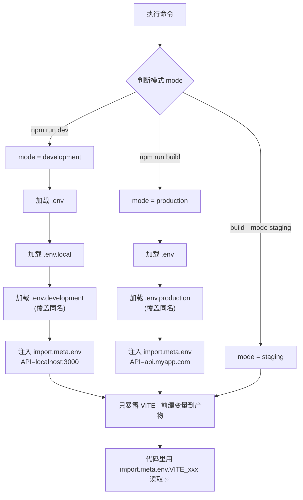

# 04 · 环境变量与模式（Env Variables & Mode）
> 同一份代码，开发连本地后端、生产连线上后端——靠的就是环境变量。Vite 用 `.env` 文件 + `import.meta.env` 优雅地解决「一套代码多套配置」。

## 📖 知识讲解

### 一、`import.meta.env`：读环境变量的入口

在 Vite 项目里，所有环境变量都挂在 `import.meta.env` 对象上。Vite **内置**了几个常量：

| 变量 | 含义 | 示例值 |
| --- | --- | --- |
| `import.meta.env.MODE` | 当前运行模式 | `'development'` / `'production'` |
| `import.meta.env.DEV` | 是否开发环境（布尔） | `true` / `false` |
| `import.meta.env.PROD` | 是否生产环境（布尔） | `true` / `false` |
| `import.meta.env.BASE_URL` | 部署基础路径（对应配置 `base`） | `'/'` |
| `import.meta.env.SSR` | 是否服务端渲染 | `false` |

### 二、自定义变量：必须 `VITE_` 前缀

你自己定义的变量，**只有以 `VITE_` 开头**的才会被暴露到客户端代码里：

```bash
VITE_API_BASE_URL=https://api.example.com   # ✅ 代码里能读到
DB_PASSWORD=secret                           # ❌ 代码里读不到（undefined）
```

这是一个**安全设计**：防止你把数据库密码、私钥等敏感信息不小心打进前端包里被人扒走。非 `VITE_` 变量只能在 `vite.config.js` / Node 构建脚本里通过 `loadEnv` 读取。

> 想改前缀？配置 `envPrefix`（不推荐改掉，更别设为空字符串，会泄露所有系统环境变量）。

### 三、`.env` 文件与加载优先级

Vite 会根据当前**模式**自动加载对应的 `.env` 文件。优先级从低到高（后者覆盖前者）：

```
.env                  # 所有模式都加载（放公共默认值）
.env.local            # 所有模式都加载，但被 git 忽略（放本地私密值）
.env.[mode]           # 仅指定模式加载，如 .env.development
.env.[mode].local     # 仅指定模式加载且被 git 忽略
```

例如 `npm run dev`（development 模式）会按顺序加载：`.env` → `.env.local` → `.env.development` → `.env.development.local`，同名变量后面的覆盖前面的。

### 四、模式（mode）从哪来

| 命令 | 默认模式 | 加载的模式专属文件 |
| --- | --- | --- |
| `vite` / `npm run dev` | `development` | `.env.development` |
| `vite build` / `npm run build` | `production` | `.env.production` |
| `vite build --mode staging` | `staging` | `.env.staging` |

用 `--mode` 可以自定义任意模式名，配合自定义 `.env.[mode]` 文件实现多环境（如预发布 staging）。

### 五、HTML 里也能用：`%VITE_XXX%`

在 `index.html` 里可以用 `%VITE_APP_TITLE%` 占位语法，构建时会被替换成对应环境变量的值（本模块的 `<title>` 就用了这招）。

## 🔄 流程图 / 原理图

下图展示开发与生产两种模式下，`.env` 文件如何被加载和覆盖：



## 💻 代码说明

`src/main.js` 把三类变量都读出来对照展示：

```js
import.meta.env.MODE             // 内置：当前模式
import.meta.env.VITE_API_BASE_URL // 自定义：开发态是 localhost，生产态是线上域名
import.meta.env.DB_PASSWORD       // undefined！没有 VITE_ 前缀被屏蔽
```

三个 `.env` 文件里 `VITE_APP_TITLE` 和 `VITE_API_BASE_URL` 设了不同的值，所以**切换命令就能看到页面显示不同的标题和接口地址**——这正是环境变量的意义。

## ▶️ 运行方式

```bash
cd 12-build-tools/04-vite-env-vars
npm install

# 开发模式 → 加载 .env.development → 标题显示「开发环境」，接口指向 localhost:3000
npm run dev

# 生产构建 + 预览 → 加载 .env.production → 标题显示「生产环境」，接口指向 api.myapp.com
npm run build && npm run preview

# 自定义模式 → 需自建 .env.staging
npm run build:staging
```

对比 `dev` 和 `preview` 两个页面的标题与接口地址，能直观看到环境差异。

## ⚠️ 常见坑 / 最佳实践

- ❌ 自定义变量忘了加 `VITE_` 前缀，代码里读出来是 `undefined`。
- ❌ 把密钥、token 等敏感信息放进 `VITE_` 变量。前端包是公开的，**任何 `VITE_` 变量都会被打进产物、可被用户看到**，敏感信息必须留在后端。
- ❌ 改了 `.env` 文件后不重启 `dev` 服务器。环境变量在启动时加载，**改完要重启**才生效。
- ✅ `.env.local` 和 `.env.*.local` 用来放个人本地配置，记得加进 `.gitignore`（Vite 脚手架默认已忽略）。
- ✅ TS 项目可在 `src/vite-env.d.ts` 里给自定义变量补类型声明，获得 `import.meta.env.VITE_xxx` 的智能提示。
- ✅ 用 `import.meta.env.DEV` / `PROD` 做环境分支（如开发开调试日志），比手写字符串判断更可靠。

## 🔗 官方文档

- [Vite · 环境变量和模式](https://cn.vitejs.dev/guide/env-and-mode.html)
- [Vite · import.meta.env 内置变量](https://cn.vitejs.dev/guide/env-and-mode.html#内建常量)
- [Vite · .env 文件与优先级](https://cn.vitejs.dev/guide/env-and-mode.html#env-文件)
- [Vite · envPrefix 配置](https://cn.vitejs.dev/config/shared-options.html#envprefix)
