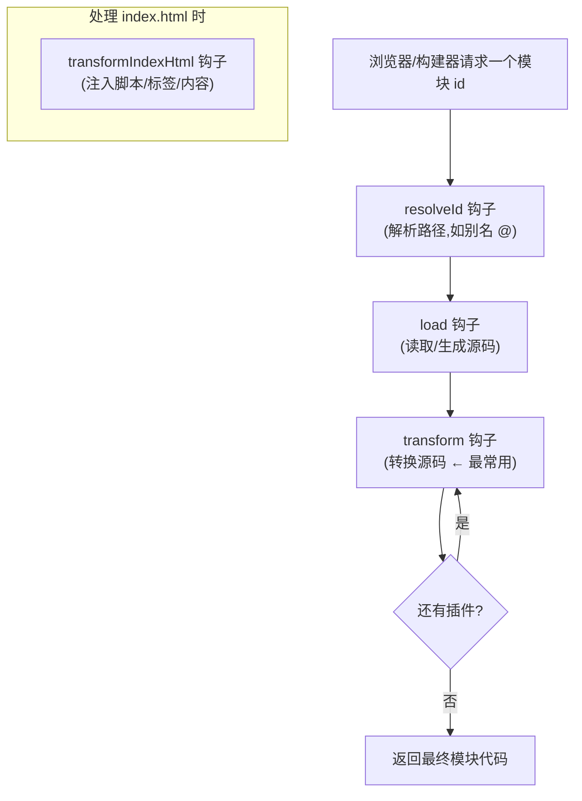

# 05 · 插件机制（Plugins）
> Vite 的能力是「可插拔」的：支持 Vue、React、自动导入、PWA…… 全靠插件。本模块带你手写一个插件，搞懂插件到底是怎么挂进构建流程的。

## 📖 知识讲解

### 一、插件是什么

Vite 插件本质上就是**一个返回「插件对象」的函数**，这个对象里写若干「钩子（hook）」。Vite 在构建的不同阶段调用这些钩子，从而干预编译过程。

```js
export default function myPlugin(options) {
  return {
    name: 'my-plugin',      // 必填：插件名
    transform(code, id) {   // 钩子：处理每个模块
      return code + '/* hi */';
    },
  };
}
```

> Vite 的插件系统**扩展自 Rollup**：Rollup 的通用钩子（`resolveId` / `load` / `transform` 等）Vite 都兼容，同时 Vite 额外提供了一批专属钩子（如 `transformIndexHtml`、`handleHotUpdate`、`configureServer`）。

### 二、怎么用插件

在 `vite.config.js` 的 `plugins` 数组里放进去即可，按数组顺序应用：

```js
import vue from '@vitejs/plugin-vue';
export default defineConfig({
  plugins: [vue()],   // 注意要「调用」插件函数
});
```

### 三、常用插件钩子速览

| 钩子 | 时机 / 作用 | 来源 |
| --- | --- | --- |
| `config` / `configResolved` | 修改 / 读取最终配置 | Vite |
| `configureServer` | 拿到 dev server，加自定义中间件 | Vite |
| `resolveId` | 自定义模块路径解析 | Rollup |
| `load` | 自定义模块加载（返回源码） | Rollup |
| `transform` | **转换每个模块的源码**（最常用） | Rollup |
| `transformIndexHtml` | 改 `index.html` | Vite |
| `handleHotUpdate` | 自定义 HMR 行为 | Vite |
| `buildStart` / `buildEnd` | 构建开始 / 结束 | Rollup |

### 四、`enforce` 与执行顺序

插件可以用 `enforce` 控制相对其他插件的执行时机：

- `enforce: 'pre'` —— 在 Vite 核心插件**之前**执行
- 不写 —— 在核心插件**之后**执行
- `enforce: 'post'` —— 在 Vite 构建插件**之后**执行

完整顺序：别名解析 → `pre` 插件 → Vite 核心插件 → 普通插件 → Vite 构建插件 → `post` 插件。

### 五、常见官方/社区插件

| 插件 | 用途 |
| --- | --- |
| `@vitejs/plugin-vue` | 处理 `.vue` 单文件组件 |
| `@vitejs/plugin-react` | React + Fast Refresh |
| `@vitejs/plugin-legacy` | 为旧版浏览器生成兼容包（降级） |
| `unplugin-auto-import` | 自动导入 API（免手写 import） |
| `vite-plugin-pwa` | 一键 PWA / Service Worker |

## 🔄 流程图 / 原理图

下图展示一个模块从被请求到返回，经过插件各钩子的处理流水线：



插件在 `plugins` 数组中的执行顺序：


## 💻 代码说明

本模块手写的 `my-banner-plugin.js` 用了三个钩子：

```js
transform(code, id) {
  // 只给项目自己的 .js 顶部加版权 banner，跳过 node_modules
  if (id.endsWith('.js') && !id.includes('node_modules')) {
    return { code: banner + code, map: null };
  }
}

transformIndexHtml(html) {
  // 往 index.html 的 </body> 前注入构建时间
  return html.replace('</body>', `...构建时间...</body>`);
}

configResolved(config) {
  // 配置解析完成后打印日志（启动时在终端可见）
  console.log('command =', config.command);
}
```

`transform` 的返回值约定很关键：返回 `{ code, map }` 表示「我改了源码」；返回 `undefined`/`null` 表示「这个模块我不处理」。`map` 是 source map，简单场景返回 `null` 即可。

## ▶️ 运行方式

```bash
cd 12-build-tools/05-vite-plugins
npm install
npm run dev
```

验证插件生效的三处现象：

1. **终端**：启动时打印 `[my-banner-plugin] 当前命令 = serve, 作者 = frontend-learning`（来自 `configResolved`）。
2. **页面底部**：有一行灰色「构建时间」（来自 `transformIndexHtml`）。
3. **Network 面板**：点开 `main.js` 的响应内容，顶部多了一行 banner 注释（来自 `transform`）。

## ⚠️ 常见坑 / 最佳实践

- ❌ `plugins: [myPlugin]` 忘了调用，写成了函数本身而不是 `myPlugin()`。绝大多数插件需要「调用后」把返回的对象放进数组。
- ❌ `transform` 里不判断 `id` 就处理所有文件，连 `node_modules` 第三方库也改，导致性能差或出错。务必过滤。
- ❌ 改了源码却没返回 `map`，复杂转换会让 source map 错位、断点调不准。涉及行号变动时应正确生成 source map。
- ✅ 插件 `name` 一定要写，报错日志靠它定位是哪个插件出的问题。
- ✅ 区分钩子的「环境」：`configureServer`、`handleHotUpdate` 只在 dev 有意义；`buildStart`/`buildEnd` 偏构建态。
- ✅ 能用现成社区插件就别自己造轮子；自己写插件适合做项目专属的小定制。

## 🔗 官方文档

- [Vite · 使用插件](https://cn.vitejs.dev/guide/using-plugins.html)
- [Vite · 插件 API（钩子）](https://cn.vitejs.dev/guide/api-plugin.html)
- [Vite · 通用钩子 / Vite 专属钩子](https://cn.vitejs.dev/guide/api-plugin.html#通用钩子)
- [Awesome Vite · 插件大全](https://github.com/vitejs/awesome-vite#plugins)
