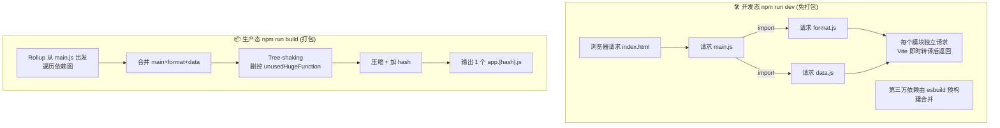
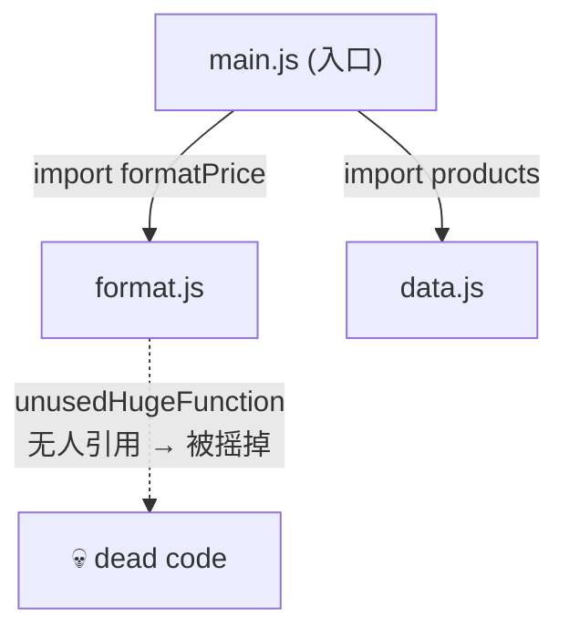

# 06 · ES Module 与打包原理（ESM & Bundling）
> Vite 的「快」不是魔法：开发时它利用浏览器原生 ESM「免打包、按需加载」，生产时再用 Rollup「打包合并、Tree-shaking」。理解这两态的区别，就抓住了现代构建工具的核心。

## 📖 知识讲解

### 一、ES Module（ESM）的关键特性

ESM 是 JS 的语言级模块标准，它有两个对构建至关重要的特性：

1. **静态结构**：`import` / `export` 必须写在模块顶层，不能放在 `if` 里动态拼。这让工具可以在**不运行代码**的情况下，静态分析出「谁依赖谁、用了哪些导出」——这是 Tree-shaking 的前提。
2. **浏览器原生支持**：现代浏览器认识 `<script type="module">`，能自己根据 `import` 一层层去请求依赖文件。

```js
import { add } from './math.js';  // 静态：构建工具一眼就知道依赖 math.js 的 add
```

### 二、为什么开发态可以「免打包」（Vite 的杀手锏）

传统打包器（Webpack）开发时也要**先把整个应用打包**才能让你访问，项目越大启动越慢。

Vite 反其道而行：开发服务器**几乎不打包**。

- 浏览器请求 `index.html` → 看到 `<script type="module" src="/src/main.js">` → 去请求 `main.js`。
- `main.js` 里有 `import './format.js'` → 浏览器**自己**再去请求 `format.js`。
- Vite 服务器收到每个请求时，**即时**把这个模块转译一下（TS→JS、处理裸导入路径等）就返回，**不合并**。

所以不管项目多大，启动都是秒级——因为它根本没在启动时打包，而是把工作摊到「浏览器按需请求」时一点点做。

### 三、依赖预构建（Dependency Pre-Bundling）

有个例外：`node_modules` 里的第三方依赖，Vite 会在启动时用 **esbuild** 做一次性「预构建」，原因有二：

1. **统一格式**：很多 npm 包还是 CommonJS（`require`）格式，浏览器不认，预构建把它们转成 ESM。
2. **减少请求**：像 `lodash-es` 这种由几百个小文件组成的包，若每个都单独请求会有几百个 HTTP 请求。预构建把它合并成一个文件，大幅减少请求数。

esbuild 用 Go 写，比 JS 工具快 10~100 倍，所以这步「预构建」也很快。

### 四、为什么生产态必须「打包」

开发态「每个模块一个请求」在本地很爽，但**上线绝不能这样**：

- 生产环境模块成百上千，几百个 HTTP 请求会让首屏巨慢（即便有 HTTP/2 也不理想）。
- 没压缩、没优化、含大量未使用代码。

所以 `npm run build` 时，Vite 用 **Rollup**（新版逐步切换到 Rust 写的 Rolldown）做真正的打包：

- **打包合并（Bundle）**：把依赖图里的模块合并成少数几个文件。
- **Tree-shaking 摇树**：基于 ESM 的静态结构，删掉「导出了但没人用」的代码（如本 demo 里的 `unusedHugeFunction`）。
- **压缩（Minify）+ 加 hash + 代码分割**（详见模块 08）。

### 五、一句话总结两态

| | 开发态 `dev` | 生产态 `build` |
| --- | --- | --- |
| 模块处理 | 原生 ESM，**不打包**，按需即时转译 | Rollup **打包合并** |
| 第三方依赖 | esbuild 预构建（一次性） | 一起打包进产物 |
| Tree-shaking | 不做 | 做，删未用代码 |
| 目标 | **启动快、改得快** | **产物小、加载快** |

## 🔄 流程图 / 原理图

下图对比开发态（原生 ESM 按需加载）与生产态（打包合并）：



依赖图（dependency graph）是打包的核心数据结构：



## 💻 代码说明

`format.js` 故意导出了两个函数，但 `main.js` 只用了 `formatPrice`：

```js
// format.js
export function formatPrice(n) { return '¥' + n.toFixed(2); }
export function unusedHugeFunction() { /* 没人 import 它 */ }
```

```js
// main.js
import { formatPrice } from './format.js'; // 只引这个
```

- **开发态**：Network 面板能看到 `main.js`、`format.js`、`data.js` 三个独立请求。
- **生产态**：`dist/assets/` 里只有一个打包后的 JS，且搜不到 `unusedHugeFunction` 的代码——被 Tree-shaking 删了。

## ▶️ 运行方式

```bash
cd 12-build-tools/06-esm-bundling
npm install

# ① 开发态：开 F12 → Network，刷新，看「三个独立模块请求」
npm run dev

# ② 生产态：打包，然后查看产物
npm run build
# 看 dist/assets/ 下生成的 js 文件，三个模块被合并成了一个
# 在产物里搜 unusedHugeFunction，搜不到 → 证明被摇掉了
npm run preview
```

## ⚠️ 常见坑 / 最佳实践

- ❌ 以为「Vite 开发不打包 = Vite 完全不打包」。生产构建是**会**打包的，两态不同。
- ❌ 用 `module.exports` / `require`（CommonJS）写源码还指望 Tree-shaking。Tree-shaking 依赖 ESM 的静态结构，**请用 `import`/`export`**。
- ❌ 动态拼接 import 路径如 `import('./' + name + '.js')` 会削弱静态分析能力，影响摇树和分包。
- ✅ 引用工具库优先选 ESM 版本（如 `lodash-es` 而非 `lodash`），Tree-shaking 才能按需保留。
- ✅ 第一次 `dev` 启动或新增依赖后，Vite 会做依赖预构建，终端会显示 "optimizing dependencies"，属正常现象。
- ✅ 想看打包到底合并/拆分成了啥，配合产物分析工具（见模块 08）。

## 🔗 官方文档

- [Vite · 为什么选 Vite（开发/生产双态）](https://cn.vitejs.dev/guide/why.html)
- [Vite · 依赖预构建](https://cn.vitejs.dev/guide/dep-pre-bundling.html)
- [Vite · 功能（ESM/HMR/构建优化）](https://cn.vitejs.dev/guide/features.html)
- [MDN · JavaScript 模块（ESM）](https://developer.mozilla.org/zh-CN/docs/Web/JavaScript/Guide/Modules)
- [Rollup · Tree-shaking](https://cn.rollupjs.org/faqs/#what-is-tree-shaking)
