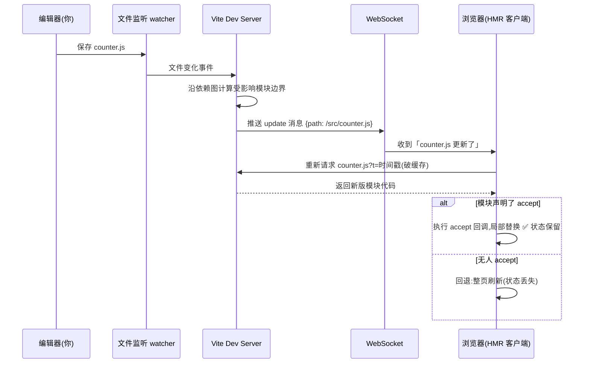
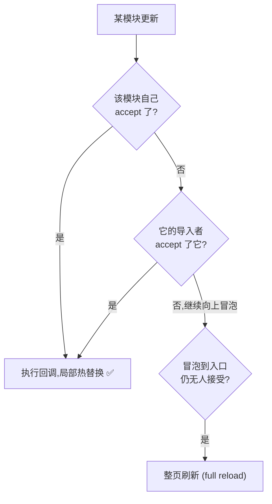

# 07 · 热模块替换（HMR · Hot Module Replacement）
> 改一行代码，页面**局部**就变了，状态还不丢——这就是 HMR。它是现代开发体验的核心。本模块讲清它的原理和 Vite 的 HMR API。

## 📖 知识讲解

### 一、HMR 解决什么问题

没有 HMR 时，改代码 → 浏览器**整页刷新**（live reload）。问题是：页面上所有运行时状态（表单填了一半、弹窗开着、计数器的值）全部丢失，得重新操作一遍，很烦。

HMR（热模块替换）做到：改了某个模块，**只替换那个模块**，页面其余部分和状态原样保留，不整页刷新。比如你改了 CSS 颜色，背景秒变，但页面上的计数器数值不归零。

### 二、HMR 是怎么实现的（原理）

核心是 Vite 开发服务器和浏览器之间的一条 **WebSocket 长连接**：

1. **建立连接**：`dev` 启动后，Vite 注入的客户端代码和服务器建立 WebSocket。
2. **监听文件**：Vite 用文件监听器（watcher）盯着你的源文件。
3. **你保存了文件**：watcher 触发，Vite 找出「这个模块影响了哪些模块」（沿依赖图找受影响的边界）。
4. **推送更新**：Vite 通过 WebSocket 给浏览器发一条消息：「`/src/counter.js` 更新了」。
5. **浏览器处理**：客户端**重新 import** 这个模块的新版本（带个时间戳查询参数破缓存），然后：
   - 如果模块声明了「我能自己处理更新」（`import.meta.hot.accept`），就执行回调做局部替换。
   - 如果没人能处理（更新冒泡到顶还没被 accept），就**回退到整页刷新**。

CSS 的 HMR 是 Vite 内置的，开箱即用，永远不会整页刷新。

### 三、Vite 的 HMR API：`import.meta.hot`

Vite 通过 `import.meta.hot` 暴露 HMR 能力（**仅开发态存在**，生产构建时为 `undefined`）：

| API | 作用 |
| --- | --- |
| `import.meta.hot.accept()` | 接受**自己**的更新（自己处理热替换） |
| `import.meta.hot.accept('./dep.js', cb)` | 接受**某个依赖**更新，用回调拿到新模块 |
| `import.meta.hot.dispose(cb)` | 模块被替换**前**调用，清理副作用（定时器/监听器） |
| `import.meta.hot.data` | 在新旧模块间传递数据（持久化状态） |
| `import.meta.hot.invalidate()` | 放弃自己处理，强制冒泡（最终可能整页刷新） |

```js
if (import.meta.hot) {                       // 先判断，生产态没有它
  import.meta.hot.accept('./counter.js', (newMod) => {
    // counter.js 更新了，这里用新模块重新渲染，不整页刷新
    newMod.setupCounter(el);
  });
}
```

### 四、为什么平时「没写 accept」也有热更新？

因为框架插件（`@vitejs/plugin-vue`、`@vitejs/plugin-react`）已经帮你在 `.vue`/`.jsx` 模块里注入了 `accept` 逻辑。所以用 Vue/React 时改组件能自动热更新、保留状态。**只有写原生 JS 模块时**才需要自己调 `import.meta.hot.accept`，否则更新会冒泡到顶 → 整页刷新。

## 🔄 流程图 / 原理图

下图用时序图展示从「保存文件」到「页面局部更新」的完整 HMR 流程：



HMR 更新的「接受 vs 冒泡」决策：



## 💻 代码说明

`main.js` 里两段是 HMR 的关键：

```js
import './style.css';   // CSS 的 HMR 内置,改样式永远不刷新整页

if (import.meta.hot) {
  // 接受 counter.js 的更新,自己处理,避免整页刷新
  import.meta.hot.accept('./counter.js', (newModule) => {
    newModule.setupCounter(document.querySelector('#btn'));
  });
  // 替换前清理副作用
  import.meta.hot.dispose(() => { /* 清定时器/监听器 */ });
}
```

- 改 `style.css` 的背景色 → 背景秒变，计数器数值**不归零**（CSS HMR）。
- 改 `counter.js` 的文字 → 控制台打印 `🔥 [HMR] counter.js 更新了`，模块被热替换。

## ▶️ 运行方式

```bash
cd 12-build-tools/07-hmr
npm install
npm run dev
```

打开页面后，先点几下按钮让计数变成非 0，然后：

1. 改 `src/style.css` 里 `body` 的 `background` 颜色保存 → 观察背景变了但**计数不归零**。
2. 改 `src/counter.js` 里 `render` 的文字保存 → 观察控制台 HMR 日志。
3. 打开 F12 → Network → WS，能看到那条 WebSocket 连接和推送的更新消息。

## ⚠️ 常见坑 / 最佳实践

- ❌ 在生产代码里直接用 `import.meta.hot.accept(...)` 不加 `if (import.meta.hot)` 判断。生产态 `import.meta.hot` 是 `undefined`，会报错（虽然通常会被摇掉，但养成判断习惯）。
- ❌ 写了有副作用的模块（注册全局事件、起定时器）却不在 `dispose` 里清理，热替换多次后副作用叠加（同一个事件绑了 N 次）。
- ❌ 期望「原生 JS 模块」不写 `accept` 也能局部热更新。不写就会冒泡到整页刷新，Vue/React 是插件帮你做了。
- ✅ HMR 是**开发态专属**功能，和生产构建无关。
- ✅ 如果 HMR 行为异常（一直整页刷新），检查是否有循环依赖、是否某模块有顶层副作用阻碍了边界判定。
- ✅ HMR 不是「自动保存状态」的银弹；像组件本地 state 的保留依赖框架插件实现（Vue/React 的 Fast Refresh）。

## 🔗 官方文档

- [Vite · 功能 · 热更新（HMR）](https://cn.vitejs.dev/guide/features.html#hot-module-replacement)
- [Vite · HMR API（import.meta.hot）](https://cn.vitejs.dev/guide/api-hmr.html)
- [Vite · 为什么选 Vite（HMR 性能）](https://cn.vitejs.dev/guide/why.html#缓慢的更新)
